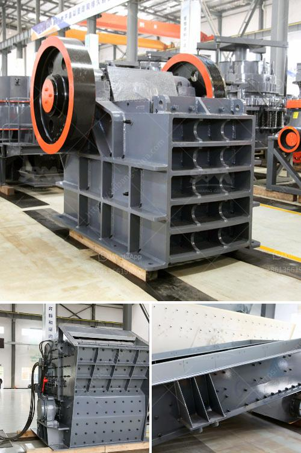

<h3>How to start a quarry factory in Nigeria?</h3>
To successfully start a quarry factory in Nigeria, there are certain requirements that must be met. However, these requirements vary depending on the nature of the quarry, its purpose, and the size of the operation. Some of the basic requirements include:

1. Land: A quarry site needs ample space for dumping and storage of raw materials. To secure a land for this purpose, you can advertise in local newspapers or collaborate with the traditional rulers and landowners to find a suitable location.

2. Machinery: You will need various sizes of machinery for the quarrying process. These include crushers, excavators, screeners, loaders, and conveyors. It's important to have dependable and efficient equipment that can handle the large volumes of materials involved in quarrying.

3. Labor: A quarrying business requires a significant amount of labor to ensure smooth operations. You will need workers to operate machinery, handle materials, and complete administrative tasks. It's crucial to hire skilled and reliable employees who are familiar with quarry operations.

4. Licensing: In Nigeria, operating a quarry requires a license from the Ministry of Mines and Steel Development. The quarry license grants the holder the right to conduct quarrying activities, including the extraction and processing of various types of rock and minerals.

Once you have met the necessary requirements, the following steps will guide you on how to start a quarry factory in Nigeria:

1. Purchase or lease a quarry site: You need to decide upon the location where you want to set up the quarrying operation. Observe the land for local communities and environmental concerns to ensure it is suitable for quarrying.

2. Prepare the site: Clear the land and remove any vegetation, rocks, or debris that may hinder quarrying activities. The site should be leveled and prepared for excavation.

3. Obtain necessary permits and licenses: Apply for the appropriate licenses and permits from relevant government agencies such as the Ministry of Mines and Steel Development. This ensures that your quarrying operation is legally compliant.

4. Purchase equipment and hire workers: Acquire the necessary machinery and equipment required for quarrying. Additionally, employ skilled workers who are experienced in operating quarry machinery and are knowledgeable about safety protocols.

5. Start quarry operations: Outline a strategic plan, detailing how you will extract and process the raw materials efficiently. This will involve drilling, blasting, crushing, screening, and transporting materials to desired locations.

6. Market your products: Establish relationships with construction companies, builders, and other potential clients to market your products. Advertise your quarry business through various marketing channels such as websites, social media, and collaborations within the construction industry.

Starting a quarry factory in Nigeria can be a profitable venture if properly planned and executed. The key to success is choosing the right location and investing in quality equipment and robust infrastructure. By following the outlined steps and complying with legal requirements, you can establish a profitable quarry factory in Nigeria and contribute to the development of the construction industry.
<h3>Contact us</h3><ul><li><strong>Whatsapp:&nbsp;<a href="https://wa.me/8613661969651">+8613661969651</a></strong></li><li><a href="https://swt.shibang-china.com/?git&amp;zhl&amp;How to start a quarry factory in Nigeria"><strong>Online Service(chat now)</strong></a></li></ul><h3>Related</h3><ul><li><a href='How to segregate gold ore from copper ore .md'>How to segregate gold ore from copper ore ?</a></li><li><a href='How to choose a basalt crusher？.md'>How to choose a basalt crusher？</a></li><li><a href='How to build sand and gravel wash plant.md'>How to build sand and gravel wash plant?</a></li><li><a href='How to start a cone crusher.md'>How to start a cone crusher?</a></li><li><a href='How to plan to build a rock crusher production line.md'>How to plan to build a rock crusher production line?</a></li></ul>