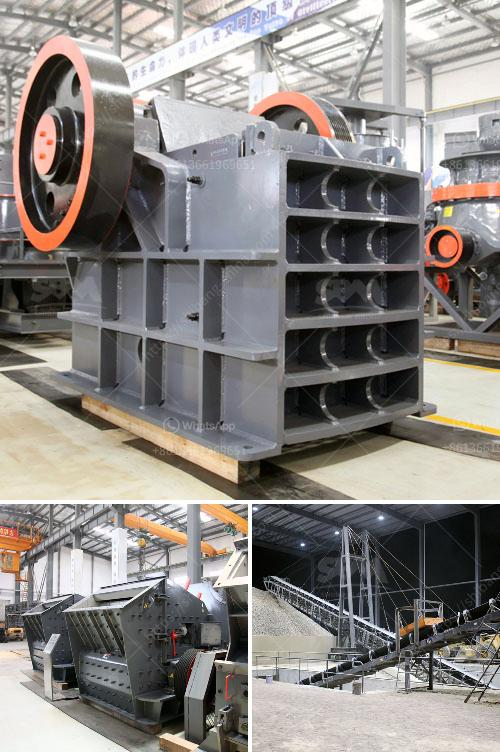

<h3>How to start a sand and gravel business?</h3>
Starting a sand and gravel business can be a lucrative venture for those with the proper resources and ambition. With the demand for sand and gravel on the rise, there has never been a better time to enter this industry. However, just like any other business, starting one in this field requires careful planning and understanding of the market. Here are some key steps to help you get started on the right foot.

Before diving into sand and gravel business, it's crucial to research the local market thoroughly. Determine the demand for these resources in your area and identify potential customers such as construction companies, contractors, and landscaping businesses. Understanding the needs and preferences of your target market will help you develop a business strategy that meets their requirements.

A well-crafted business plan is essential for any new venture. It serves as a roadmap that outlines your business goals, marketing strategy, financial projections, and operational procedures. Your plan should include details about your target market, competitive analysis, pricing strategy, and a comprehensive marketing plan. Develop a budget that covers your initial investment, ongoing expenses, and potential profit margins.

Starting a sand and gravel business involves compliance with regulations and obtaining the necessary permits and licenses. Check with your local authorities to understand the specific requirements for operating such a business in your area. Some common licenses you may need include a general business license, environmental permits, and permits for operating heavy machinery and transportation vehicles.

Finding the right location to set up your sand and gravel business is crucial. Look for areas with ample reserves of sand and gravel, preferably close to your target market to minimize transportation costs. Ensure that you have legal access to the resources, either through ownership or leasing agreements. Consider factors like transportation logistics, proximity to suppliers, and potential environmental impacts when selecting your site.

To operate a successful sand and gravel business, you'll need heavy equipment like excavators, loaders, and trucks. These are essential for extracting, processing, and transporting sand and gravel to your customers. Consider purchasing or leasing the equipment based on your budget and expected workload. Additionally, you'll need to invest in storage facilities, quality control systems, and proper maintenance procedures to ensure smooth operations.

Promoting your sand and gravel business is crucial for attracting customers and generating revenue. Utilize a mix of traditional and digital marketing techniques to reach your target market effectively. This may include advertising in local newspapers, trade publications, and online platforms, as well as attending industry events and networking with potential clients. Establish strong relationships with contractors and construction firms, as they are likely to be regular customers.

Starting a sand and gravel business requires careful planning, adequate resources, and a clear understanding of the market. With the right approach, attention to detail, and perseverance, you can build a successful venture in this industry.
<h3>Contact us</h3><ul><li><strong>Whatsapp:&nbsp;<a href="https://wa.me/8613661969651">+8613661969651</a></strong></li><li><a href="https://swt.shibang-china.com/?git&amp;zhl&amp;How to start a sand and gravel business"><strong>Online Service(chat now)</strong></a></li></ul><h3>Related</h3><ul><li><a href='How to adjust the discharge opening of an impact crusher.md'>How to adjust the discharge opening of an impact crusher?</a></li><li><a href='How to choose manganese ore crushing machinery.md'>How to choose manganese ore crushing machinery?</a></li><li><a href='How does investing in a cone crusher benefit.md'>How does investing in a cone crusher benefit?</a></li><li><a href='How to build sand and gravel wash plant.md'>How to build sand and gravel wash plant?</a></li><li><a href='How to extract iron ore flow chart.md'>How to extract iron ore flow chart?</a></li></ul>