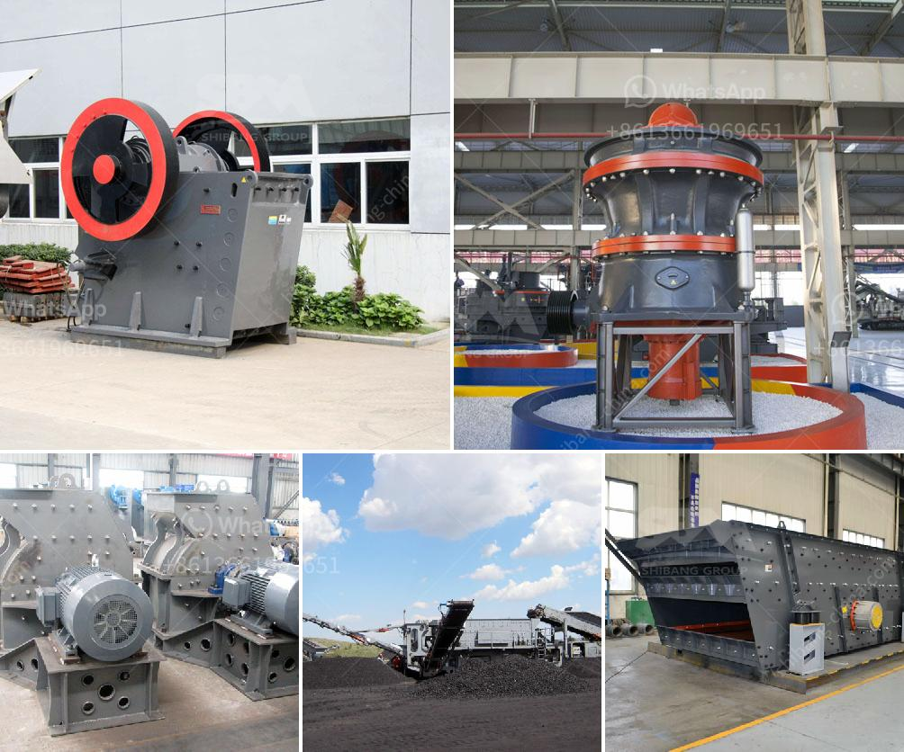

<h3>How to start a stone quarry business?</h3>
Starting a stone quarry business is a massive undertaking, but it can be a highly profitable one if done correctly. Stone quarry businesses are essential to the construction and building industry as they provide the necessary materials for the construction of roads, bridges, buildings, and other infrastructure.

Not all quarries are created equal. Some quarries are more conducive to certain types of rocks and minerals, while others may have a more abundant supply of a particular stone. Therefore, when starting a stone quarry business, it is important to have a clear understanding of your target market.

The next step in starting a quarry business is to identify the type of rock or mineral that will be extracted from the quarry. Different types of stones and rocks can be used for various purposes, such as building materials, landscaping, and ornamental purposes. Some stones may also have specific market demands due to their unique properties or aesthetic appeal.

After identifying the type of stone or rock, it is essential to conduct thorough market research. This research will help you determine the demand for the stone in your local area and beyond. Look into the current and future construction projects in your region, as well as the potential for export opportunities. Analyze your competition to understand their products and pricing strategies.

Once you have completed market research, you can begin to develop a business plan. Your business plan should outline your company's objectives, target market, marketing strategies, financial projections, and operational plans. This document will serve as a roadmap for your business and will be essential when seeking funding from investors or financial institutions.

An important aspect to consider when starting a stone quarry business is location. The location of your quarry will determine the success and profitability of your venture. Ensure that your quarry is situated in an area with ample supply of stone and rocks, and that it is easily accessible for transportation and distribution.

Obtaining the necessary permits and licenses is another crucial step in starting a quarry business. Depending on the location, you may need to apply for permits related to environmental impact, mining rights, explosives, and transport. Consult with local authorities to understand the specific requirements in your area.

Investing in essential equipment and machinery is also vital when starting a stone quarry business. This may include excavators, loaders, stone crushers, generators, trucks, and other heavy machinery. You will need skilled laborers to operate the equipment effectively and efficiently.

To gain customers and establish your brand in the market, invest in marketing and promotional efforts. Develop a website, create social media profiles, and advertise in relevant industry publications. Attend trade shows and networking events to connect with potential clients and industry professionals.

Finally, always prioritize safety in your stone quarry business. Ensure that your employees follow proper safety protocols and provide them with the necessary protective gear. Regularly inspect and maintain all equipment to prevent accidents and breakdowns.

Starting a stone quarry business requires careful planning and execution. However, with the right resources and strategies, it can be a profitable venture. By identifying your target market, conducting thorough market research, obtaining necessary permits, and investing in essential equipment, you can successfully launch your stone quarry business and thrive in the construction industry.
<h3>Contact us</h3><ul><li><strong>Whatsapp:&nbsp;<a href="https://wa.me/8613661969651">+8613661969651</a></strong></li><li><a href="https://swt.shibang-china.com/?git&amp;zhl&amp;How to start a stone quarry business"><strong>Online Service(chat now)</strong></a></li></ul><h3>Related</h3><ul><li><a href='How to install quarry equipment.md'>How to install quarry equipment?</a></li><li><a href='How does investing in a cone crusher benefit.md'>How does investing in a cone crusher benefit?</a></li><li><a href='How to operate a hp cone crusher.md'>How to operate a hp cone crusher?</a></li><li><a href='how to eliminate titaniumsulphur and silica in iron sand？.md'>how to eliminate titaniumsulphur and silica in iron sand？</a></li><li><a href='how to realize the feeding control of raymond mill .md'>how to realize the feeding control of raymond mill ?</a></li></ul>