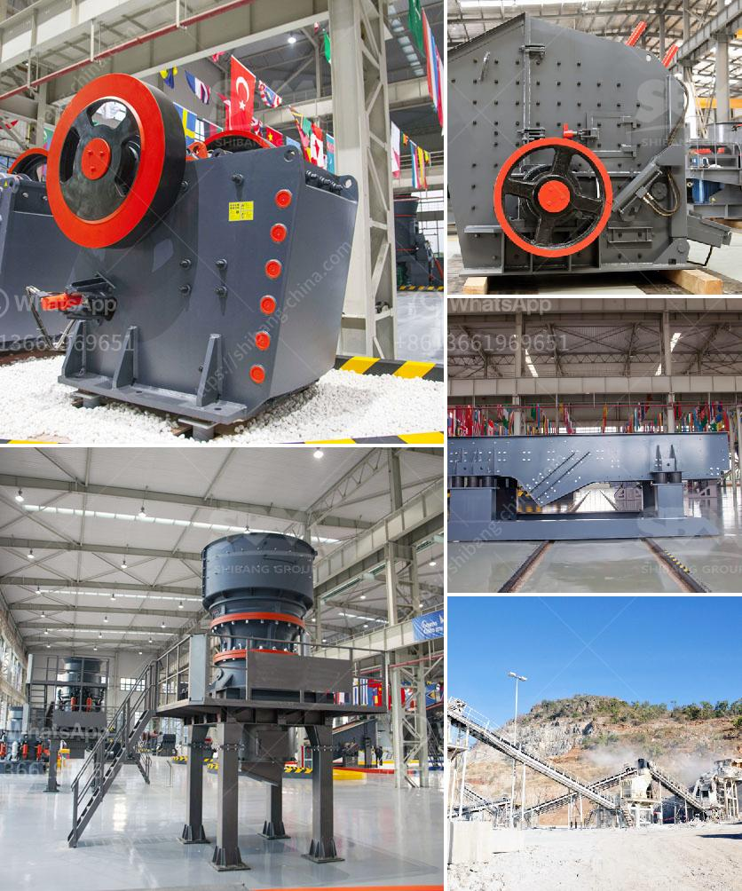

<h3>How to start crushed limestone production?</h3>
Crushed limestone, often referred to as limestone aggregate, is a versatile and beneficial material for a variety of construction and landscaping purposes. It’s commonly used in road construction, landscaping projects, and the production of cement. Limestone is an important raw material to create aggregates for the construction industry, as the quality of aggregates significantly impacts the strength and durability of the concrete.

If you’re considering starting a crushed limestone production business, here are some essential steps to follow:

Before starting any business, it is crucial to thoroughly research and understand the market dynamics, including the demand for crushed limestone in your area. Explore potential customers, such as construction companies, contractors, and landscapers, to gauge their interest and quantity requirements. Additionally, evaluate existing suppliers and their prices to determine the competitiveness of your product.

Finding an appropriate location for your limestone production business is vital. Look for areas with easily accessible limestone deposits. Consider factors such as proximity to transportation networks, availability of permits, and potential environmental impacts. Partnering with local experts and conducting a comprehensive environmental impact assessment can help ensure that your operations comply with regulations.

To start a limestone production business, you will need to secure various permits and licenses. These may include mining rights, environmental permits, and any other local, state, or federal requirements. Consult with local authorities and regulatory bodies to ensure compliance with all legal obligations.

Investments in the appropriate equipment and machinery are essential for successful limestone production. These may include crushers, conveyors, screens, and loaders. Purchase or lease the equipment that best suits your production needs and budget. Additionally, consider investing in a fleet of trucks for transportation purposes.

To establish a consistent supply of high-quality limestone, build strong relationships with reliable suppliers or explore the possibility of quarrying limestone on your own property. It’s crucial to ensure a steady flow of raw materials to meet the demand of your customers. Negotiate favorable contracts with suppliers to secure competitive prices, consistent quality, and timely delivery.

Develop efficient production processes that optimize the use of raw materials and generate high-quality crushed limestone. Implement quality control measures to ensure that your product meets industry standards. Investing in modern technology and automation can help increase production efficiency and reduce operational costs.

Develop a comprehensive marketing strategy to promote your crushed limestone business. Utilize both traditional and digital marketing platforms to reach potential customers. Engage in networking activities, participate in industry trade shows, and establish an online presence through a website and social media platforms. Collaborate with construction companies and industry-related associations to increase awareness and generate leads.

Starting a crushed limestone production business requires careful planning, comprehensive market research, and efficient operations. While it may require significant upfront investments, a well-executed limestone production business can be highly profitable in the construction and landscaping industries. Always strive to provide high-quality products, exceptional customer service, and maintain a strong industry reputation to ensure sustained success.
<h3>Contact us</h3><ul><li><strong>Whatsapp:&nbsp;<a href="https://wa.me/8613661969651">+8613661969651</a></strong></li><li><a href="https://swt.shibang-china.com/?git&amp;zhl&amp;How to start crushed limestone production"><strong>Online Service(chat now)</strong></a></li></ul><h3>Related</h3><ul><li><a href='How do I change the mantle of a cone crusher.md'>How do I change the mantle of a cone crusher?</a></li><li><a href='how to intall a jaw crusher ？.md'>how to intall a jaw crusher ？</a></li><li><a href='How to improve the crushing capacity of ball mill.md'>How to improve the crushing capacity of ball mill?</a></li><li><a href='how ores are classified .md'>how ores are classified ?</a></li><li><a href='How to install a conveyor belt for the coal mill.md'>How to install a conveyor belt for the coal mill?</a></li></ul>