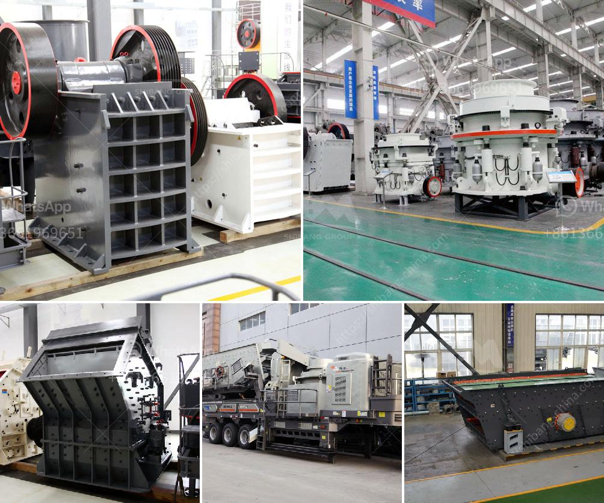

<h3>How to start gold ball mill unit?</h3>
Opening a gold ball mill unit requires a lot of work, but with the right planning and resources, it can be a profitable venture. This article will outline the steps to start a gold ball mill unit, including obtaining the necessary licenses, creating a business plan, and purchasing equipment.

Before starting any business, it is essential to obtain the necessary licenses and permits. In the case of a gold ball mill unit, you will need to research and comply with the local regulations and obtain the required mining and environmental permits. It is crucial to ensure that you adhere to all legal requirements to avoid any potential issues.

Understanding the gold market is crucial before starting a gold ball mill unit. Conduct a thorough market research to determine the demand for gold in your area and identify potential customers. This will help you gauge the market potential and plan your business strategies accordingly.

A well-thought-out business plan is the foundation of any successful business. Outline your goals, target market, financial projections, and strategies for acquiring and processing gold ore. Your business plan should also include your marketing and sales strategies, as well as a contingency plan in case of unforeseen challenges.

Starting a gold ball mill unit requires considerable upfront investment. You need to secure funding to cover equipment costs, materials, labor, and operational expenses. Approach potential investors or consider obtaining a business loan from financial institutions that specialize in supporting small businesses in the mining industry.

When setting up a gold ball mill unit, the location plays a crucial role. Look for a site that has sufficient access to power, water supply, and transportation infrastructure. Consider proximity to mining sites where you can source raw materials easily. The location should also meet any zoning requirements and environmental regulations.

Investing in the right equipment is vital for efficient gold extraction and processing. Consult with experts in the field to determine the equipment needed for your specific operation. This may include crushers, ball mills, concentrators, refining equipment, and safety gear. Research reputable suppliers, compare prices, and ensure you purchase equipment that meets quality standards and is suitable for your production needs.

To operate a gold ball mill unit successfully, you need a team of skilled workers. Employ experienced laborers who are knowledgeable about gold extraction processes and possess strong analytical and problem-solving skills. Additionally, make sure to implement the necessary safety protocols and provide training to ensure a safe working environment.

Implement marketing strategies to promote your gold ball mill unit and attract customers. Establish relationships with mining companies, jewelers, and investors who may be interested in buying your gold. Maintain a strong online presence, create a professional website, and utilize social media platforms to reach a wider audience. Continuously evaluate and adapt your business strategies to grow and thrive in the competitive gold market.

Starting a gold ball mill unit is no easy feat, but with careful planning and diligent execution of the steps outlined above, you can build a successful and profitable operation. Remember to comply with all legal requirements, invest in quality equipment, and prioritize safety in your operations. Stay focused, persevere through challenges, and always strive for continuous improvement to achieve long-term success in the gold mining industry.
<h3>Contact us</h3><ul><li><strong>Whatsapp:&nbsp;<a href="https://wa.me/8613661969651">+8613661969651</a></strong></li><li><a href="https://swt.shibang-china.com/?git&amp;zhl&amp;How to start gold ball mill unit"><strong>Online Service(chat now)</strong></a></li></ul><h3>Related</h3><ul><li><a href='How to choose crusher manufacturer.md'>How to choose crusher manufacturer?</a></li><li><a href='How to function the cone crusher .md'>How to function the cone crusher ?</a></li><li><a href='How to Improve the Crusher Productivity of Jaw Crusher ？.md'>How to Improve the Crusher Productivity of Jaw Crusher ？</a></li><li><a href='how to limit excess fines in crushing .md'>how to limit excess fines in crushing ?</a></li><li><a href='How to separate iron from manganese.md'>How to separate iron from manganese?</a></li></ul>