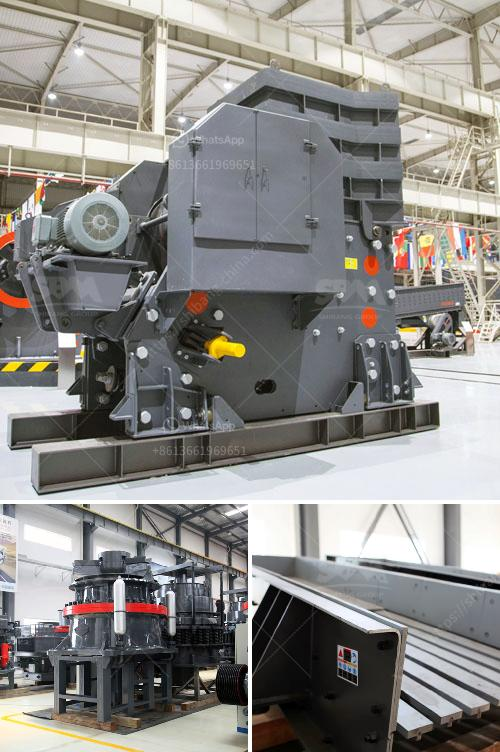

<h3>How to start stone crusher project?</h3>
Stone crushing industry is an important industrial sector in the country. This is due to the fact that it plays a vital role in constructing buildings and roads. Manufacturing crushed stone of different sizes and grades is sometimes called as stone crushing. This industry requires the use of different types of machinery for the crushing process. Stone crusher project can be a significant investment, but with the proper planning and understanding on how to start a stone crushing plant, it will greatly reduce project costs and increase business profits.

Firstly, determine the main purpose of stone crusher plant. The crusher plant is widely used in stone mining, metallurgy industry, building material, highway, railway and chemical industry for the purpose of crushing and mining stones. To match the international quality standards, stone crushing is an essential part of the mining industry nowadays.

Most importantly, this industry requires a material called stone pieces. Stone mining is a vocation mainly filled by people who are social outcasts or who have no other means of earning a living. Stones are essential raw materials for building and other infrastructure development purposes. As an industry, stone crushing provides numerous employment opportunities regardless of whether they are consumed by the local community or exported.

To start a stone crusher project, the promoter first needs to have a detailed understanding of the requirements for the project including the machinery to be used, manufacturing process, target market, investment budget, and profitability analysis. The machinery required in stone crusher project is as below:

Once the machinery is obtained, the next step is to install and set up the stone crusher plant. The land needs to be cleared and leveled to accommodate the crusher, structures, and other auxiliary equipment. A stone crushing plant requires sufficient space to accommodate the machinery and the actual operation of the plant.

Once the installation is complete and the crushing plant is up and running, material loading, feeding, crushing, and discharging should be smooth and uninterrupted. The material should be fed evenly into the jaw crusher or cone crusher to avoid overloading the machine and causing uneven crushing.

Additionally, it is important to regularly inspect and maintain the stone crusher to ensure smooth operation and prolong its lifespan. Routine maintenance includes checking and replacing wear parts, lubricating moving parts, and conducting regular inspections to identify and address any potential issues or damage.

Finally, it is crucial to have a marketing and distribution plan in place to sell the crushed stone products. Identify potential customers and establish strong relationships with them. Furthermore, determine the most cost-effective and efficient way to transport and deliver the products to customers.

In conclusion, starting a stone crusher project requires careful planning and careful execution to ensure desired outcomes are achieved. With the right machinery, equipment, and a well-prepared business plan, one can effectively set up a stone crushing plant for profit.
<h3>Contact us</h3><ul><li><strong>Whatsapp:&nbsp;<a href="https://wa.me/8613661969651">+8613661969651</a></strong></li><li><a href="https://swt.shibang-china.com/?git&amp;zhl&amp;How to start stone crusher project"><strong>Online Service(chat now)</strong></a></li></ul><h3>Related</h3><ul><li><a href='How to Design a Copper Processing Plant.md'>How to Design a Copper Processing Plant?</a></li><li><a href='How does bauxite crushers work.md'>How does bauxite crushers work?</a></li><li><a href='How can the throughput capacity of a ball mill be increased.md'>How can the throughput capacity of a ball mill be increased?</a></li><li><a href='How to remove feldspars from sand production.md'>How to remove feldspars from sand production?</a></li><li><a href='How to build a 600TPH mobile cone crusher.md'>How to build a 600TPH mobile cone crusher?</a></li></ul>