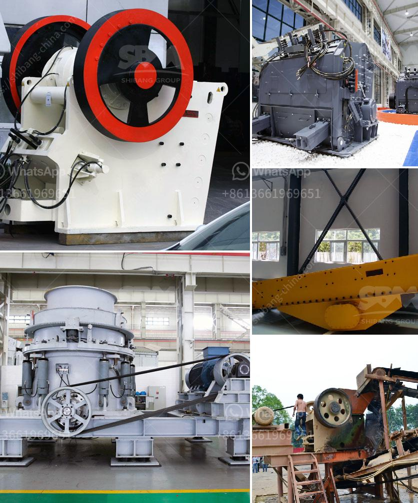

<h3>How to start stone crushing business in Ghana ?</h3>
Stone crushing businesses are essential to the construction industry, as they produce the necessary aggregate needed for concrete and asphalt manufacturing. In Ghana, the stone crushing industry has been growing rapidly due to the abundance of stones in every part of the country. With the continued increase in demand for these stones, there are opportunities for entrepreneurs to set up their own stone crushing businesses and contribute to the sustainable development of Ghana.

1. Market analysis: The first and foremost step in starting a stone crushing business is to conduct a comprehensive market analysis. This entails examining the key players in the industry, understanding their pricing policies, evaluating the market demand-supply dynamics, and identifying potential customers.

2. Source for raw materials: The availability and access to high-quality raw materials are essential for the success of a stone crushing business. Identify suitable sources or quarries that will provide you with a consistent supply of stones. It is crucial to assess the stone quality, the ease of extraction, transportation costs, and the potential environmental impact.

3. Site selection: Find a suitable location for your stone crushing business that is easily accessible to your target market. Consider factors such as proximity to major construction sites, transportation infrastructure, and availability of electricity and water supply. Ensure compliance with local regulations and obtain the necessary permits and licenses for operation.

4. Investment and financing: Determine the required investment for your stone crushing business. This includes the cost of acquiring the necessary equipment, hiring skilled workers, marketing, and operational expenses. Evaluate different financing options, such as bank loans, grants, or partnerships, to secure the necessary capital.

5. Equipment procurement: Acquire the necessary equipment for your stone crushing business. This may include a primary crusher, secondary crusher, vibrating screens, conveyor belt system, control panel, and various other machinery and equipment. Consider the capacity and efficiency of each equipment based on the expected production requirements.

6. Hiring and training: Hire skilled and experienced workers who have expertise in stone crushing operations. Provide them with proper training to ensure their safety and to maximize productivity. Ensure compliance with health and safety regulations, and establish standard operating procedures to minimize accidents and injuries.

7. Marketing and promotion: Develop a marketing plan to promote your stone crushing business. Utilize various marketing channels, such as social media, local directories, and online platforms, to create awareness about your products and services. Build relationships with contractors, builders, and construction companies to secure contracts and long-term partnerships.

Starting a stone crushing business in Ghana requires a lot of hard work and dedication. You must initially invest in getting the necessary machinery and equipment needed for the business. Additionally, you need to obtain the required licenses and permits to start operations. Conducting market research and developing a sound marketing strategy will help you penetrate the market and achieve success. With the right approach, a stone crushing business can be a profitable venture in Ghana.
<h3>Contact us</h3><ul><li><strong>Whatsapp:&nbsp;<a href="https://wa.me/8613661969651">+8613661969651</a></strong></li><li><a href="https://swt.shibang-china.com/?git&amp;zhl&amp;How to start stone crushing business in Ghana "><strong>Online Service(chat now)</strong></a></li></ul><h3>Related</h3><ul><li><a href='How to build a ball mill for grinding.md'>How to build a ball mill for grinding?</a></li><li><a href='How to effectively improve the production capacity of the crusher.md'>How to effectively improve the production capacity of the crusher?</a></li><li><a href='How to get the best aggregates after crushing and screening.md'>How to get the best aggregates after crushing and screening?</a></li><li><a href='how to calculate tons per hour ball mill machine .md'>how to calculate tons per hour ball mill machine ?</a></li><li><a href='How does a stone crushing plant work.md'>How does a stone crushing plant work?</a></li></ul>