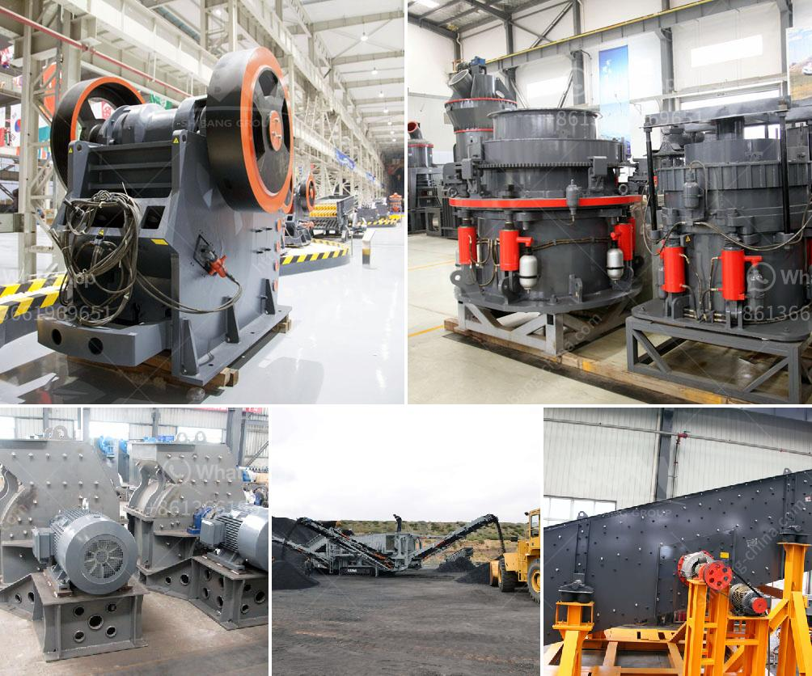

<h3>How to start stone mining hard rock crusher?</h3>
Are you interested in entering the mining industry and want to start extracting valuable stones from hard rocks? If so, you're in the right place. In this article, we will guide you through the process of starting a stone mining hard rock crusher, providing you with the essential steps and considerations to ensure a successful venture.

Before commencing any mining operation, it is crucial to conduct thorough research and planning. Begin by researching the types of stones found in your desired location, assessing the market demand and potential profitability. Make sure to study the local mining regulations, environmental impact assessments, and any permits or licenses required for mining operations.

Choose a suitable site for your stone mining operation. Assess the geology, availability of hard rocks, and evaluate potential risks associated with the location. Consider market proximity, transportation accessibility, and infrastructure such as roads and power supply. Additionally, ensure that the site is large enough to accommodate the crusher and other necessary equipment.

Investing in reliable and efficient machinery is essential for a successful stone mining operation. An important piece of equipment for this endeavor is a hard rock crusher. This device is designed to break large stones into smaller-sized rocks suitable for further processing. Consider factors such as capacity, power consumption, and maintenance requirements when selecting the right hard rock crusher for your operation.

Starting a stone mining hard rock crusher requires a significant investment. To fund your project, consider approaching financial institutions or private investors. Prepare a detailed business plan that showcases the potential profitability of the venture, including operational costs, revenue projections, and return on investment.

Mining operations have a significant impact on the environment. Ensure compliance with all environmental regulations and obtain necessary permits to mitigate any negative effects. Implement measures to prevent soil erosion, dust control, and proper wastewater disposal. Respect and protect the surrounding ecosystems to maintain a sustainable mining operation.

Providing a safe working environment is paramount for any mining operation. Develop a comprehensive safety plan that includes appropriate training for all employees, proper use of protective gear, and strict adherence to safety protocols. Regularly assess and mitigate potential risks associated with the operation, including falls, equipment malfunctions, and exposure to harmful substances.

Once your stone mining hard rock crusher operation is up and running smoothly, you may consider expanding and scaling up your business. Evaluate the demand in the market and explore opportunities to diversify your product range. Additionally, invest in modern technologies and equipment upgrades to enhance efficiency and productivity.

In conclusion, starting a stone mining hard rock crusher requires careful planning, research, and compliance with local regulations. Take the time to evaluate the market, select an appropriate site, invest in quality equipment, and prioritize safety and environmental considerations. By following these steps, you'll be well on your way to building a successful stone mining business.
<h3>Contact us</h3><ul><li><strong>Whatsapp:&nbsp;<a href="https://wa.me/8613661969651">+8613661969651</a></strong></li><li><a href="https://swt.shibang-china.com/?git&amp;zhl&amp;How to start stone mining hard rock crusher"><strong>Online Service(chat now)</strong></a></li></ul><h3>Related</h3><ul><li><a href='how does a grinding cement mill work？.md'>how does a grinding cement mill work？</a></li><li><a href='How to build sand and gravel wash plant.md'>How to build sand and gravel wash plant?</a></li><li><a href='How to start a crusher plant in Odisha.md'>How to start a crusher plant in Odisha?</a></li><li><a href='how much is an iron ore crushr machine？.md'>how much is an iron ore crushr machine？</a></li><li><a href='How to build a sand washing plant.md'>How to build a sand washing plant?</a></li></ul>