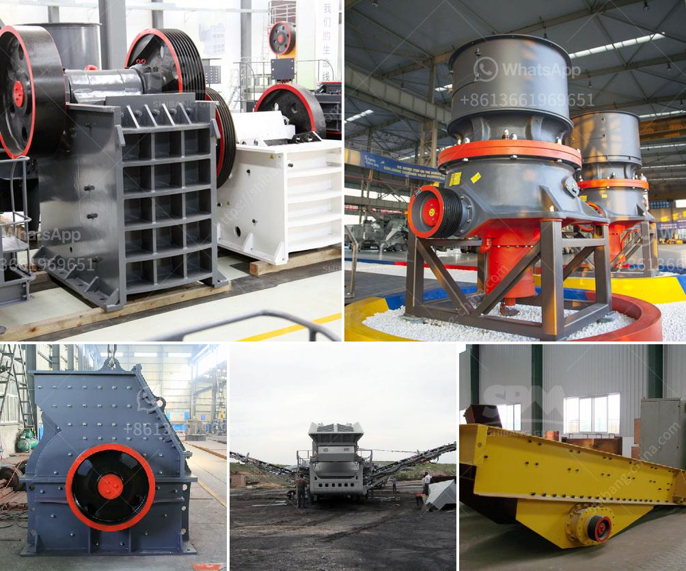

<h3>How to turn off crushing and screening plant?</h3>
Operating a crushing and screening plant can be a complicated task. It requires significant planning, coordination, and attention to detail to ensure that all aspects of the plant are functioning optimally and safely. However, knowing how to properly turn off the plant is equally essential to avoid accidents and equipment damage. In this article, we will outline a step-by-step guide on how to safely turn off a crushing and screening plant.

Before initiating the shutdown process, it is vital to inform the entire team about the plan. Hold a briefing session to ensure that every member of the team is aware and understands the importance of following the correct shutdown procedure. This will promote safety and prevent any miscommunication during the shutdown process.

First, stop the supply of material to the crushing and screening plant. Make sure that all conveyor belts are turned off and no material is being fed into the system. This step is crucial to prevent any accidental injuries and material blockages during the shutdown process.

The next step is to turn off the crushers in the plant. Start by cleaning up the area around the crushers to remove any residual material or debris. Ensure that the crushers are inactive before proceeding to the next steps. Consult the plant manual or reach out to the manufacturer for precise instructions on how to turn off the specific crushers being used.

After shutting down the crushers, it is essential to turn off the screens. Similar to the previous step, clear the area around the screens from any remaining material. Follow the manufacturer's instructions to safely power down the screens, ensuring that all operations are halted and no power supply is provided to the screens.

Aside from crushers and screens, many other pieces of machinery, like conveyors, generators, and motors, are typically present in a crushing and screening plant. Proceed to power down these devices by shutting off their power supply and following the manufacturer's instructions. Ensure that all machinery is completely turned off before moving on to the next step.

Once all machinery and equipment have been turned off, perform a final safety inspection. This includes checking for any remaining hazards, loose or damaged parts, and potential safety concerns. Address any issues identified during the inspection promptly to prevent accidents or damage when the plant is reactivated.

Finally, secure the entire crushing and screening plant. Lock any gates, restrict access to the area, and put up visible signs indicating that the plant is out of service. This prevents unauthorized individuals from entering the plant and ensures that no one accidentally starts up the machinery.

In conclusion, properly turning off a crushing and screening plant is essential for maintaining safety and preventing equipment damage. By following these step-by-step guidelines, operators can ensure a smooth and safe shutdown process. Remember to communicate with your team, cease the feeding process, shut down the crushers and screens, turn off other machinery, perform safety checks, and secure the area. Following these procedures will help maintain a safe working environment and extend the lifespan of the plant.
<h3>Contact us</h3><ul><li><strong>Whatsapp:&nbsp;<a href="https://wa.me/8613661969651">+8613661969651</a></strong></li><li><a href="https://swt.shibang-china.com/?git&amp;zhl&amp;How to turn off crushing and screening plant"><strong>Online Service(chat now)</strong></a></li></ul><h3>Related</h3><ul><li><a href='How to process metallic minerals .md'>How to process metallic minerals ?</a></li><li><a href='How to separate gold ore from rock.md'>How to separate gold ore from rock?</a></li><li><a href='How to measure the jaw crusher bearing temperature.md'>How to measure the jaw crusher bearing temperature?</a></li><li><a href='How does a rock crusher plant work.md'>How does a rock crusher plant work?</a></li><li><a href='How to maintain a coal crusher.md'>How to maintain a coal crusher?</a></li></ul>