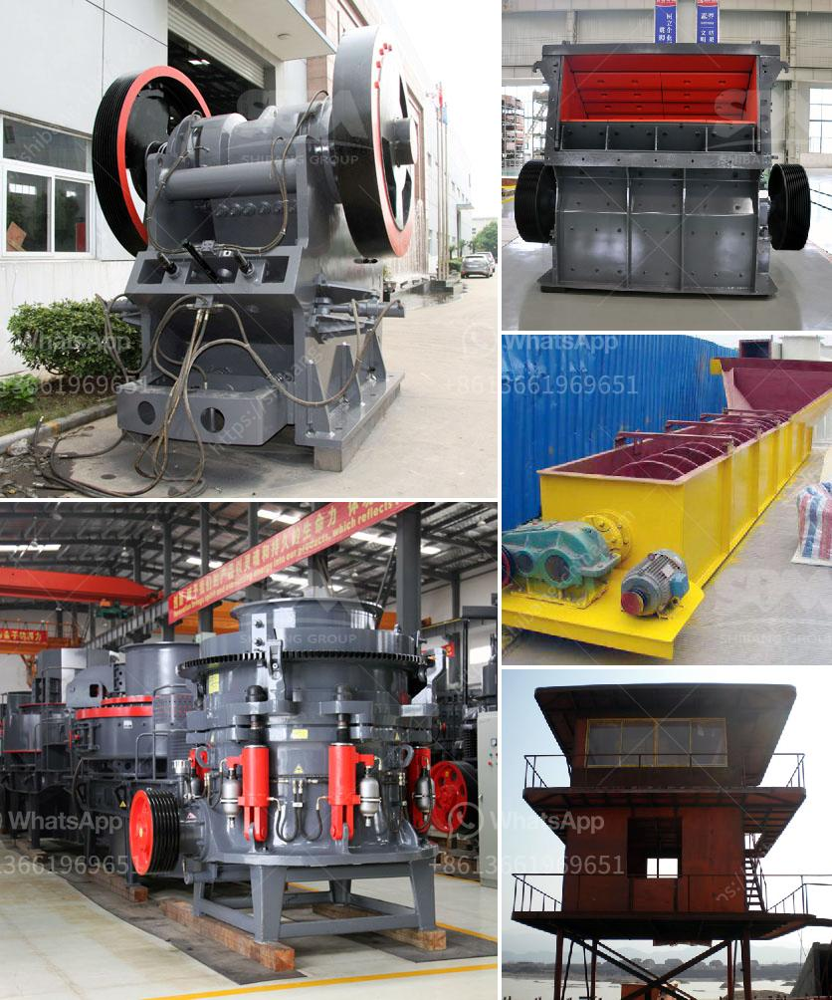

<h3>How to unjam a mine crushing mill?</h3>
Mining operations often rely on crushing mills to break down raw materials into smaller, more manageable pieces. While numerous types of mills exist, such as ball, rod, or hammer mills, the crushing process can be especially challenging for materials with a high amount of moisture or extremely hard rock formations. If a crushing mill becomes jammed, it can severely impact the efficiency and productivity of the mining operation. In this article, we will explore the steps involved in unjamming a mine crushing mill.

The first step in unjamming any crushing mill is to identify the root cause of the jam. This can be achieved by observing any abnormal noises, vibrations, or operational issues. Common causes of mill jams include oversize rocks, blockages in the feed chute, build-up of material in the mill, or mechanical failure of the equipment.

Once the jamming issue is detected, it is essential to shut down the mill to prevent any further damage or potential safety hazards. Isolate the mill from the power source and lock out/tag out all energy sources to ensure the equipment cannot be accidentally restarted.

After the mill is safely shut down, visually assess the chamber to determine the whereabouts of the jammed material. Most mills will have inspection doors or panels that can be opened for better access. Use appropriate safety equipment like gloves, goggles, and protective clothing before attempting to remove any jammed material. 

If the jam is caused by oversize rocks, it may be necessary to use heavy machinery or a hydraulic rock breaker to break the larger pieces into more manageable sizes. Once the obstructions are reduced in size, they can be safely removed from the mill chamber.

In cases where material build-up or blockages are causing the jam, it might be necessary to manually clean the mill. This can be done using shovels, brushes, compressed air, or even high-pressure water jets, depending on the nature of the blockage. However, caution must be exercised not to damage the mill's internal components during the cleaning process.

While removing the jammed material, it is essential to inspect the milling equipment for any damage. If any components are found to be faulty or broken, they should be repaired or replaced before restarting the mill. It may be necessary to consult with mill manufacturers, suppliers, or specialized technicians to ensure proper repairs are undertaken.

Once the jam is resolved, all safety precautions have been taken, and any damaged components have been repaired or replaced, it is time to restart the mill. Observe the mill's operation for any abnormal behavior and make necessary adjustments to optimize its performance.

Prevention is always better than cure, so regular maintenance and inspection of crushing mills are crucial to reduce the likelihood of jams. However, in the event of a jam, following these steps will help to unjam the mill efficiently and effectively, minimizing downtimes and ensuring the continuity of mining operations.
<h3>Contact us</h3><ul><li><strong>Whatsapp:&nbsp;<a href="https://wa.me/8613661969651">+8613661969651</a></strong></li><li><a href="https://swt.shibang-china.com/?git&amp;zhl&amp;How to unjam a mine crushing mill"><strong>Online Service(chat now)</strong></a></li></ul><h3>Related</h3><ul><li><a href='how to pulverized limestone crusher ？.md'>how to pulverized limestone crusher ？</a></li><li><a href='How to cut costs for a quarry.md'>How to cut costs for a quarry?</a></li><li><a href='how a stone crusher operates ？.md'>how a stone crusher operates ？</a></li><li><a href='How to become a large mineral processing equipment supplier.md'>How to become a large mineral processing equipment supplier?</a></li><li><a href='How to install a stone crusher plant.md'>How to install a stone crusher plant?</a></li></ul>