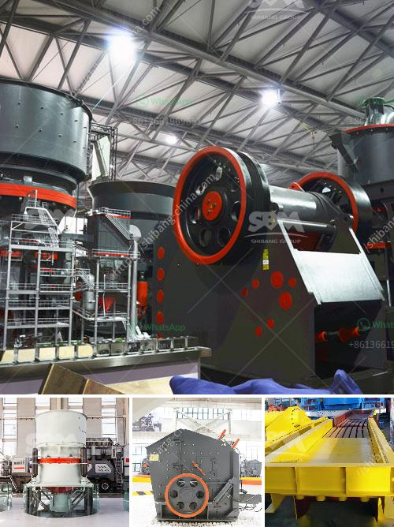

<h3>How to use mineral processing equipment for tin ore beneficiation ?</h3>
Mineral processing refers to the process of separating valuable minerals from their ores. In the case of tin ore beneficiation, mineral processing equipment is used to improve the grade and purity of tin ore, thereby achieving better economic benefits. The following article will introduce the common equipment used in tin ore beneficiation and how to use them effectively.

Crushing is an essential process for the extraction and processing of tin ore. The first stage of the crushing process usually involves a jaw crusher or gyratory crusher to reduce the raw ore to a proper size for further grinding. The selection of the crushing equipment depends on the properties of the tin ore and the desired particle size.

After the crushing process, the tin ore needs to be ground into a fine particle size to facilitate further separation. Commonly used grinding equipment includes ball mills, rod mills, and vertical mills. The choice of the grinding equipment depends on the fineness of the tin ore and the required production capacity. It is important to choose the right grinding equipment to ensure efficient and cost-effective beneficiation.

Gravity separation is a widely used method for tin ore beneficiation. It relies on the difference in density between tin ore minerals and gangue minerals to achieve separation. Gravity separation equipment includes jigs, shaking tables, spiral chutes, and centrifugal concentrators. These devices are designed to exploit the specific gravity difference between minerals and facilitate the separation process.

Magnetic separation is another effective method for tin ore beneficiation, especially for the recovery of fine-grained tin minerals. Magnetic separators, including high-intensity magnetic separators and wet magnetic separators, can be used to separate magnetic minerals from non-magnetic minerals. The choice of magnetic separation equipment depends on the magnetic properties of the tin ore.

Flotation is a commonly used method for treating tin ores with high calcium and magnesium content or complex mineral composition. Flotation equipment, such as flotation cells and flotation machines, can be used to selectively separate different minerals in the ore. It is crucial to optimize the flotation process parameters, such as reagent dosage and flotation time, to achieve satisfactory beneficiation results.

In conclusion, the effective use of mineral processing equipment is essential for tin ore beneficiation. By selecting the appropriate equipment and optimizing the beneficiation process, the grade and purity of tin ore can be improved, resulting in greater economic benefits. It is important to consider factors such as the physical and chemical properties of the ore, the desired particle size, and production capacity when choosing and using mineral processing equipment. With proper operation and maintenance, mineral processing equipment can play a significant role in tin ore beneficiation.
<h3>Contact us</h3><ul><li><strong>Whatsapp:&nbsp;<a href="https://wa.me/8613661969651">+8613661969651</a></strong></li><li><a href="https://swt.shibang-china.com/?git&amp;zhl&amp;How to use mineral processing equipment for tin ore beneficiation "><strong>Online Service(chat now)</strong></a></li></ul><h3>Related</h3><ul><li><a href='How to control vibrating screen .md'>How to control vibrating screen ?</a></li><li><a href='How to make the design of gold mining plant .md'>How to make the design of gold mining plant ?</a></li><li><a href='How to improve the crushing capacity of ball mill.md'>How to improve the crushing capacity of ball mill?</a></li><li><a href='How to concentrate gold in hard rock.md'>How to concentrate gold in hard rock?</a></li><li><a href='How to choose crushing limestone machinery.md'>How to choose crushing limestone machinery?</a></li></ul>