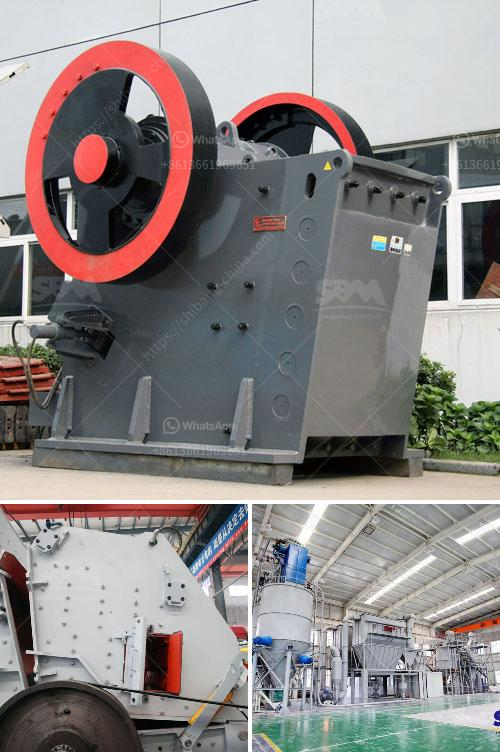

<h3>How to use the impact crusher ？</h3>
The impact crusher is a versatile and efficient machine that can be used in many industries. It is ideal for crushing and processing various materials such as limestone, dolomite, and gravel. However, unlike the jaw crusher, the impact crusher operates in a different way. So, how does an impact crusher work?

The working principle of the impact crusher is relatively simple. It uses a rotating hammer on the rotor to generate high-speed impact and breakage of the material. When the material enters the action area of the hammer, it undergoes a series of impacts with the hammer, then it is thrown onto the impact plate, and crushed further. The material is finally discharged from the bottom of the impact crusher.

To use the impact crusher correctly, you must first understand the practical operation of the crusher. So, before starting the machine, be sure to check the circuit breaker, safety valve, oil pump, oil reservoir, hopper, electric motor, and other components. And make sure they are in good working condition.

Before starting the machine, check the rotor for any tightness, wear, or damage. If any abnormalities are found, please replace them immediately. In addition, check if the rotor is running correctly and if the rotor and the body are tightly connected.

A proper and consistent feed size will ensure the efficient operation of the impact crusher. Too large or too small feed size will affect the production efficiency and output of the machine. Adjust the size of the feed opening to match the size of the material being crushed.

The gap between the impact plate and the rotor is an important parameter to consider when adjusting the output size. By adjusting the gap, you can control the size of the finished product. Generally, a smaller gap will result in finer output size, while a larger gap will produce coarser output size.

The hammers of the impact crusher are prone to wear over time. It is necessary to regularly replace the worn hammers to maintain the efficiency of the machine. Be sure to choose the right type of hammer when replacing them to avoid affecting the balance of the rotor.

The impact plate and lining plate inside the impact crusher are prone to wear due to the impact of the material. Therefore, regular inspection and maintenance are necessary to ensure the service life of these parts. Replace them in time if they are worn beyond the acceptable range.

In conclusion, the impact crusher is a versatile and efficient machine that can be used in many industries. However, to use the machine effectively, you must know the working principles and practical operation methods. By following the proper steps, you can maximize the efficiency and output of the impact crusher, ensuring high-quality finished products in your production process.
<h3>Contact us</h3><ul><li><strong>Whatsapp:&nbsp;<a href="https://wa.me/8613661969651">+8613661969651</a></strong></li><li><a href="https://swt.shibang-china.com/?git&amp;zhl&amp;How to use the impact crusher ？"><strong>Online Service(chat now)</strong></a></li></ul><h3>Related</h3><ul><li><a href='How to Make Sand from River Pebbles ？.md'>How to Make Sand from River Pebbles ？</a></li><li><a href='how to own quarry in nigeria.md'>how to own quarry in nigeria?</a></li><li><a href='How to increase productivity in ball mill.md'>How to increase productivity in ball mill?</a></li><li><a href='How to design a crushing plant .md'>How to design a crushing plant ?</a></li><li><a href='How to commission a limestone crusher first.md'>How to commission a limestone crusher first?</a></li></ul>