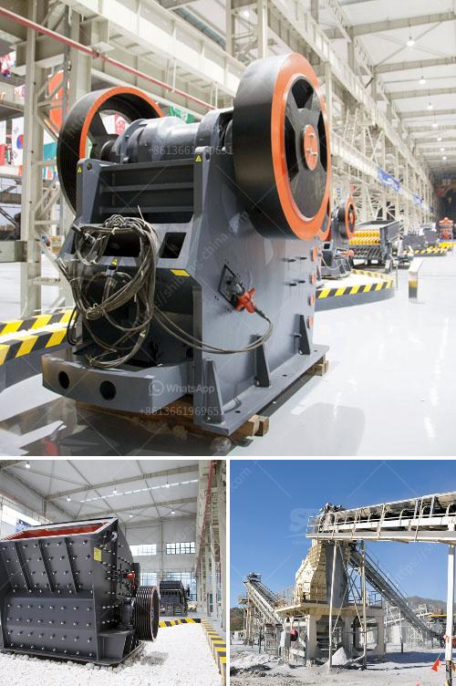

<h3>How to use the sand making machine?</h3>
The sand making machine is a powerful device that can transform raw materials into construction sand quickly and efficiently. With the rapid development of infrastructure projects, the demand for sand is increasing, making it an essential component in the construction industry. Learning how to use the sand making machine effectively is crucial to producing high-quality sand and ensuring project success. Here are some essential steps to guide you in using the sand making machine.

Before operating the sand making machine, gather all the necessary materials. These typically include crushed stone, gravel, or pebbles, which will be used as the raw materials for sand production. Ensure that the materials are clean, free of impurities, and have a suitable particle size for the sand making process.

Before starting the machine, carefully inspect it to ensure it is in proper working condition. Check for any loose or damaged parts that may hinder the machine's performance. Tighten any loose bolts and make any necessary repairs or replacements before proceeding.

Once the machine has been inspected, turn on the power supply and start the sand making machine. Make sure to follow the manufacturer's instructions for starting the machine and allow it to run for a few minutes to warm up.

The sand making machine is equipped with various settings that can be adjusted according to specific requirements. These settings include the speed of the rotor, the amount of feed material, and the size of the finished sand. Adjust these settings based on the desired outcome and the characteristics of the raw materials being used.

During the sand making process, closely monitor the machine's operation to ensure it is functioning correctly. Pay attention to any unusual noises or vibrations, as they may indicate potential issues. Regularly check the sand production output and adjust the settings if necessary to achieve the desired quantity and quality of sand.

To ensure the sand making machine operates efficiently and has a long lifespan, regular maintenance is essential. Clean the machine after use, removing any residual sand or debris that has accumulated. Lubricate the machine's moving parts as per the manufacturer's recommendations. Additionally, inspect the machine periodically for any signs of wear and tear and address any issues promptly.

After completing the sand making process, turn off the power supply and shut down the machine. Allow the machine to cool down before performing any maintenance or cleaning tasks. Always follow the proper shutdown procedures outlined in the manufacturer's guidelines to avoid any accidents or damage to the machine.

In conclusion, the sand making machine is a valuable tool in the construction industry. By following the above steps, you can effectively use the machine to produce high-quality sand for various construction projects. Remember to prioritize safety and regularly maintain the machine to ensure its optimal performance and longevity.
<h3>Contact us</h3><ul><li><strong>Whatsapp:&nbsp;<a href="https://wa.me/8613661969651">+8613661969651</a></strong></li><li><a href="https://swt.shibang-china.com/?git&amp;zhl&amp;How to use the sand making machine"><strong>Online Service(chat now)</strong></a></li></ul><h3>Related</h3><ul><li><a href='How to extract iron efficiently from silica.md'>How to extract iron efficiently from silica?</a></li><li><a href='How to separate gold from sand with machine .md'>How to separate gold from sand with machine ?</a></li><li><a href='How can we increase the production of the jaw crusher.md'>How can we increase the production of the jaw crusher?</a></li><li><a href='How to Build a Sand Washing Plant in Indonesia ？.md'>How to Build a Sand Washing Plant in Indonesia ？</a></li><li><a href='How will the bauxite crusher work.md'>How will the bauxite crusher work?</a></li></ul>