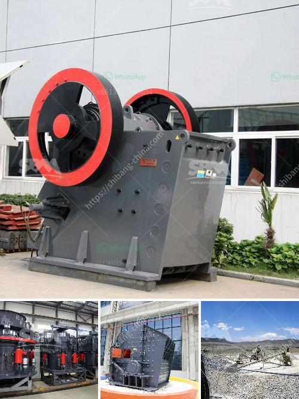

<h3>How to wash clay out of bauxite?</h3>
Bauxite, the primary source of aluminum, is a naturally occurring ore composed mainly of aluminum hydroxide minerals, along with other impurities such as clay. Clay particles in bauxite can hinder the extraction and refining process, reducing the quality and quantity of the final aluminum product. Therefore, it is crucial to effectively wash out clay from bauxite before processing. In this article, we will explore various methods to achieve efficient clay removal, ensuring higher-quality bauxite for aluminum production.

Before any washing process can begin, the bauxite ore must first be screened and crushed, breaking it into smaller particles for easier handling. A vibrating screen is commonly used to remove larger particles while a jaw crusher or gyratory crusher can be employed for the initial crushing stage.

Once the bauxite is crushed and sorted, scrubbing is the next step in the clay removal process. Scrubbers, typically horizontal trommel screens, are utilized to scrub the bauxite by tumbling it with water. This mechanical action helps break down the clay lumps present and disintegrate them into smaller particles. Additionally, water sprays within the scrubber further aid in diluting the clay and suspending it for removal.

After scrubbing, the bauxite slurry undergoes a washing process. The slurry is pumped into settling tanks or clarifiers where it is allowed to settle for a period of time. As gravity causes the heavier clay particles to sink to the bottom, the clarified water at the top can be drained out and reused for further washing cycles. The settled clay, commonly called red mud, is discarded as waste.

Desilication is a crucial step in the clay removal process. Various methods can be employed to break down the remaining silica particles present in the bauxite, after clay removal. One common desilication method is to subject the bauxite slurry to elevated temperatures and pressures in an autoclave. Alkali reagents such as sodium hydroxide are often added during this process to aid in dissolving the silica.

Once the clay and silica have been effectively removed, the bauxite particles are classified according to size using cyclones, hydrocyclones, or filtration techniques. This ensures a more uniform bauxite product for further processing. Finally, the classified bauxite is dried to reduce moisture content, making it suitable for shipment or subsequent aluminum extraction processes.

In conclusion, the efficient washing of clay out of bauxite is critical to obtain high-quality ore for aluminum production. Screening, crushing, scrubbing, and washing are integral steps in this process, effectively removing impurities such as clay and silica. Reliable machinery, such as vibrating screens, crushers, and scrubbers, along with proper settling tanks and classification techniques, facilitate the clay removal process. By implementing these steps, aluminum production can be optimized, ensuring the production of quality aluminum products.
<h3>Contact us</h3><ul><li><strong>Whatsapp:&nbsp;<a href="https://wa.me/8613661969651">+8613661969651</a></strong></li><li><a href="https://swt.shibang-china.com/?git&amp;zhl&amp;How to wash clay out of bauxite"><strong>Online Service(chat now)</strong></a></li></ul><h3>Related</h3><ul><li><a href='How to set up a granite processing plant.md'>How to set up a granite processing plant?</a></li><li><a href='How do you calculate the motor power for a vibrator screen.md'>How do you calculate the motor power for a vibrator screen?</a></li><li><a href='how to build a concrete wash rack for heavy equipment .md'>how to build a concrete wash rack for heavy equipment ?</a></li><li><a href='How the mechanism sand is produced .md'>How the mechanism sand is produced ?</a></li><li><a href='How to design an iron ore processing facility with crushing and beneficiation.md'>How to design an iron ore processing facility with crushing and beneficiation?</a></li></ul>