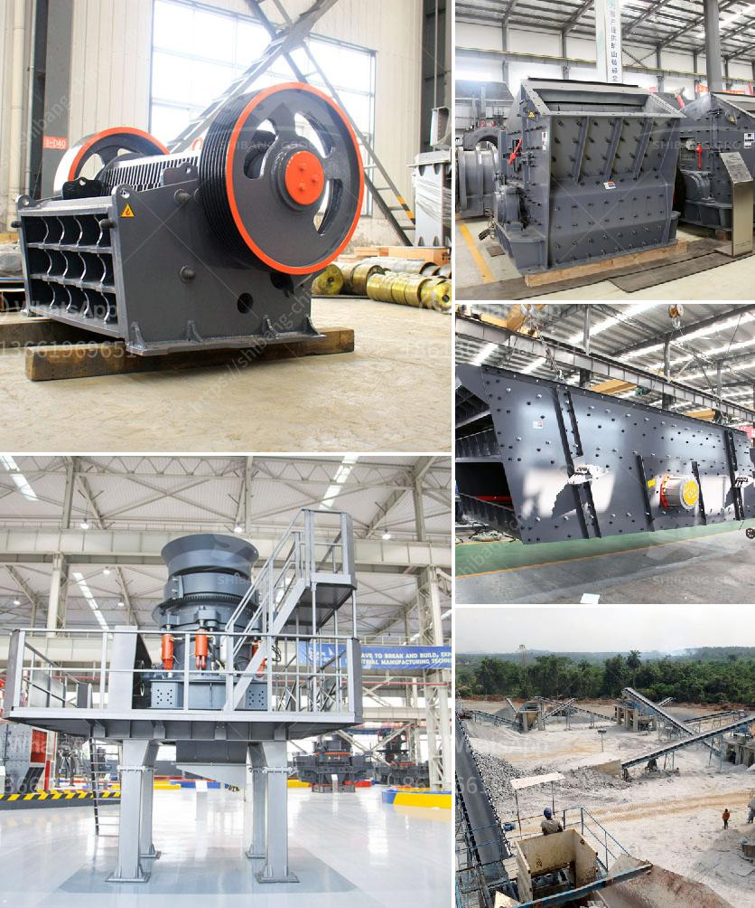

<h3>How to wash manufacturing sand ?</h3>
Manufacturing sand is a crucial component in the construction industry. It is mainly produced through the crushing of rocks, stones, or gravel. This sand is used for several purposes, including producing concrete, asphalt, and mortar. However, before it can be used, it needs to be properly washed to ensure its cleanliness and remove any impurities. In this article, we will provide a step-by-step guide on how to wash manufacturing sand effectively.

Before starting the washing process, it is essential to prepare the sand properly. Start by removing any large debris or unwanted materials, such as rocks or branches, from the sand. This can be done by handpicking or using a sieve to separate them from the sand. Once the large particles are removed, the sand is ready for the washing process.

The first step in washing manufacturing sand is wet screening. This process involves spreading the sand on a screen and spraying it with water to wash away any dirt or impurities. The screen should have small holes to allow water and fine materials to pass through while retaining the larger particles.

After wet screening, it is time to scrub the sand to further remove any stubborn impurities. This can be done using a scrubber or a rotating brush. The sand is poured into a tank, and the scrubber agitates it, ensuring that all the particles are thoroughly cleaned. The scrubbing process helps in removing clay, silt, or organic matter that may be present in the sand.

Once the sand has been scrubbed, it needs to settle to separate the clean sand from the dirty water. The tank in which the scrubbing process took place is left undisturbed for a specified period to allow the sand particles to settle at the bottom. This settling process helps in removing any fine particles that may still be suspended in the water.

After settling, the clean sand is drained, leaving the dirty water behind. The sand is then rinsed with clean water to remove any remaining impurities or residues. This can be done by pouring water over the sand or using a hose to rinse it. It is important to rinse thoroughly to ensure that all the impurities are removed completely.

The final step in the process of washing manufacturing sand is drying it properly. Drying the sand ensures that it is free from moisture and ready to be used in construction applications. The drying process can be done naturally by spreading the sand in a dry and well-ventilated area or by using specialized drying equipment.

In conclusion, washing manufacturing sand is an essential process to ensure its cleanliness and remove any impurities. By following the steps outlined above, you can effectively wash manufacturing sand and make it suitable for various construction purposes. Properly washed sand will not only enhance the quality of your construction materials but also contribute to the durability and strength of the final products.
<h3>Contact us</h3><ul><li><strong>Whatsapp:&nbsp;<a href="https://wa.me/8613661969651">+8613661969651</a></strong></li><li><a href="https://swt.shibang-china.com/?git&amp;zhl&amp;How to wash manufacturing sand "><strong>Online Service(chat now)</strong></a></li></ul><h3>Related</h3><ul><li><a href='How to disassemble the jaw plate of jaw crusher.md'>How to disassemble the jaw plate of jaw crusher?</a></li><li><a href='How to separate iron from manganese.md'>How to separate iron from manganese?</a></li><li><a href='How can we solve the problem of the crusher bearing heating.md'>How can we solve the problem of the crusher bearing heating?</a></li><li><a href='how to start a stone crushing business in USA .md'>how to start a stone crushing business in USA ?</a></li><li><a href='How to increase the output of jaw crusher .md'>How to increase the output of jaw crusher ?</a></li></ul>