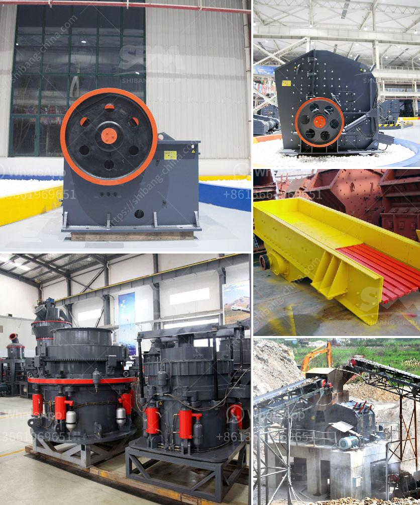

<h3>How to weld the broken jaw plate of jaw crusher?</h3>
A jaw crusher is a type of primary crusher used in mines and ore processing plants. Jaw crushers are designed to crush the toughest materials through the use of compressive force (pressure). The jaw crusher design includes a set of two vertical jaws—a fixed (stationary) jaw and a swing (reciprocating) jaw. The swing jaw moves back and forth by a cam or pitman mechanism, acting like a nutcracker to partially crush or fragment larger materials to smaller ones.

However, due to the heavy workload and extreme conditions, jaw crusher parts are prone to wear and breakage. One of the critical parts that tend to fail prematurely in a jaw crusher is the jaw plate. In the event of a jaw plate failure, it is crucial to quickly and effectively repair or replace the damaged component to minimize downtime and ensure the crusher's optimal performance.

Welding is one of the most commonly used methods for repairing broken or damaged jaw plates. Here is a step-by-step guide on how to weld the broken jaw plate of a jaw crusher:

1. Clean the jaw plate and the surface of the frame carefully. Inspect the jaw plate for any cracks, deformations, or worn areas. It is essential to remove any dirt, debris, or grease present on both surfaces to ensure a strong weld.

2. Preheat the jaw plate and the frame to prevent thermal shocks during the welding process. Use oxy-acetylene torches or any other suitable heat source uniformly. Gradually heat the entire area until it reaches a temperature of about 300-350℃ (572-662°F). Maintain this temperature for approximately one hour.

3. Select the appropriate welding electrode or filler wire that matches the material properties of the jaw plate and the frame. Commonly used electrodes are austenitic manganese steel electrodes or high-strength welding wires.

4. In case of severe damage or cracks, you may need to create V-grooves or bevel the edges of the broken jaw plate to promote better fusion of the weld material. Use a suitable angle grinder or cutting tool for this task.

5. Position the broken jaw plate on the frame, ensuring it aligns correctly with the swing jaw and the fixed jaw. Clamp or secure the plate in place using welding clamps or a vice.

6. Begin welding the broken jaw plate. Start by making a tack weld at one end of the break using short bursts of welding current. Continue the tack welds along the length of the crack, maintaining a small gap between each tack weld. This technique helps prevent heat build-up and reduces the risk of thermal deformation or cracking.

7. After completing the tack welds, proceed to fill the gaps between the tack welds with the welding electrode or filler wire. Use a suitable welding technique, such as a back-and-forth motion or a circular pattern, to ensure sufficient weld penetration and fusion.

8. Once the welds are completed, allow the welded jaw plate to cool down gradually. Avoid sudden cooling or quenching, as it may cause the welds to become brittle and prone to cracking.

9. Finally, grind or smooth the surface of the welded jaw plate to remove any excess weld material or imperfections.

In conclusion, welding is a reliable and effective method to repair broken jaw plates of a jaw crusher. By following the steps outlined above, you can ensure a successful welding process, restoring the jaw crusher's functionality and prolonging its service life. However, it is important to note that complex or extensive jaw plate fractures may require the assistance of professional welders or specialized repair techniques.
<h3>Contact us</h3><ul><li><strong>Whatsapp:&nbsp;<a href="https://wa.me/8613661969651">+8613661969651</a></strong></li><li><a href="https://swt.shibang-china.com/?git&amp;zhl&amp;How to weld the broken jaw plate of jaw crusher"><strong>Online Service(chat now)</strong></a></li></ul><h3>Related</h3><ul><li><a href='How to choose a generator for a crusher plant .md'>How to choose a generator for a crusher plant ?</a></li><li><a href='How to change the blow bars on an impact crusher.md'>How to change the blow bars on an impact crusher?</a></li><li><a href='How to maintain the jaw crusher.md'>How to maintain the jaw crusher?</a></li><li><a href='How to increase the production capacity of stone grinding machine ？.md'>How to increase the production capacity of stone grinding machine ？</a></li><li><a href='How to build iron ore crushing line in Malaysia .md'>How to build iron ore crushing line in Malaysia ?</a></li></ul>