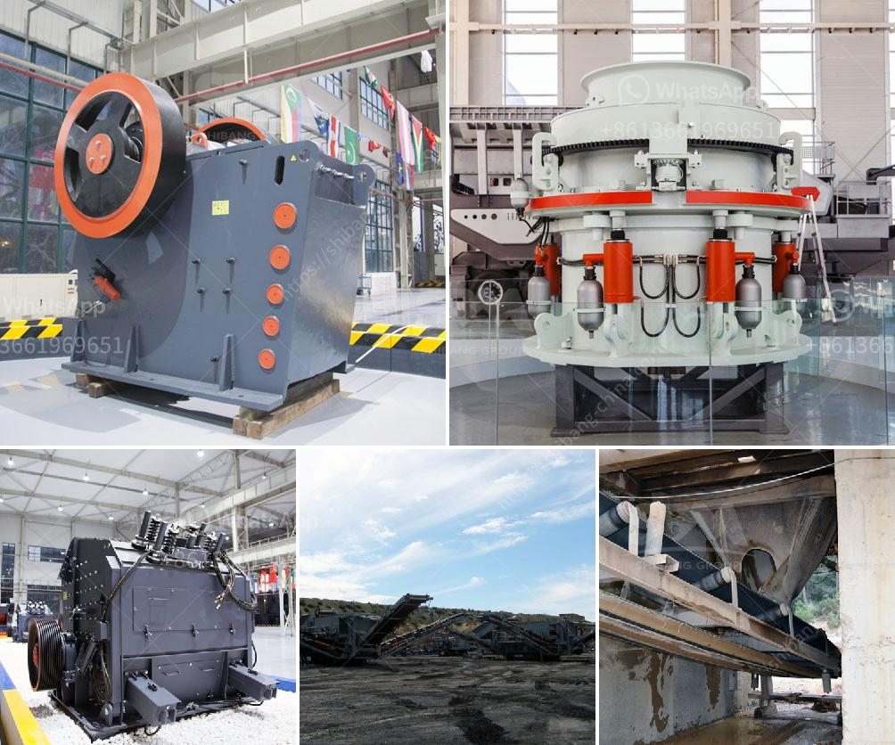

<h3>How to work a gyratory crusher?</h3>
A gyratory crusher is often used as a primary crusher, providing a controlled feed for the subsequent crushing stages. Gyratory crushers can be operated in both the raw material and the recycling industries, and they are a popular choice for the crushing stage in mining operations.

Gyratory crushers have a solid cone-shaped bowl. The rotating cone carries the mantle, which is covered with a wear resistant layer that ensures longer life of the crusher. The mantle is supported by spherical bearings at the upper and lower end of the main shaft. These bearings can handle high impact loads, reducing the risk of fatigue cracks in the supporting structure.

To operate a gyratory crusher, a worker places ore in the top of the crusher and carefully lowers the mantle while applying pressure to the ore. The amount of pressure applied will depend on the desired size reduction ratio and the strength of the ore.

Once the ore is in the crusher, the mantle can rotate freely. It is driven by the main shaft, eccentric, and then it is squeezed against the concave liners. The space between the mantle and the concave liners is called the crushing chamber. The size of this space can be adjusted by moving the concave liners closer to or further away from the mantle.

The gyratory crusher works on the principle of eccentricity, which is the layer between the mantle and the concave liners. When the mantle moves, the gap between the mantle and the concave liners decreases, causing the rock to be crushed into smaller pieces. The crushed material then exits the crushing chamber through the discharge opening at the bottom of the crusher. This process is repeated continuously as the mantle rotates, allowing for a constant flow of material through the crusher.

To ensure the optimal performance of a gyratory crusher, regular maintenance is essential. This includes inspecting and cleaning the crusher regularly, as well as checking the condition of the wearing parts and replacing them when necessary. Additionally, lubricating all moving parts and ensuring a proper oil level in the lubrication system will contribute to the efficient operation of the crusher.

In conclusion, a gyratory crusher is a versatile crushing machine that allows for a controlled feed of material and is commonly used in mining operations. By carefully lowering the mantle and applying pressure to the ore, the gyratory crusher works to crush materials into smaller pieces. Regular maintenance is key to ensuring the crusher's optimal performance. As with any machinery, proper care and attention will extend the life and efficiency of the equipment.
<h3>Contact us</h3><ul><li><strong>Whatsapp:&nbsp;<a href="https://wa.me/8613661969651">+8613661969651</a></strong></li><li><a href="https://swt.shibang-china.com/?git&amp;zhl&amp;How to work a gyratory crusher"><strong>Online Service(chat now)</strong></a></li></ul><h3>Related</h3><ul><li><a href='How to set up the stone crusher project .md'>How to set up the stone crusher project ?</a></li><li><a href='how much does rock crusher cost ？.md'>how much does rock crusher cost ？</a></li><li><a href='How to choose a basalt crusher？.md'>How to choose a basalt crusher？</a></li><li><a href='How to ensure the efficient operation of impact crusher.md'>How to ensure the efficient operation of impact crusher?</a></li><li><a href='How to repair a damaged ball mill shaft.md'>How to repair a damaged ball mill shaft?</a></li></ul>