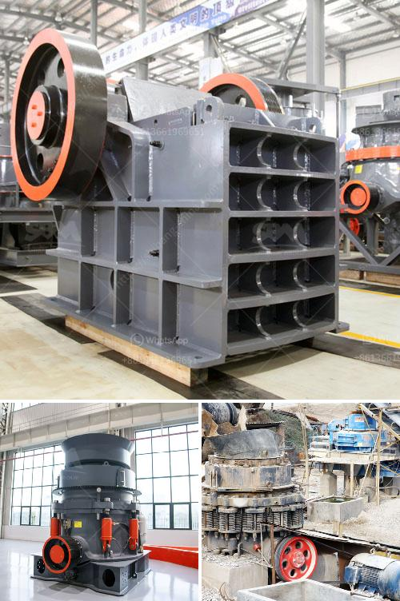

<h3>How to work a roller grinding mill?</h3>
A roller grinding mill is a widely used machine used in the mining industry to grind various materials into fine powders. It is used to crush, grind, and pulverize the raw materials to make the desired products. In this article, we will discuss how to operate a roller grinding mill effectively and efficiently.

1. Understand the operation process: Before using a roller grinding mill, it is essential to understand its operation process thoroughly. Familiarize yourself with its components and their functions. The main parts of a roller grinding mill include the grinding rollers, the grinding ring, the air classifier, the feed inlet, and the outlet. Each part plays a crucial role in the milling process.

2. Proper installation and maintenance: Once you have a good understanding of the roller grinding mill, ensure that it is properly installed and maintained. Check all the nuts and bolts, and ensure everything is tightened. Lubricate the machine regularly to prevent any friction or damage in the moving parts.

3. Adjust the grinding gap: The grinding gap is the space between the grinding rollers and the grinding ring. It determines the size of the final product. Adjusting the grinding gap is essential to achieve the desired level of fineness. Start with a larger gap and gradually reduce it until you obtain the desired particle size.

4. Control the air flow: The air flow plays a vital role in the grinding process. It helps to carry the ground material out of the mill and control the temperature inside the machine. A high airflow promotes better grinding efficiency, whereas a low airflow may result in material buildup and decrease the mill's performance. Therefore, monitor and adjust the air flow to ensure optimal grinding conditions.

5. Feed the materials evenly: The roller grinding mill has a feed inlet through which the raw materials are introduced. It is essential to feed the materials evenly to prevent overloading the mill and ensure a smooth operation. Uneven feeding can lead to material clogging or uneven grinding, which affects the quality of the final product.

6. Regularly inspect and clean: Regular inspection and cleaning of the roller grinding mill are crucial for its smooth operation. Look for any signs of wear and tear, loose parts, or material buildup. Clean the grinding rollers, grinding ring, and air classifier to remove any debris or impurities. This will help maintain the mill's performance and prolong its lifespan.

7. Safety precautions: Lastly, always prioritize safety when working with a roller grinding mill. Wear protective gear, such as gloves and goggles, to avoid any accidents or injuries. Follow the manufacturer's instructions and guidelines for safe operation.

In conclusion, operating a roller grinding mill requires a good understanding of its operation process, proper installation and maintenance, adjustment of grinding gap and air flow, feeding the materials evenly, regular inspection and cleaning, and adherence to safety precautions. By following these steps, you can effectively and efficiently work a roller grinding mill, ensuring high-quality and consistent end products.
<h3>Contact us</h3><ul><li><strong>Whatsapp:&nbsp;<a href="https://wa.me/8613661969651">+8613661969651</a></strong></li><li><a href="https://swt.shibang-china.com/?git&amp;zhl&amp;How to work a roller grinding mill"><strong>Online Service(chat now)</strong></a></li></ul><h3>Related</h3><ul><li><a href='How to Operate a Portable Cone Crusher.md'>How to Operate a Portable Cone Crusher?</a></li><li><a href='How to install ore jaw crusher.md'>How to install ore jaw crusher?</a></li><li><a href='How to crush spongy limestone.md'>How to crush spongy limestone?</a></li><li><a href='How to Build a Sand Screening Plant.md'>How to Build a Sand Screening Plant?</a></li><li><a href='How to install tunnel feeders in a crushing plant.md'>How to install tunnel feeders in a crushing plant?</a></li></ul>