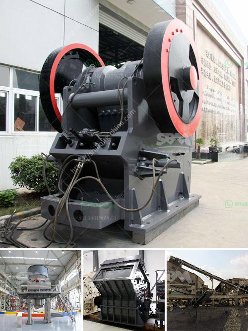

<h3>How to work jaw crusher and impact crusher ?</h3>
Crushing equipment plays an important role in the construction industry because it can break down large rocks into smaller pieces. Crushers are commonly used in construction sites to crush stones and raw materials into smaller, manageable pieces for further use. However, not everyone knows how these machines work. In this article, we will provide a step-by-step guide on how to work a jaw crusher and an impact crusher.

Jaw Crusher: A jaw crusher is a commonly used crushing machine in the mining and construction industry. Jaw crushers are heavy-duty machines designed to efficiently crush hard materials by using compressive force. They consist of a fixed jaw plate attached to an eccentric shaft, and a movable jaw plate that exerts force on the rock by forcing it against the fixed plate.

1. Check the condition of the machine's parts, such as the toggle plate, the pitman arm, and the swing jaw assembly. If any of these components are damaged or worn out, they should be replaced to ensure the proper functioning of the crusher.

2. Start by feeding the raw material into the hopper at the top of the crusher. The material will be gradually fed into the crushing chamber through the vibrating feeder.

3. Toggle the switch to activate the motor and the flywheel. The motor will rotate the eccentric shaft, causing the movable jaw to move back and forth, crushing the rocks against the fixed plate.

4. Use the hydraulics system to adjust the gap between the jaws. This allows for different sizes of crushed material to be produced by the jaws.

5. Once the material reaches the desired size, it will exit through the discharge opening at the bottom of the crusher. The crushed material can then be used for various construction purposes.

Impact Crusher: An impact crusher, on the other hand, uses force to crush materials. It consists of a rotating hammer set in a cylinder, where the material is fed into the machine. The rotating hammers strike the material, causing it to be fragmented into smaller pieces.

1. Before starting the machine, ensure that all safety mechanisms are in place. This includes guarding and safety devices to protect operators from injury.

2. Feed the material into the impact crusher through the feed chute. The material is then accelerated by the rotor and thrown against the hammers.

3. The hammers strike the material, causing it to break into smaller pieces. The size of the crushed material can be controlled by adjusting the gap between the hammers and the impact plates.

4. The crushed material is then discharged through the bottom of the crusher. It can be conveyed or stockpiled for future use.

Both jaw crushers and impact crushers are essential equipment in the construction industry. They are used to crush materials for further processing and can help increase productivity on construction sites. By following the steps mentioned above, operators can work these machines effectively and safely, ensuring the successful completion of their construction projects.
<h3>Contact us</h3><ul><li><strong>Whatsapp:&nbsp;<a href="https://wa.me/8613661969651">+8613661969651</a></strong></li><li><a href="https://swt.shibang-china.com/?git&amp;zhl&amp;How to work jaw crusher and impact crusher "><strong>Online Service(chat now)</strong></a></li></ul><h3>Related</h3><ul><li><a href='How to design an impact crusher.md'>How to design an impact crusher?</a></li><li><a href='How to build crushing plant foundation .md'>How to build crushing plant foundation ?</a></li><li><a href='How to fit water pipes on vibrating screen in sand washing plant.md'>How to fit water pipes on vibrating screen in sand washing plant?</a></li><li><a href='How does a rock crusher work.md'>How does a rock crusher work?</a></li><li><a href='How to design a hopper feeder.md'>How to design a hopper feeder?</a></li></ul>