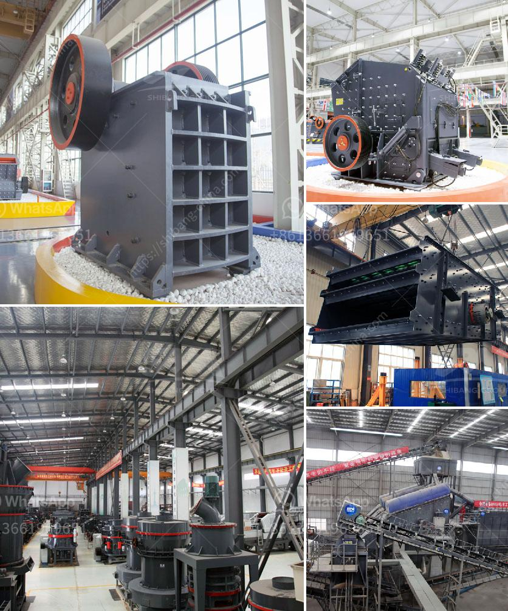

<h3>How to work with a Raymond Mill?</h3>
Raymond Mill, also known as hanging roller mill, is a popular grinding mill for mining and construction industries. It is widely used for fine or superfine crushing of various materials with Mohs hardness less than 9.3 and humidity below 6%. But do you know how to work with a Raymond Mill correctly? In this article, we will provide a step-by-step guide on how to work with a Raymond Mill effectively and efficiently.

First and foremost, make sure that the Raymond Mill is installed correctly. Before installing the mill, you need to make a foundation chart and find a suitable location for the machine. Ensure that the site is level, dry, and free from any debris or obstacles that may hinder the smooth operation of the mill. Once the foundation is ready, follow the manufacturer's instructions to install the mill accurately.

After the installation is complete, you need to check the tightness of all the bolts and ensure that there are no loose parts. Inspect the lubrication system and adjust it if necessary. Lubrication is crucial for the efficient operation of the Raymond Mill, so make sure that all the lubrication points are well-oiled.

Once the machine is ready, you can start it up. However, before you turn on the mill, it is important to preheat it first. This is done by turning on the electromagnetic vibrating feeder and letting it run for a few minutes. This preheating process ensures that the mill operates smoothly and prevents any damage to the internal components.

When the mill is preheated, you can start feeding the material into the machine. It is essential to feed the Raymond Mill slowly and evenly to avoid overloading the machine. Improper feeding can lead to low production efficiency and even damage the mill. Therefore, always maintain a consistent and controlled feeding rate.

During the operation of the Raymond Mill, keep an eye on the temperature and pressure gauges to ensure that they are within the specified range. If the temperature or pressure exceeds the recommended levels, stop the mill immediately and identify the cause of the problem. Ignoring abnormal conditions can lead to severe damage to the mill and compromise its performance.

Regular maintenance is critical for the longevity and smooth operation of the Raymond Mill. Perform routine inspections of all the parts and components, paying special attention to the grinding roller, grinding ring, mainframe, and bearings. Clean the mill regularly and check for wear and tear in the grinding parts. Replace any worn-out components promptly to avoid any potential breakdowns.

In conclusion, working with a Raymond Mill requires careful attention and adherence to the manufacturer's instructions. Correct installation, proper preheating, controlled feeding, regular maintenance, and monitoring of the mill's temperature and pressure are essential for its efficient and safe operation. By following these guidelines, you can maximize the performance and lifespan of your Raymond Mill and achieve high-quality grinding results.
<h3>Contact us</h3><ul><li><strong>Whatsapp:&nbsp;<a href="https://wa.me/8613661969651">+8613661969651</a></strong></li><li><a href="https://swt.shibang-china.com/?git&amp;zhl&amp;How to work with a Raymond Mill"><strong>Online Service(chat now)</strong></a></li></ul><h3>Related</h3><ul><li><a href='How to make sand from rocks.md'>How to make sand from rocks?</a></li><li><a href='How to disassemble jaw crushers.md'>How to disassemble jaw crushers?</a></li><li><a href='How does a stone crusher work.md'>How does a stone crusher work?</a></li><li><a href='How does the Vibrating Screen machine work？.md'>How does the Vibrating Screen machine work？</a></li><li><a href='How to choose crushing limestone machinery.md'>How to choose crushing limestone machinery?</a></li></ul>