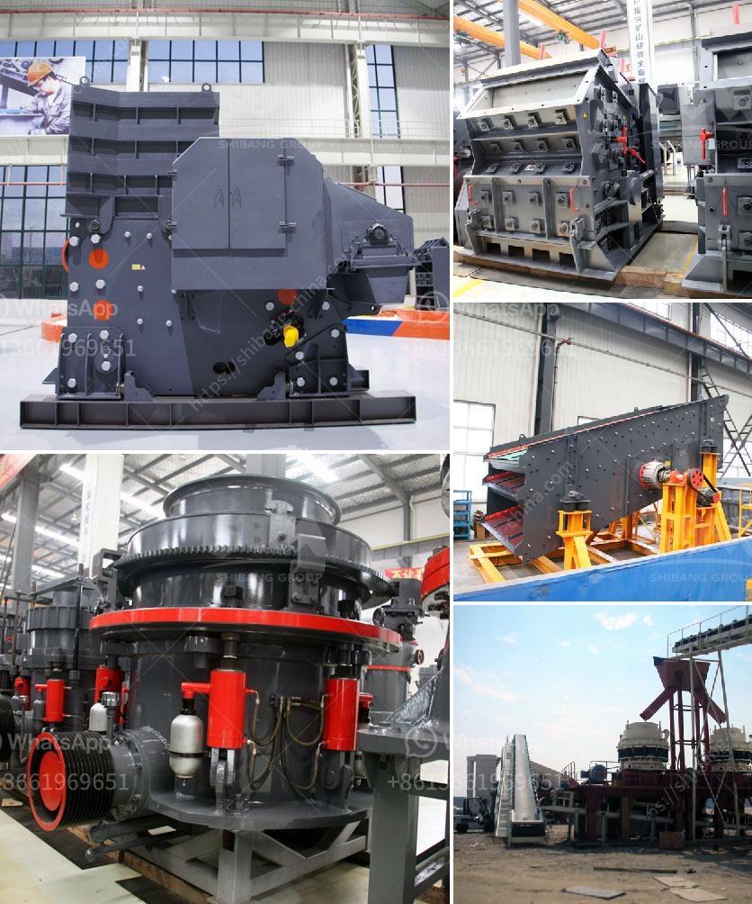

<h3>How to write a proposal for a quarry ？</h3>
A proposal is a crucial document when it comes to seeking approval for any project, and a quarry is no exception. Writing a comprehensive and well-structured proposal will not only ensure that your project gets the green light but also provides a roadmap for its successful implementation. Here are some key tips to help you write an effective proposal for a quarry.

Begin your proposal with a compelling introduction that clearly states the purpose of your proposal. Provide a brief overview of the quarry project and highlight its potential benefits to the community, economy, and environment. Introduce your team and their expertise relevant to the quarry project. Make sure to grab the reader's attention from the very beginning.

In this section, provide a detailed description of the quarry project. Outline the project's location, size, and the type of materials that will be extracted. Include information about the proposed extraction methods and the expected production capacity. It is also important to mention any environmental considerations and how you plan to mitigate any potential negative impacts from the quarry operations.

Demonstrate that there is a market demand for the materials to be extracted from the quarry. Conduct a thorough market analysis to identify potential customers and quantify the demand for the materials. Provide data on pricing, competition, and market trends. This section will help to demonstrate the economic feasibility of the quarry project.

Outline your quarry's operational plan, explaining in detail how the extraction and production processes will be carried out. Describe the machinery and equipment needed, the required workforce, and relevant health and safety measures. This section should emphasize efficient and sustainable quarry practices.

Address any potential environmental impacts stemming from the quarry operations. Discuss the steps you plan to take to minimize or mitigate these impacts, such as implementing erosion control measures, adopting safe blasting practices, and rehabilitating the site after extraction is complete. Ensure that your proposal aligns with local regulations and environmental standards.

Present a well-structured financial plan that includes your projected costs, revenue forecasts, and return on investment (ROI) estimations. Include details about potential funding sources and their terms, such as bank loans or partnerships. A solid financial plan will instill confidence in your project's viability and attract potential investors.

Acknowledge the concerns and interests of local communities and other stakeholders who may be affected by the quarry project. Demonstrate how you plan to actively engage and communicate with them throughout the different project stages. Highlight the socio-economic benefits your project can bring to the community, such as job creation or infrastructure development.

Wrap up your proposal with a concise summary of the key points discussed throughout the document. Reinforce the potential of the quarry project and its positive impacts. Express your readiness to engage in further discussions and provide any additional information that might be required.

Remember that a well-crafted proposal is a persuasive tool, presenting your quarry project in the best possible light. Pay attention to the details, use supporting data and visuals when appropriate, and ensure your proposal is error-free and well-organized. Following these tips will greatly increase your chances of receiving approval for your quarry proposal.
<h3>Contact us</h3><ul><li><strong>Whatsapp:&nbsp;<a href="https://wa.me/8613661969651">+8613661969651</a></strong></li><li><a href="https://swt.shibang-china.com/?git&amp;zhl&amp;How to write a proposal for a quarry ？"><strong>Online Service(chat now)</strong></a></li></ul><h3>Related</h3><ul><li><a href='How to separate silica sand from rock.md'>How to separate silica sand from rock?</a></li><li><a href='how to run an impact jaw crusher.md'>how to run an impact jaw crusher?</a></li><li><a href='How to maintain stone grinding machine？.md'>How to maintain stone grinding machine？</a></li><li><a href='How to ensure the efficient operation of impact crusher.md'>How to ensure the efficient operation of impact crusher?</a></li><li><a href='How to build a small cement plant ？.md'>How to build a small cement plant ？</a></li></ul>