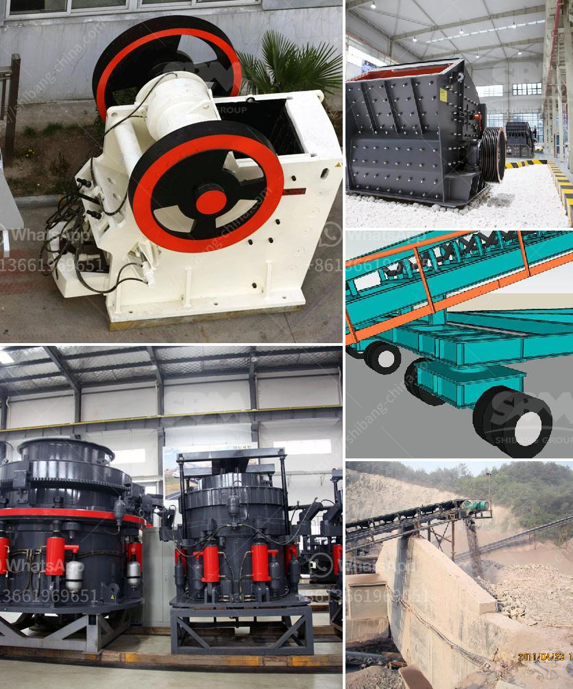

<h3>Maintenance method of impact crusher?</h3>
Impact crushers are widely used in mining, metallurgy, construction, roads, railways, water conservancy, and chemical industries. They have the advantages of large crushing ratio, uniform particle size, simple structure, reliable performance, and convenient maintenance. However, in the process of use, various problems may occur, affecting the normal operation of the equipment. Therefore, it is essential to carry out regular maintenance and repair.

Regularly inspect the wear condition of the impact crusher liners and hammer heads. If any parts are severely worn, they need to be replaced promptly to avoid affecting the normal operation of the equipment. In addition to the wear of the external parts, it is also necessary to check the bolts and nuts for loosening and timely tightening if necessary.

The lubrication system of the impact crusher plays a significant role in the operation of the equipment. It is essential to ensure the proper lubrication of each component. Regularly check the oil level in the oil tank, the quality of the lubricating oil, and the filter element. If the lubricating oil is deteriorated or the filter element is clogged, it should be replaced in time. Also, pay attention to the appropriate amount of lubricating oil, avoid excessive or insufficient lubrication.

The rotor and impact plate are the main components of the impact crusher. Their maintenance is crucial for the normal operation of the equipment. Regularly inspect the rotor for wear and replace it in time if necessary. Pay close attention to the wear condition of the impact plate. If severe wear is found, replace it immediately to prevent more significant damage to the impact crusher.

The gap between the impact plate and the rotor plays a crucial role in the overall performance of the impact crusher. A proper gap ensures the normal operation and output of the equipment. Regularly check and adjust the gap between the impact plate and the rotor to ensure that it meets the requirements of the manufacturer's specifications.

The feeding device of the impact crusher is an important part that directly affects the crushing efficiency. Regularly clean up the accumulated materials in the feeding device to ensure smooth and uniform feeding.

During the operation of the impact crusher, some materials may accumulate in the crushing cavity, affecting the normal operation and output of the equipment. Therefore, regularly clean up the accumulated materials in the crushing cavity to ensure the smooth operation of the impact crusher.

In conclusion, proper and regular maintenance of the impact crusher is essential to ensure its normal operation and prolong its service life. By implementing the above maintenance methods, operators can effectively reduce the occurrence of failures, enhance the efficiency of the equipment, and achieve better production results.
<h3>Contact us</h3><ul><li><strong>Whatsapp:&nbsp;<a href="https://wa.me/8613661969651">+8613661969651</a></strong></li><li><a href="https://swt.shibang-china.com/?git&amp;zhl&amp;Maintenance method of impact crusher"><strong>Online Service(chat now)</strong></a></li></ul><h3>Related</h3><ul><li><a href='How to choose the jaw crusher motor ？.md'>How to choose the jaw crusher motor ？</a></li><li><a href='How can I improve the grinding of a raw mill.md'>How can I improve the grinding of a raw mill?</a></li><li><a href='How does bauxite crushers work.md'>How does bauxite crushers work?</a></li><li><a href='How to prevent environmental pollution in washing plants？.md'>How to prevent environmental pollution in washing plants？</a></li><li><a href='How to measure the theoretical output of a jaw crusher .md'>How to measure the theoretical output of a jaw crusher ?</a></li></ul>