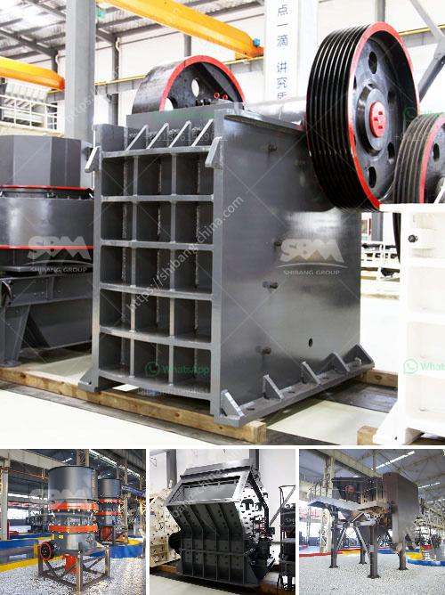

<h3>Procedures on how to mine nickel ore ?</h3>
Nickel, often referred to as the "unsung hero" of the mining industry, has gained significant popularity due to its wide range of applications. As a vital component in electric vehicle batteries, stainless steel production, and various industrial processes, the demand for nickel has seen a steady rise over the years.

To meet this demand, mining companies engage in the extraction of nickel ore, a complex process that requires careful planning, advanced machinery, and adherence to safety protocols. In this article, we will explore the procedures involved in mining nickel ore, shedding light on the mining industry's efforts to unlock the power of this precious metal.

Before commencing mining operations, extensive geological studies and surveys are conducted to identify potential nickel deposits. This involves analyzing rock samples, conducting drilling tests, and employing geophysical techniques. Once a promising site is identified containing nickel-bearing ore deposits, the mine can be developed.

After securing the necessary permits and approvals, the selected mining site must be cleared of any existing natural vegetation and wildlife. The topsoil is carefully removed and set aside for later use in reclamation efforts. Access roads, water sources, and other infrastructure are also constructed during this phase.

With the site cleared and prepared, the nickel deposit is accessed by drilling holes into the earth. These holes are strategically placed to ensure maximum extraction efficiency. Once the holes are drilled, explosives are carefully placed and detonated, fragmenting the rocks and allowing for easier removal.

After blasting, the broken rocks, known as muck, are loaded onto large mining trucks or conveyor belts for transport to the processing plant. Depending on the accessibility of the site, trucks may need to navigate through challenging terrains and rugged landscapes to transport the nickel ore for processing.

At the processing plant, the nickel ore undergoes crushing and grinding to reduce its size and enhance its consistency. This preparation step is crucial for downstream processes, as it ensures that the nickel ore is granulated and ready for the subsequent extraction processes.

The crushed and ground nickel ore is then subjected to a process called froth flotation. In this process, different chemicals are added to the crushed ore to separate the valuable nickel minerals from the gangue, or waste materials. The resulting concentrate is further refined to remove impurities and moisture.

Once the nickel concentrate is obtained, the next step is smelting. During smelting, the nickel concentrate is subjected to extremely high temperatures to separate the nickel from any remaining impurities. The pure nickel is then refined and shaped into various forms, such as nickel cathodes or pellets.

Mining companies prioritize environmental conservation and ensure responsible practices. After the extraction of nickel ore, rehabilitation efforts are undertaken to restore the land to its original state. This includes re-vegetation, erosion control, and water management programs, ensuring the sustainability of the environment.

In conclusion, mining nickel ore involves a comprehensive set of procedures, from exploration and site selection to reclamation and rehabilitation. The mining industry's commitment to responsible practices ensures the sustainability of nickel extraction, a critical resource powering numerous industries worldwide. As the demand for nickel continues to grow, it is vital that these procedures are followed diligently to unlock the power of this precious metal without compromising the environment or the communities surrounding these mining operations.
<h3>Contact us</h3><ul><li><strong>Whatsapp:&nbsp;<a href="https://wa.me/8613661969651">+8613661969651</a></strong></li><li><a href="https://swt.shibang-china.com/?git&amp;zhl&amp;Procedures on how to mine nickel ore "><strong>Online Service(chat now)</strong></a></li></ul><h3>Related</h3><ul><li><a href='How to Select a Type of Crusher.md'>How to Select a Type of Crusher</a></li><li><a href='How to build a granite crushing plant？.md'>How to build a granite crushing plant？</a></li><li><a href='How to crush feldspar with impact crusher ？.md'>How to crush feldspar with impact crusher ？</a></li><li><a href='How to process tantalite mineral.md'>How to process tantalite mineral?</a></li><li><a href='How to run a crushing plant.md'>How to run a crushing plant?</a></li></ul>