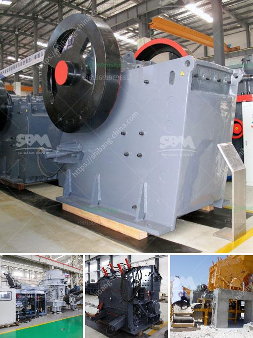

<h3>how a cone crusher works ?</h3>
A cone crusher is a useful piece of machinery that helps in reducing waste and heavy rocks into smaller rocks, gravel, or rock dust. These machines are essential in many mining and construction industries where large rocks need to be crushed into smaller pieces for further processing. With heavy-duty crushing capabilities, a cone crusher is designed to operate efficiently and deliver reliable performance even under harsh conditions.

The main components of a cone crusher include the main shaft, mantle, concaves, cone, eccentric bushing, drive, and hydraulic system. The working principle of the machine is quite simple. As the eccentric rotates, the main shaft is pushed up and down against the mantle, allowing the rocks to be crushed into smaller pieces. The crushing chamber of the cone crusher is filled with rocks, and when the mantle moves downward, the rocks are crushed as they move closer to the concave surface.

During operation, the motor drives the eccentric shaft to rotate through a belt pulley or a couple of V-belts, which transmits power to the cone crusher. A small bevel gear, a large bevel gear, and an eccentric sleeve make up the driving system of the machine. The eccentric sleeve, driven by the horizontal shaft and a pair of bevel gears, rotates the eccentric shaft, causing the cone crusher to move in a swing motion.

The hydraulic system plays a key role in ensuring the efficient operation of the cone crusher. It allows the clearance settings to be adjusted easily and conveniently, reducing downtime. The hydraulic chamber-clearing system also helps in removing the metal fragments that may enter the chamber, improving the overall efficiency of the machine.

One of the primary benefits of a cone crusher is its ability to carry out a wide range of secondary and tertiary crushing tasks. With the help of a cone crusher, it is possible to achieve desired particle sizes and shape from large rocks, making it an essential piece of equipment in the mining and construction industries. Cone crushers are also beneficial in the production of manufactured sand, as they can produce a well-graded and cubical product.

Maintenance of the cone crusher is relatively simple and does not require extensive downtime. Regular inspections, lubrication, and replacing worn-out parts can help maximize the lifespan and performance of the machine. Proper maintenance ensures that the cone crusher operates at its full capacity and contributes to the overall productivity of the operation.

In conclusion, a cone crusher is a valuable machine that is capable of reducing large rocks into smaller ones. It operates through the main shaft and the mantle, crushing rocks as they move closer to the concave surface. With the help of the hydraulic system, the machine can easily adjust the clearance settings and clear any metal fragments that enter the crushing chamber. Regular maintenance is key to ensuring the efficiency and longevity of the cone crusher, making it an indispensable tool in various industries.
<h3>Contact us</h3><ul><li><strong>Whatsapp:&nbsp;<a href="https://wa.me/8613661969651">+8613661969651</a></strong></li><li><a href="https://swt.shibang-china.com/?git&amp;zhl&amp;how a cone crusher works "><strong>Online Service(chat now)</strong></a></li></ul><h3>Related</h3><ul><li><a href='How to measure the theoretical output of a jaw crusher .md'>How to measure the theoretical output of a jaw crusher ?</a></li><li><a href='how to crusher river pebbles into sand ？.md'>how to crusher river pebbles into sand ？</a></li><li><a href='How to clean manganese ore .md'>How to clean manganese ore ?</a></li><li><a href='How to choose jaw crusher in Malaysia 7 suggestions for you.md'>How to choose jaw crusher in Malaysia? 7 suggestions for you</a></li><li><a href='how much price for used stone crusher in Uae.md'>how much price for used stone crusher in Uae</a></li></ul>