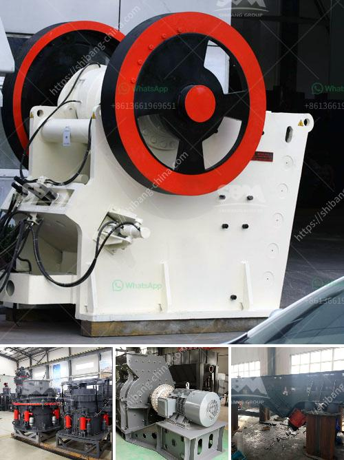

<h3>how a impactor crusher works ？</h3>
The Impact Crusher, also known as a horizontal shaft impactor, has revolutionized the crushing process. This versatile machine is widely used in mining and construction industries due to its ability to crush hard materials efficiently. In this article, we will explore how an impact crusher works and its various components.

An impact crusher consists of a feed hopper, feeder, rotating shafts, blow bars, and an enclosed rotor. The feed hopper receives the material to be crushed and ensures an even distribution to the feeder. The feeder, in turn, controls the flow of the material into the crusher chamber.

Once the material enters the crusher chamber, it encounters rotating shafts. These shafts, equipped with blow bars, deliver high-speed impacts to crush the material. The blow bars are generally made of durable materials such as manganese steel or white iron, which are resistant to wear and tear.

As the material is crushed, it is propelled against the impact plates located on the walls of the crusher chamber. The impact plates absorb the energy from the high-speed impacts and further crush the material. The material is then expelled through the discharge opening at the bottom of the crusher, achieving the desired product size.

The enclosed rotor, a critical component of the impact crusher, enhances the crushing process. This rotor is composed of two or more discs with spacers in between. The material enters the rotor through the central feed tube and is redirected towards the periphery due to centrifugal force.

The high-speed rotation of the rotor generates a strong air suction, which pulls the material towards the blow bars. As the material passes through the rotor, it undergoes multiple high-speed impacts, resulting in efficient crushing.

The impact crusher offers several advantages over other crushing machines. Firstly, it allows for a higher reduction ratio, which means finer end products. Secondly, it is versatile and can handle various types of materials, including sensitive and abrasive ones. Moreover, it has a relatively low energy consumption and can operate in a closed circuit, allowing for better control over the size and shape of the end product.

Maintenance of an impact crusher is crucial to ensure optimal performance. Regular inspection and cleaning of the blow bars are necessary to prevent excessive wear. The wear parts of the crusher, such as the impact plates, should also be regularly checked and replaced when needed. Lubrication of the bearings and other moving parts is essential to reduce friction and prevent premature failure.

In conclusion, the impact crusher is a powerful machine that utilizes high-speed impacts to crush hard materials efficiently. With its versatile design and numerous benefits, it has become a preferred choice in various industries. Understanding how this machine works and ensuring proper maintenance can greatly enhance its performance and prolong its lifespan.
<h3>Contact us</h3><ul><li><strong>Whatsapp:&nbsp;<a href="https://wa.me/8613661969651">+8613661969651</a></strong></li><li><a href="https://swt.shibang-china.com/?git&amp;zhl&amp;how a impactor crusher works ？"><strong>Online Service(chat now)</strong></a></li></ul><h3>Related</h3><ul><li><a href='How to adjust a toggle spring on a jaw crusher.md'>How to adjust a toggle spring on a jaw crusher?</a></li><li><a href='How to crush limestone.md'>How to crush limestone?</a></li><li><a href='How to build a manganese ore concentrator What crushing machinery do you need.md'>How to build a manganese ore concentrator? What crushing machinery do you need?</a></li><li><a href='How to start stone crusher project.md'>How to start stone crusher project?</a></li><li><a href='How to crush spongy limestone.md'>How to crush spongy limestone?</a></li></ul>