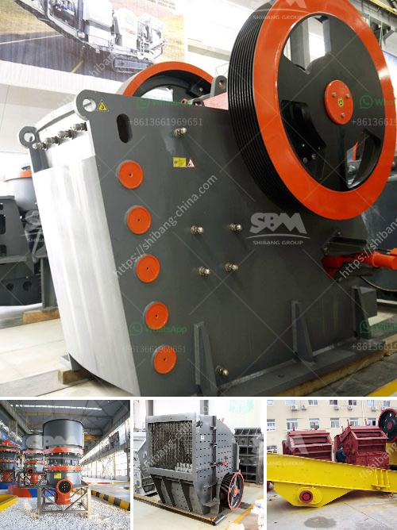

<h3>how a stone crusher operates ？</h3>
A stone crusher, also known as rock crusher, is one of the most commonly used mining machines. It is designed to reduce large rocks into smaller rocks or gravel. Extensively used in construction, infrastructure, and other industries, the stone crushers are highly important for limestone processing, granite, basalt, and other igneous and metamorphic rock processing operations.

Stone crushers are heavy-duty machines that are designed to reduce the size of large materials. They are commonly used in mining, metallurgical, building materials, highways, railways, water conservancy, and chemical industries. Stone crushers have a large crushing ratio and a high production capacity, which makes them popular in the mining industry.

The working principle of a stone crusher is relatively simple. The stone crusher is mainly driven by a diesel engine or a motor, and the motor drives the belt and pulley to carry out the crushing process. In the process of crushing, the raw materials enter the feed cavity of the stone crusher evenly and continuously. The high-speed rotating rotor impacts and crushes the materials into small pieces. The crushed materials are discharged from the lower part of the machine.

Stone crushers have various types, such as jaw crusher, cone crusher, impact crusher, mobile crusher, and sand making machine. The jaw crusher is widely used in mining, building materials, chemical industry, metallurgy, and so on. It is suitable for primary and secondary crushing of all kinds of minerals and rocks with compressive strength less than 320 MPa.

The cone crusher is used for crushing ores and rocks with medium hardness. It is widely used in metallurgy, construction, road building, chemical and silicate industries. It has the characteristics of large crushing ratio, high efficiency, low energy consumption, uniform product size, and reliable performance.

The impact crusher is suitable for the crushing of various materials with compressive strength less than 350 MPa, including limestone, dolomite, coal, granite, quartz stone, and cement clinker. It is widely used in mining, metallurgy, construction, highways, railways, water conservancy, and chemical industries.

The mobile crusher is a highly integrated rock crushing equipment that integrates feeding, crushing, screening, and conveying. It is equipped with a crawler system, which can be remotely operated for ease of mobility. The mobile crusher can be flexibly combined and configured according to different process requirements to meet various crushing and screening needs.

In conclusion, the stone crusher operates at a high level of efficiency, flexibility, and low cost. It provides a good alternative to traditional stationary crushers and is conducive to environmental protection and sustainable development. With the rapid advancement of urbanization, the application of stone crushers in various fields will further promote the overall development of the industry.
<h3>Contact us</h3><ul><li><strong>Whatsapp:&nbsp;<a href="https://wa.me/8613661969651">+8613661969651</a></strong></li><li><a href="https://swt.shibang-china.com/?git&amp;zhl&amp;how a stone crusher operates ？"><strong>Online Service(chat now)</strong></a></li></ul><h3>Related</h3><ul><li><a href='How does a crusher work to make different types of sand.md'>How does a crusher work to make different types of sand?</a></li><li><a href='How to eliminate jaw crusher problems during its operation.md'>How to eliminate jaw crusher problems during its operation?</a></li><li><a href='How to break granite rocks in a double toggle jaw crusher.md'>How to break granite rocks in a double toggle jaw crusher?</a></li><li><a href='How to crush aggregates.md'>How to crush aggregates?</a></li><li><a href='How to Buy a Stone Crusher in India ？.md'>How to Buy a Stone Crusher in India ？</a></li></ul>