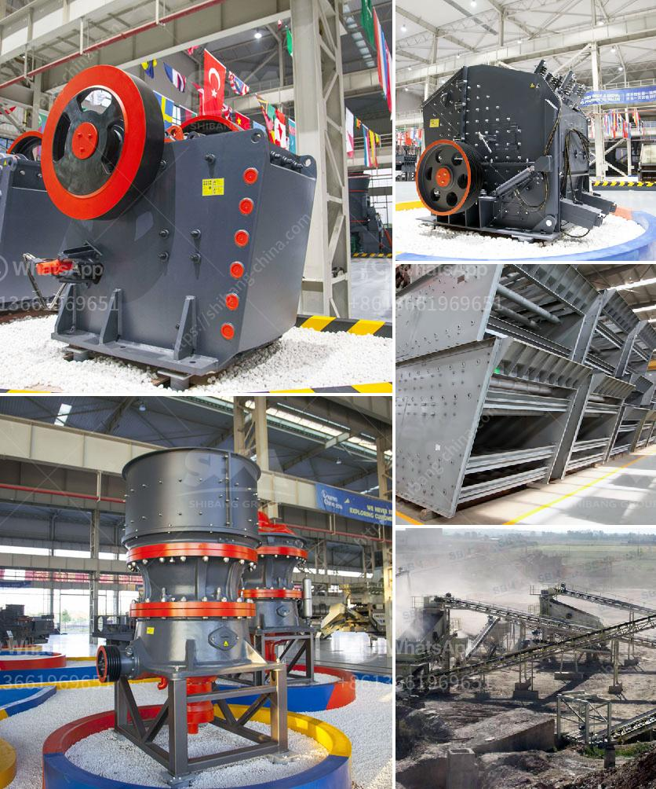

<h3>how can work the crusher house in thermal power plant ?</h3>
The crusher house in a thermal power plant works in the same manner as any other crusher house used in industries. Just like we take various types of coal to consume in a thermal power plant, the crusher house is used to crush the coal to a size suitable for combustion in the boiler of the power plant.

The crushed coal is then transported to the boiler by the conveyors in the crusher house. The coal is crushed into small pieces by a rotating hammer. This coal is then fed to the coal mill for pulverization. Even when the coal is unloaded from the wagon tippler hopper, it is crushed to a smaller size using the crusher house.

1. Wagon tippler: It is a machine that unloads the coal from the wagon. The coal is crushed and then fed to the crusher house.

2. Belt conveyors: These conveyors transport the coal from the wagon tippler hopper to the crusher house.

3. Crushers: The crushers in the crusher house are used to crush the coal to a size suitable for combustion in the boiler. There are different types of crushers available in the market, such as jaw crushers, gyratory crushers, cone crushers, impact crushers, etc. Depending on the type of coal and its moisture content, the appropriate type of crusher is selected.

4. Vibrating screens: These screens separate the crushed coal into different sizes. The smaller-sized coal is directed to the coal mill for further grinding, while the larger-sized coal is sent back to the crushers for re-crushing.

5. Coal mill: It is the equipment used for grinding and drying the coal in the thermal power plant. The finely ground coal is used as fuel in the boiler for generating steam.

6. Dust extraction system: The crusher house generates a lot of dust during the crushing process. To prevent the dust from spreading in the surrounding area, a dust extraction system is installed. This system helps in maintaining a dust-free environment and protects the health of workers.

The crusher house plays a crucial role in a thermal power plant. It ensures that the coal supplied to the boiler is of the required size and quality for efficient combustion. The functioning of the crusher house directly impacts the overall performance of the power plant.

To summarize, the crusher house in a thermal power plant works by crushing the coal into a size suitable for combustion in the boiler. The crushed coal is transported to the boiler through belt conveyors. Various types of crushers, vibrating screens, and a dust extraction system are used in the crusher house for efficient operation and maintenance of the thermal power plant.
<h3>Contact us</h3><ul><li><strong>Whatsapp:&nbsp;<a href="https://wa.me/8613661969651">+8613661969651</a></strong></li><li><a href="https://swt.shibang-china.com/?git&amp;zhl&amp;how can work the crusher house in thermal power plant "><strong>Online Service(chat now)</strong></a></li></ul><h3>Related</h3><ul><li><a href='How to buy a cone crusher.md'>How to buy a cone crusher?</a></li><li><a href='How to start a sand and gravel business.md'>How to start a sand and gravel business?</a></li><li><a href='How to calculate the cost of grinding .md'>How to calculate the cost of grinding ?</a></li><li><a href='How to install a stone crusher plant in Sikkim.md'>How to install a stone crusher plant in Sikkim?</a></li><li><a href='how to rebuild cone crusher .md'>how to rebuild cone crusher ?</a></li></ul>