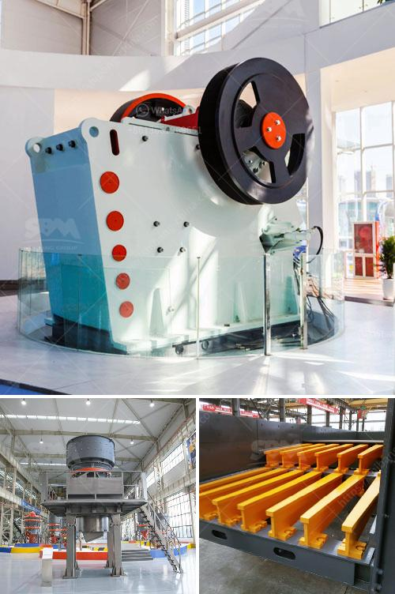

<h3>how do you process of gold in south africa</h3>
South Africa is renowned for its rich mineral resources, particularly gold, as it has been a significant player in the gold mining industry for over a century. This article aims to shed light on the captivating process of extracting and refining gold in South Africa, from exploration to the final product.

The process of gold mining in South Africa starts with exploration, where geologists examine potential sites and conduct tests to determine the presence of gold and other minerals. Modern techniques such as geophysical surveys, satellite imagery, and aerial photography aid in identifying promising locations. Once a potential site is identified, further detailed assessments are carried out to determine the quantity and quality of the gold deposit.

South Africa employs various mining methods to extract gold from underground mines. The most commonly used method is underground mining, specifically deep-level or hard rock mining. This technique involves drilling vertical shafts as well as horizontal tunnels or adits to access the gold-bearing ore. Large equipment and machinery such as crushers, underground loaders, and explosives are used to extract the ore.

Once the gold-bearing ore is extracted, it needs to be processed further to extract the precious metal. The primary techniques used for gold processing in South Africa include cyanidation, carbon adsorption, and smelting.

1. Cyanidation: Cyanidation is the most widely used method for gold extraction. It involves crushing the ore into fine particles, which are then mixed with a weak cyanide solution. The gold particles bond with the cyanide to form soluble compounds, which are then collected and processed further to obtain pure gold.

2. Carbon Adsorption: Carbon adsorption, also known as carbon-in-pulp (CIP) or carbon-in-leach (CIL) process, is commonly used to treat low-grade gold ore. In this method, the crushed ore is mixed with activated carbon, which adsorbs the gold particles. The loaded carbon is then separated from the pulp, and gold is eluted from the carbon using various means.

3. Smelting: Smelting is a traditional method used to extract gold from high-grade ore. It involves heating the ore to high temperatures (around 1,100 degrees Celsius), which melts the gold-containing material. Through this process, impurities are removed, and molten gold is obtained, ready for further purification.

Once the pure gold is obtained, further refining processes may be employed to achieve higher purity levels. Refining methods such as the Miller process, Wohlwill process, or electrolysis are used to remove any remaining impurities. The final product is a pure gold bar or ingot that meets international standards.

South Africa is a major player in the global gold market. The refined gold bars are then either sold to local jewelers and manufacturers or exported worldwide, contributing significantly to the country's economy.

South Africa has a rich heritage in gold mining, and the fascinating process of extracting and processing gold plays a vital role in the country's economy. From exploration to the final product, the entire process requires precision, expertise, and advanced technologies to ensure the safe and efficient production of gold. As South Africa continues to unlock its mineral potential, it remains an iconic destination for gold mining exploration and production.
<h3>Contact us</h3><ul><li><strong>Whatsapp:&nbsp;<a href="https://wa.me/8613661969651">+8613661969651</a></strong></li><li><a href="https://swt.shibang-china.com/?git&amp;zhl&amp;how do you process of gold in south africa"><strong>Online Service(chat now)</strong></a></li></ul><h3>Related</h3><ul><li><a href='how to work cone crusher ？.md'>how to work cone crusher ？</a></li><li><a href='How do I adjust a conetype crusher.md'>How do I adjust a cone-type crusher?</a></li><li><a href='How to extract manganese from ore.md'>How to extract manganese from ore?</a></li><li><a href='How to grind white cement clinker.md'>How to grind white cement clinker?</a></li><li><a href='how to do ball mill liner？.md'>how to do ball mill liner？</a></li></ul>