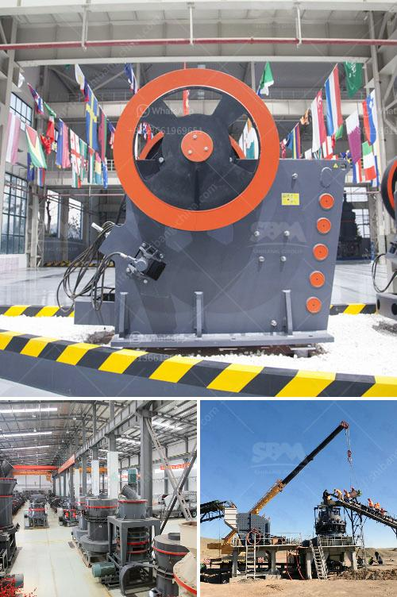

<h3>how does a limestone ball mill working ?</h3>
A limestone ball mill is a versatile grinding mill commonly used in limestone powder production lines. It produces fine limestone powder for various applications in chemical, metallurgy, feed additives, soil amendments, and other industries. This article will analyze how the limestone ball mill works and its working principles.

Limestone enters the limestone ball mill through the feeding device, which is horizontal cylinder rotating and driven externally by a transmission device. The material is crushed by the steel ball impact and grinding produced when the cylinder rotates. The limestone particles are ground to a fine powder during the grinding process.

The working principle of the limestone ball mill is as follows: after the material is roughly crushed, it is sent to the silo by the hoist, and then evenly distributed to the main engine via the vibrating feeder. The material is crushed again and moved to the ball mill by the elevator. Finally, it is ground and pulverized in the ball mill, after which the powder is separated by the classifier built inside the ball mill.

The limestone ball mill mainly consists of a cylindrical drum, an end cover, a bearing and transmission ring gear, and two end caps for sealing. The drum contains grinding media, which are constantly broadly dispersed, crushed, and grounded by the rotation of the drum.

The limestone ball mill has a range of options for cement grinding depending on the technical requirements for the final products produced. Typically, limestone is mined on a large scale and used as the raw material for cement production. This coarse limestone is then finely ground in ball mills to produce a raw meal or a clinker precursor for the production of cement.

The system is more efficient in producing fine particles of limestone due to its high-speed rotation and high grinding force. Additionally, the limestone ball mill has a low wear rate and low energy consumption, so it can work continuously for a long time without stopping or frequently replacing vulnerable parts.

In addition to its cement manufacturing applications, the limestone ball mill is also suitable for grinding other ores and has been widely used in industries such as chemical, metallurgy, refractory materials, and non-ferrous metals.

In conclusion, the limestone ball mill is a versatile grinding mill that produces fine limestone powder for various applications in chemical, metallurgy, feed additives, soil amendments, and other industries. It operates on the principle of impact and grinding, crushing the limestone particles to a fine powder. With its high efficiency and low energy consumption, the limestone ball mill has become an essential equipment in various industries.
<h3>Contact us</h3><ul><li><strong>Whatsapp:&nbsp;<a href="https://wa.me/8613661969651">+8613661969651</a></strong></li><li><a href="https://swt.shibang-china.com/?git&amp;zhl&amp;how does a limestone ball mill working "><strong>Online Service(chat now)</strong></a></li></ul><h3>Related</h3><ul><li><a href='How does a coal mill work.md'>How does a coal mill work?</a></li><li><a href='How to break down a copper ore.md'>How to break down a copper ore?</a></li><li><a href='How to build a coal washing plant.md'>How to build a coal washing plant?</a></li><li><a href='how to choose mill and crusher ？.md'>how to choose mill and crusher ？</a></li><li><a href='how a impactor crusher works ？.md'>how a impactor crusher works ？</a></li></ul>