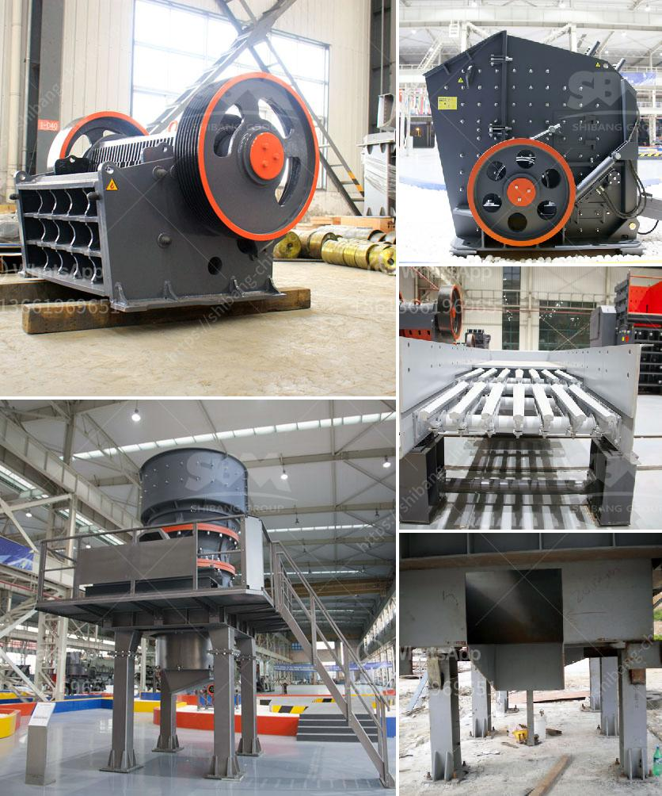

<h3>how does the hydraulic cone crusher works ?</h3>
The hydraulic cone crusher has been widely used in the mining machinery industry which has brought enormous economic benefits to our modern society. It realizes the efficient operation of various crushing equipment by applying hydraulic technology to enhance the crushing efficiency and crushing capacity.

The hydraulic cone crusher is a crushing machine for ore processing equipment. It is divided into single cylinder hydraulic cone crusher and multi-cylinder hydraulic cone crusher. The hydraulic cone crusher adopts the principle of intergranular laminating crushing which significantly improves the crushing capacity and the quality of products. The hydraulic cone crusher adopts the hydraulic overload protection device, which reduces the maintenance time and cost of the equipment.

When the equipment is in operation, the eccentric sleeve of the cone crusher rotates around the fixed point through the driving device such as the eccentricity, so that the crushing wall of the cone crusher is sometimes close to and away from the surface of the rolling wall, causing the material to be crushed by extrusion, impact, and bending between the two cone crushers. The uniform particle size of the finished product is achieved by controlling the distance between the crushing wall and the rolling wall.

The hydraulic cone crusher is driven by the motor to realize the rotation of the eccentric sleeve, and through the drive shaft, the cone crusher sleeve swings back and forth. The rotating cone crusher moves along the outer surface of the crushing chamber, and the material moves during crushing, and resists the extrusion and impact of the moving cone crusher. The crushed material is discharged from the bottom of the cone crusher, and the product granularity is controlled by adjusting the width of the discharge port.

The hydraulic cone crusher uses the hydraulic system to adjust the size of the crusher discharge port, the hydraulic system can effectively ensure the safe operation of the equipment. When there are foreign bodies in the crushing cavity, the hydraulic system can make the moving cone move back, and the foreign bodies can pass through the crushing cavity discharge port, making the moving cone back to continue to work, thereby enabling foreign Matter discharge and avoiding equipment damage.

In summary, the hydraulic cone crusher is a new generation crushing equipment that integrates mechanical, hydraulic, electrical, and automation technologies. It has a high crushing capacity, reasonable structure design, and a unique crushing cavity shape, which can make the material to be crushed more compact and full. The hydraulic cone crusher not only improves the production capacity and crushing efficiency but also expands the application range from limestone to basalt, from stone production to various ore crushing, providing users with a wide range of crushing choices and features.
<h3>Contact us</h3><ul><li><strong>Whatsapp:&nbsp;<a href="https://wa.me/8613661969651">+8613661969651</a></strong></li><li><a href="https://swt.shibang-china.com/?git&amp;zhl&amp;how does the hydraulic cone crusher works "><strong>Online Service(chat now)</strong></a></li></ul><h3>Related</h3><ul><li><a href='How to select ball mill.md'>How to select ball mill?</a></li><li><a href='How to calculate the cost per ton of crushing and screening stone.md'>How to calculate the cost per ton of crushing and screening stone?</a></li><li><a href='how to realize the feeding control of raymond mill .md'>how to realize the feeding control of raymond mill ?</a></li><li><a href='How to process lightweight aggregates in Ethiopia.md'>How to process lightweight aggregates in Ethiopia?</a></li><li><a href='How to build sand and gravel wash plant.md'>How to build sand and gravel wash plant?</a></li></ul>