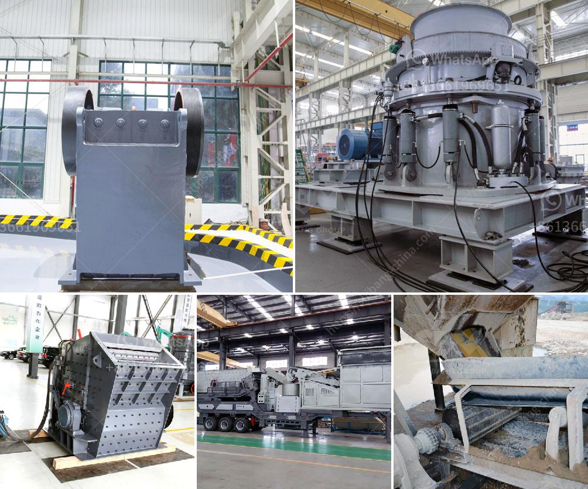

<h3>how does the jaw crusher works</h3>
Jaw crushers are most commonly used as primary crushers to crush large rocks into smaller ones for use in construction materials such as concrete and asphalt. Jaw crushers are also used in mining and metallurgical industries to crush ores, rocks, and other materials efficiently. One influential factor in jaw crusher technology is the concept of crushing with the jaw crusher’s eccentric shaft. In this study, the authors investigate the kinematic and dyn kinematic analysis of structures.

A jaw crusher consists of a fixed jaw and a swing jaw. The swing jaw, which is inclined at an angle to the fixed jaw, rotates around its own axis via an eccentric shaft. The movement of the swing jaw provides for powerful compression and crushing forces, resulting in maximum size reduction.

The working principle of the jaw crusher can be explained as follows: The material is fed into the crushing chamber through the hopper, and the movable jaw makes periodic reciprocating movements against the fixed jaw until the material is crushed to the desired size. The crushed material is discharged from the discharge opening at the bottom of the crusher.

The primary factors influencing the jaw crusher’s production capacity are the feed rate and the particle size distribution of the feed. The maximum size of the material that can be fed into the jaw crusher depends on the size of the opening and the width of the discharge opening. The feed rate is influenced by the operation speed of the crusher, the angle of the crushing chamber, and the length of the stroke.

The feed rate affects both the production capacity and the power consumption of the jaw crusher. A higher feed rate results in a higher production capacity, but it also increases the power consumption. The particle size distribution of the feed directly affects the crushing efficiency and the product particle shape. A well-graded feed with a narrow particle size distribution generally results in better crushing performance.

The jaw crusher’s operating principle is based on the reciprocating movement of the movable jaw that compresses and crushes the rock or ore between itself and the fixed jaw, as the material enters the zone between the jaws. The moving jaw moves back and forth against the fixed jaw, and material fed into the crushing chamber slowly gets smaller and smaller until it is completely crushed.

Jaw crushers are often used for primary crushing of hard or abrasive materials and are the most common crushers in the mining industry. These crushers are also popular among recycling applications and can process materials such as concrete, asphalt, and demolition waste.

In conclusion, the jaw crusher is a versatile and efficient machine that can be used in a variety of applications. It operates using compression and crushing forces, allowing it to break down even the hardest materials. With its simple yet robust design, jaw crushers offer exceptional reliability and low maintenance requirements. Whether used in mining, construction, or recycling, jaw crushers are essential for processing various materials and providing high-quality aggregates for the construction industry.
<h3>Contact us</h3><ul><li><strong>Whatsapp:&nbsp;<a href="https://wa.me/8613661969651">+8613661969651</a></strong></li><li><a href="https://swt.shibang-china.com/?git&amp;zhl&amp;how does the jaw crusher works"><strong>Online Service(chat now)</strong></a></li></ul><h3>Related</h3><ul><li><a href='how to  granite rocks in double toggle jaw crusher.md'>how to  granite rocks in double toggle jaw crusher</a></li><li><a href='how to calculate stone crusher production .md'>how to calculate stone crusher production ?</a></li><li><a href='How to install a conveyor belt down a crusher.md'>How to install a conveyor belt down a crusher?</a></li><li><a href='How is manganese extracted.md'>How is manganese extracted?</a></li><li><a href='How to produce silica sand 7 steps.md'>How to produce silica sand? 7 steps</a></li></ul>