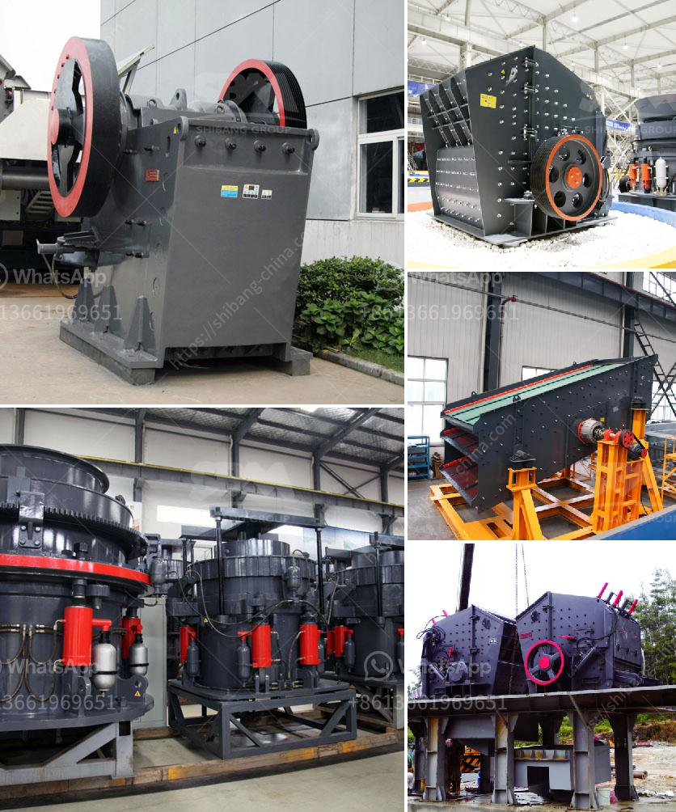

<h3>how does the quarry affect the biodiversity in tamil nadu ?</h3>
Quarrying, the extraction of raw materials such as stone, sand, and gravel, plays a significant role in the construction industry. While this activity provides essential resources for development, it also poses various environmental challenges. This article aims to shed light on how quarrying operations in Tamil Nadu affect the biodiversity of the region.

Tamil Nadu is rich in biodiversity, housing a wide variety of plants, animals, and ecosystems. Its diverse landscape spans forests, wetlands, grasslands, and coastal regions, providing habitats for numerous endangered and endemic species. The state's biodiversity is crucial for maintaining ecological balance and supporting human livelihoods.

Quarrying involves the stripping of vegetation, topsoil, and minerals from the earth's surface. In Tamil Nadu, the demand for construction materials, especially for infrastructural projects, has led to an increase in quarrying activities. Stone quarries are particularly prevalent, seeking resources such as granite, limestone, and marbles.

Quarrying operations not only remove minerals but also disrupt surrounding ecosystems. The excavation process often involves clearing vegetation and topsoil, resulting in the loss of various plants and animals. Many species that rely on particular habitats may be displaced, which can disrupt their reproductive cycles and even lead to population decline or local extinctions.

Quarries create physical barriers within the landscape, fragmenting habitats and restricting the movement of wildlife. Fragmentation disrupts migration routes and isolates populations, reducing genetic diversity and increasing the vulnerability of species to diseases and other threats. This isolation can also result in reduced mating opportunities, leading to decreased fertility and long-term population decline.

Quarrying operations generate large amounts of dust, which can contaminate nearby water bodies, including rivers and groundwater sources. The deposition of sediment and particulate matter can disrupt the aquatic ecosystem, harming fish, amphibians, and other aquatic species. Moreover, the chemicals used in quarrying, such as explosives and diesel fuel, can seep into nearby water sources, contaminating them and further threatening aquatic biodiversity.

Quarrying activities produce significant noise and air pollution. The constant noise from heavy machinery and blasting can disrupt wildlife, causing stress and altering their behavior. Additionally, the emission of dust and pollutants into the air can negatively impact vegetation and surrounding ecosystems, with repercussions for both plant and animal life.

The quarrying industry in Tamil Nadu has provided necessary construction materials for development but has come at a significant cost to biodiversity. The ecological impact of quarry operations includes habitat destruction, fragmentation, water pollution, noise pollution, and air pollution. It is imperative to implement stricter regulations and sustainable quarrying practices to minimize the negative impacts and protect the biodiversity that is fundamental to the ecological health and well-being of Tamil Nadu. Adequate site restoration and rehabilitation efforts should be undertaken, focusing on restoring habitats, enhancing connectivity, and promoting the reestablishment of indigenous species. Only by adopting environmentally conscious practices can we strike a balance between economic development and the preservation of Tamil Nadu's rich biodiversity.
<h3>Contact us</h3><ul><li><strong>Whatsapp:&nbsp;<a href="https://wa.me/8613661969651">+8613661969651</a></strong></li><li><a href="https://swt.shibang-china.com/?git&amp;zhl&amp;how does the quarry affect the biodiversity in tamil nadu "><strong>Online Service(chat now)</strong></a></li></ul><h3>Related</h3><ul><li><a href='How does a sand washing machine work.md'>How does a sand washing machine work?</a></li><li><a href='How to crush and clean stone.md'>How to crush and clean stone?</a></li><li><a href='How to work with a Raymond Mill.md'>How to work with a Raymond Mill?</a></li><li><a href='How to set up a quarry plant in India.md'>How to set up a quarry plant in India?</a></li><li><a href='How to operate the hammer mill.md'>How to operate the hammer mill</a></li></ul>