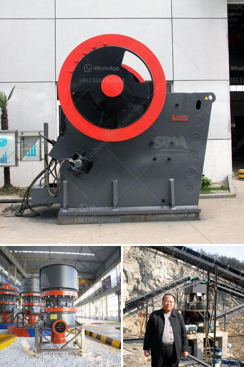

<h3>how is aluminium made from its ore ?</h3>
Aluminium, an incredibly versatile and valuable metal, is used in a wide range of industries, including transportation, construction, electronics, packaging, and much more. But have you ever wondered how this coveted metal is made from its ore? In this article, we will delve into the fascinating process of aluminium extraction and production.

Before we explore how aluminium is made, it is essential to understand its primary source: bauxite. Bauxite is a reddish-brown ore that contains a high concentration of alumina, the primary component of aluminium. It is typically found in tropical and subtropical regions, such as Australia, West Africa, and South America, due to the unique geological conditions required for its formation.

The first step in the aluminium production process is the extraction of alumina from bauxite. This process is known as the Bayer process, named after Karl Josef Bayer, an Austrian chemist who developed it in 1888. The Bayer process begins with the mining of bauxite, which is then crushed and mixed with a hot solution of sodium hydroxide. This mixture is put through a series of heaters, clarifiers, and filters to remove impurities and reagents.

Once purified, the resulting solution, known as sodium aluminate, is cooled and passed through a series of filters to separate the solid impurities. The clear solution is then mixed with aluminum hydroxide, which precipitates out the impurities and produces a more concentrated solution of aluminate. This solution is subjected to various chemical reactions to produce pure alumina, also known as aluminum oxide.

The next step in the aluminium production process is the conversion of pure alumina into molten aluminium metal. This process is known as the Hall-Héroult process, named after the American chemist Charles Martin Hall and the French engineer Paul Héroult, who independently developed it in the late 19th century.

In the Hall-Héroult process, alumina is dissolved in a molten mixture of cryolite, a fluoride mineral, and other additives, which lowers the melting point of alumina. This mixture is electrolyzed in large containers called cells, where carbon electrodes are immersed. When an electric current is passed through these cells, the oxygen in the alumina reacts with the carbon anode to form carbon dioxide gas, while the aluminium ions are reduced at the cathode to form liquid aluminium metal.

The molten aluminium is then siphoned out of the cells and transported to various casting facilities for further processing. It can be cast into ingots, sheets, extrusions, or even poured directly into specific molds for various products.

In conclusion, the production of aluminium from its ore involves a complex process that starts with the extraction of alumina from bauxite, followed by the conversion of alumina into molten aluminium metal using the Hall-Héroult process. This metal has revolutionized numerous industries worldwide due to its exceptional strength, lightweight nature, and resistance to corrosion. By understanding this intricate process, we can truly appreciate the marvel of aluminium and its invaluable contributions to our modern world.
<h3>Contact us</h3><ul><li><strong>Whatsapp:&nbsp;<a href="https://wa.me/8613661969651">+8613661969651</a></strong></li><li><a href="https://swt.shibang-china.com/?git&amp;zhl&amp;how is aluminium made from its ore "><strong>Online Service(chat now)</strong></a></li></ul><h3>Related</h3><ul><li><a href='How to improve grinding efficiency of a mill.md'>How to improve grinding efficiency of a mill?</a></li><li><a href='how is aluminium made from its ore .md'>how is aluminium made from its ore ?</a></li><li><a href='How to Configure Crusher Indonesia ？.md'>How to Configure Crusher Indonesia ？</a></li><li><a href='how does a limestone ball mill working .md'>how does a limestone ball mill working ?</a></li><li><a href='How to set up a milling plant in zambia.md'>How to set up a milling plant in zambia?</a></li></ul>