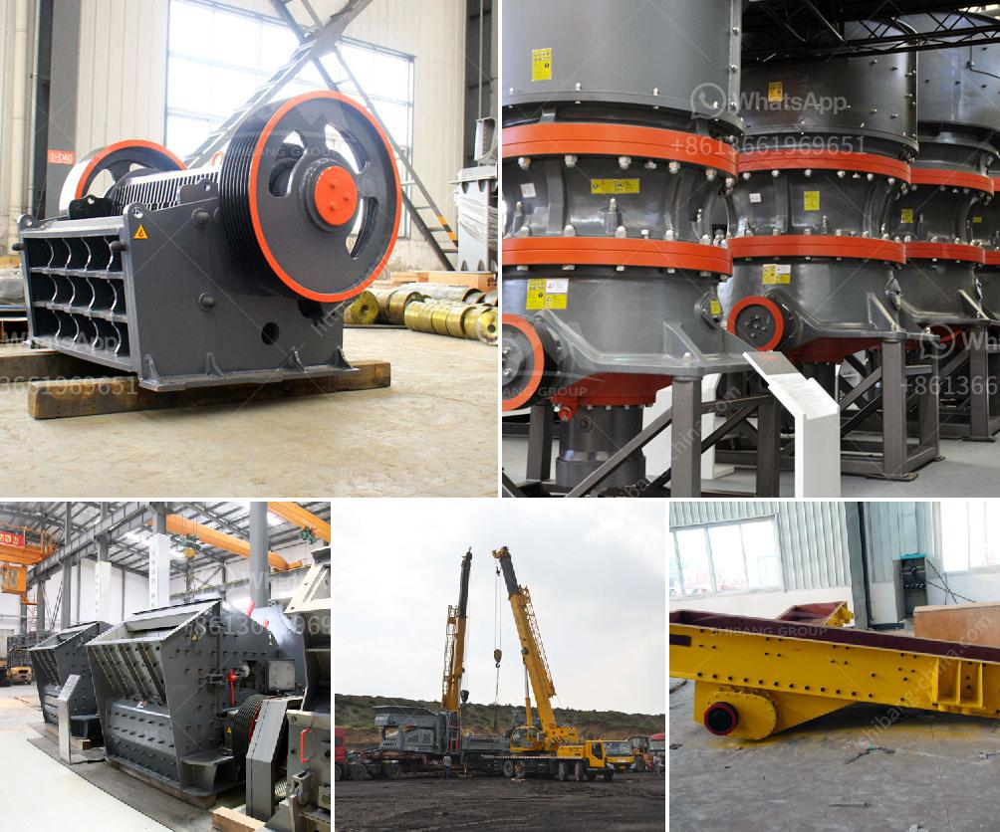

<h3>how limestone is mined in kenya</h3>
Limestone is a sedimentary rock composed primarily of calcium carbonate (CaCO3) in the form of the mineral calcite. It is extensively used for various purposes in construction and manufacturing industries. Limestone is one of the key minerals extracted in Kenya for different applications.

In Kenya, limestone mining is controversially considered crucial for economic growth. Limestone mining creates employment opportunities and stimulates the construction and infrastructure development sectors. Nevertheless, the process of extracting limestone involves significant environmental impact, particularly concerning water pollution and deforestation.

The process of limestone mining in Kenya primarily entails utilizing heavy machinery to extract the rock from the ground. This machinery involves drilling, blasting, excavating, and transporting the limestone.

Drilling typically begins with the use of specialized rotary drills equipped with diamond-tipped bits. These drills penetrate the rock, creating holes for the insertion of explosives. The holes are strategically placed to ensure effective extraction.

After the drilling process, explosives are placed into the holes. Controlled detonations then break the limestone into smaller pieces, making it easier to extract and transport. The shattered limestone is loaded onto trucks for transportation to the crushing plant or storage area.

Next, the extracted limestone is transported to a crushing plant where it undergoes a series of crushing and screening processes to produce various grades of crushed stone. These different sizes of crushed limestone satisfy distinct industrial requirements and find application in construction projects, cement production, and agricultural use.

Limestone mining in Kenya poses several environmental challenges. One of the main concerns is water pollution caused by the runoff from mining sites. The toxins and sediments from the mines end up in nearby water bodies, which can contaminate the water and affect aquatic life. Additionally, the runoff from limestone mines alters the pH balance of the water, making it unsuitable for consumption.

Another environmental concern associated with limestone mining is deforestation. Extraction of limestone often involves clearing large areas of land, leading to the destruction of natural habitats and loss of biodiversity. Forests, which serve as carbon sinks and help regulate the climate, are particularly affected. The loss of these vital ecosystems can have long-lasting and far-reaching consequences.

To mitigate these environmental concerns, regulations and guidelines need to be put in place and strictly enforced. Mining companies should adhere to sustainable mining practices and invest in proper waste management systems. Additionally, rehabilitation programs should be implemented to restore the land affected by limestone mining.

In conclusion, limestone mining in Kenya plays a crucial role in economic development, job creation, and infrastructure development. However, it also poses significant environmental challenges, including water pollution and deforestation. Balancing these conflicting interests requires the implementation of strict regulations and sustainable mining practices to ensure the long-term well-being of both the economy and the environment.
<h3>Contact us</h3><ul><li><strong>Whatsapp:&nbsp;<a href="https://wa.me/8613661969651">+8613661969651</a></strong></li><li><a href="https://swt.shibang-china.com/?git&amp;zhl&amp;how limestone is mined in kenya"><strong>Online Service(chat now)</strong></a></li></ul><h3>Related</h3><ul><li><a href='How to make a coal primary jaw crusher machine.md'>How to make a coal primary jaw crusher machine?</a></li><li><a href='How to improve grinding efficiency of a mill.md'>How to improve grinding efficiency of a mill?</a></li><li><a href='How to break granite rocks in a double toggle jaw crusher.md'>How to break granite rocks in a double toggle jaw crusher?</a></li><li><a href='How to remove pyrite stones from coal.md'>How to remove pyrite stones from coal?</a></li><li><a href='How to calculate the running cost of a crusher.md'>How to calculate the running cost of a crusher?</a></li></ul>