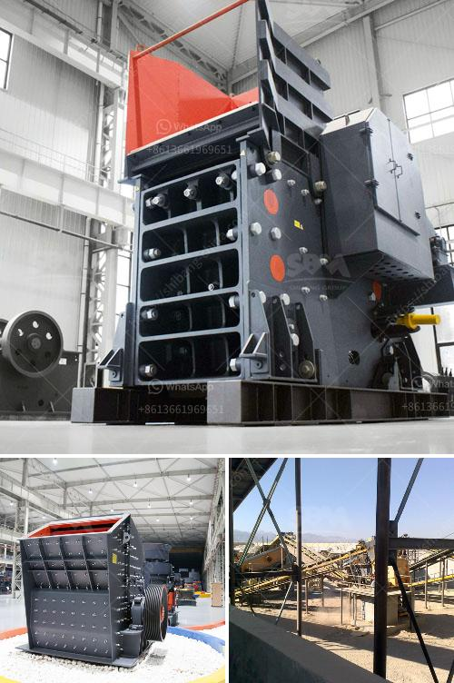

<h3>how much does rock crusher cost ？</h3>
Rock crusher is a machinery that crushes rocks into smaller pieces, resulting in various sizes of gravel or stone particles. It is mainly used for crushing large stones into smaller ones, ranging from 3mm to 150mm. Rock crusher is extensively used in quarries, mining, construction, highways, and roads. The increased demand for gravel due to the surge in infrastructure development projects has led to an increase in the demand for rock crushers. However, one common question arises- how much does a rock crusher cost?

The cost of a rock crusher depends on various factors, including the type of rock crusher, capacity of the machine, the initial investment when purchasing the equipment, operation and maintenance costs, and more. On average, the overall cost of a rock crusher can range from $100,000 to $250,000 or more. This article will discuss the factors influencing the overall cost of a rock crusher in detail.

Firstly, the type of rock crusher plays a significant role in determining the cost. There are different types of rock crushers available in the market, including jaw crushers, cone crushers, impact crushers, and gyratory crushers. Each type has its unique features and advantages. For instance, jaw crushers are preferred for primary crushing because of their high capacity and efficiency. However, they cost more compared to other types of rock crushers.

Secondly, the capacity of the rock crusher also affects its cost. Higher capacity rock crushers can process more materials, resulting in higher productivity. The cost of a high-capacity rock crusher is usually higher compared to a low-capacity one. Therefore, businesses need to assess their requirements and invest in a rock crusher that can handle the production demands efficiently without overinvesting.

The upfront investment required to purchase a rock crusher is another crucial factor affecting the cost. High-quality rock crushers often come with a higher price due to their durability, performance, and advanced features. It is essential to consider the quality and reliability of the rock crusher before making a purchase decision. Opting for a cheaper option initially might result in higher long-term maintenance and repair costs.

Furthermore, operation and maintenance costs are ongoing expenses that should be considered when determining the overall cost of owning a rock crusher. Regular maintenance, replacement of wear parts, and lubrication are necessary to ensure the smooth and efficient functioning of the equipment. Ignoring these maintenance requirements can lead to breakdowns, reduced productivity, and increased repair costs.

In conclusion, the cost of a rock crusher primarily depends on factors such as the type of rock crusher, capacity, initial investment, and ongoing operational and maintenance expenses. It is essential for businesses to carefully analyze their requirements and budget before investing in a rock crusher. Additionally, it is advisable to consult with industry professionals or manufacturers to gain insights into the best-suited rock crusher for specific business needs. Taking these factors into account will help ensure a cost-effective investment and efficient utilization of a rock crusher.
<h3>Contact us</h3><ul><li><strong>Whatsapp:&nbsp;<a href="https://wa.me/8613661969651">+8613661969651</a></strong></li><li><a href="https://swt.shibang-china.com/?git&amp;zhl&amp;how much does rock crusher cost ？"><strong>Online Service(chat now)</strong></a></li></ul><h3>Related</h3><ul><li><a href='How to become a large mineral processing equipment supplier.md'>How to become a large mineral processing equipment supplier?</a></li><li><a href='How to extract copper from tailings.md'>How to extract copper from tailings?</a></li><li><a href='How to Build a Marble Mill ？.md'>How to Build a Marble Mill ？</a></li><li><a href='How much is the copper ore separation machine.md'>How much is the copper ore separation machine?</a></li><li><a href='How to Artificially Make Concrete Sand？.md'>How to Artificially Make Concrete Sand？</a></li></ul>