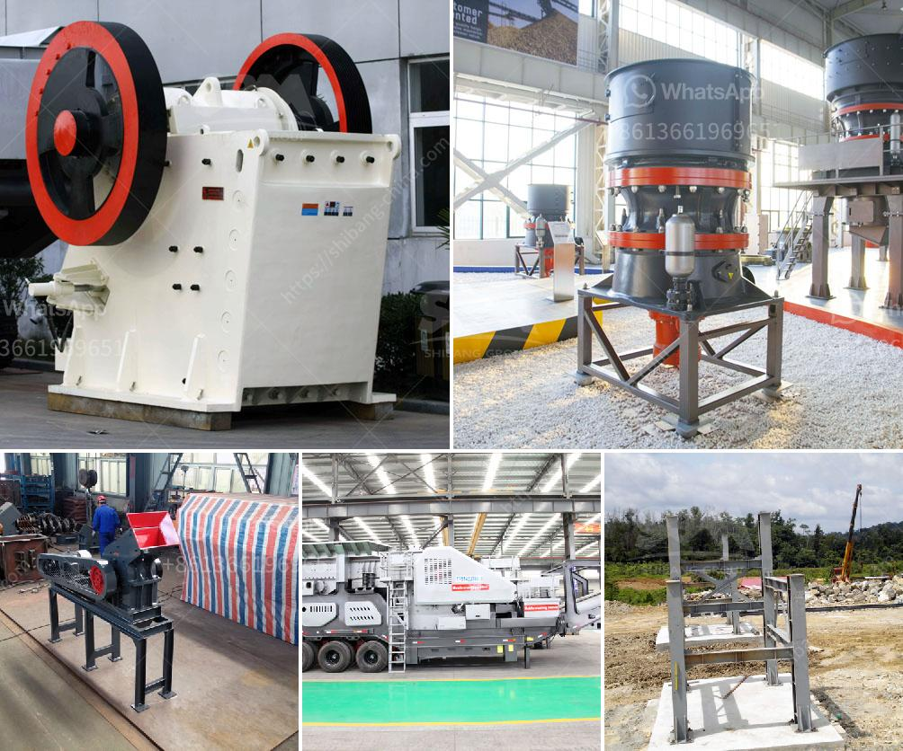

<h3>how much is an iron ore crushr machine？</h3>
Iron ore, one of the most abundant metals on Earth, is the primary raw material used to make steel. Due to its excellent strength and toughness, iron ore has been widely used in the construction and manufacturing industries. However, before it can be used in steel production, iron ore must undergo a series of crushing processes to remove impurities and prepare it for further processing. The crusher machine plays a crucial role in these processes, making it an essential piece of equipment for iron ore processing plants. But how much does an iron ore crusher machine cost?

The price of an iron ore crusher machine is determined by several factors, including the manufacturing process, brand, materials used, and the market demand. Some of these factors are outlined below:

1. Manufacturing process: Different manufacturers adopt different manufacturing processes for their crushers, leading to variations in prices. The more advanced the equipment, the higher the cost is likely to be. Manufacturers with advanced technology and high-quality materials tend to price their machines higher to reflect the added value they offer.

2. Brand: The brand of the crusher machine can also impact its price. Well-known brands with a good reputation often charge higher prices, as customers are willing to pay for the assurance of quality and reliability. On the other hand, lesser-known brands or new entrants into the market may sell their machines at lower prices to capture market share and establish their brand presence.

3. Materials used: The quality of the materials used to manufacture the crusher machine can significantly affect its price. Machines made with superior materials such as high-grade steel are typically more durable and efficient, but they also come at a higher cost.

4. Market demand: The supply and demand dynamics of the market impact the price of crusher machines. When iron ore prices are high, there is a greater demand for crushers as companies invest in expanding their mining and processing operations. This increased demand can drive up prices. Conversely, during periods of low iron ore prices or market downturns, the demand for crushers may decrease, leading to lower prices.

It is important to note that the price of an iron ore crusher machine is not fixed and can vary depending on the factors mentioned above. To get an accurate cost estimate, it is recommended to request quotes from multiple manufacturers and compare their offerings. Additionally, factors such as after-sales service, warranty, and spare parts availability should also be considered before making a purchase decision.

In conclusion, an iron ore crusher machine is an essential piece of equipment in iron ore processing plants. The cost of the machine can vary depending on factors such as manufacturing process, brand, materials used, and market demand. To determine the exact price, it is crucial to evaluate these factors and compare quotes from different manufacturers. Ultimately, investing in a high-quality machine can result in improved efficiency and productivity for iron ore processing operations.
<h3>Contact us</h3><ul><li><strong>Whatsapp:&nbsp;<a href="https://wa.me/8613661969651">+8613661969651</a></strong></li><li><a href="https://swt.shibang-china.com/?git&amp;zhl&amp;how much is an iron ore crushr machine？"><strong>Online Service(chat now)</strong></a></li></ul><h3>Related</h3><ul><li><a href='How to crush drain rock using a crusher.md'>How to crush drain rock using a crusher?</a></li><li><a href='How to adjust a jaw crusher .md'>How to adjust a jaw crusher ?</a></li><li><a href='How to work a roller grinding mill.md'>How to work a roller grinding mill?</a></li><li><a href='How to extract iron efficiently from silica.md'>How to extract iron efficiently from silica?</a></li><li><a href='How to select the screen size for a crusher plant.md'>How to select the screen size for a crusher plant?</a></li></ul>