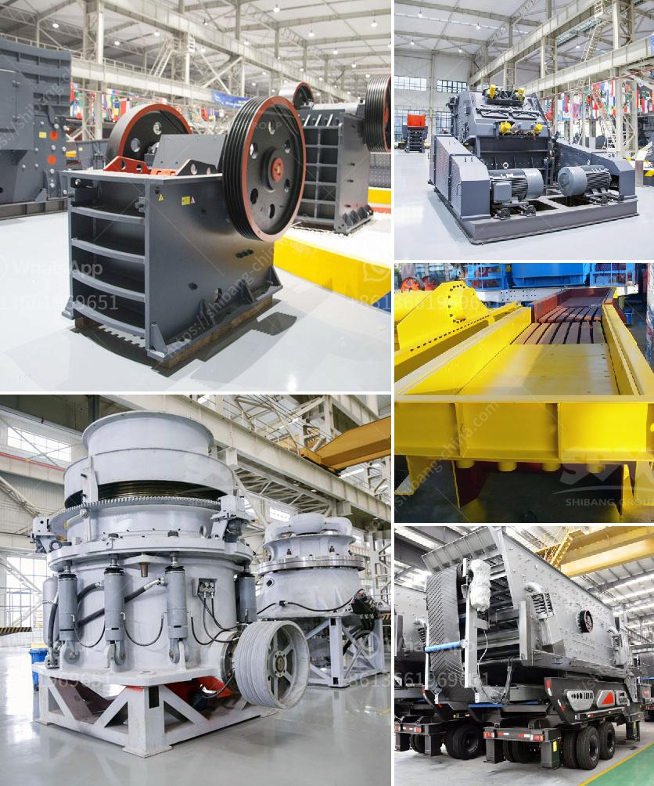

<h3>how much power does a 50 tph crusher need ？</h3>
A crusher is a machine designed to reduce large rocks into smaller rocks, gravel, or rock dust. It uses mechanical force to break up the material, such as limestone, granite, or basalt, into smaller pieces suitable for further processing. With advancements in technology, crushers have become more efficient and powerful, allowing them to handle larger volumes of material in a shorter time.

One of the commonly used crushers is the 50 tph crusher. The term "tph" stands for tons per hour and indicates the maximum capacity of the crusher. It plays a crucial role in various industries, including mining, construction, and recycling. Understanding the power requirements of a 50 tph crusher is essential in determining the efficiency and overall performance of the machine.

The power consumption of a 50 tph crusher depends on several factors, such as the type of rock or material being crushed, the size of the feed material, and the desired final product size. Other factors that influence power consumption include the crushing chamber design, the specific crushing method employed by the crusher, and the operating conditions.

Typically, a 50 tph crusher requires a power range of 75-100 HP (55-75 kW). The power consumption may vary depending on the hardness of the material and the feed size. For instance, a harder rock will require more energy to crush compared to a softer material. Similarly, a larger feed size will require higher power consumption. It is important to note that these are approximate values and may vary based on the specific crusher design and manufacturer.

To ensure optimal power consumption, manufacturers continuously strive to improve crusher efficiency. This involves innovative designs and technological advancements such as adjustable settings, hydraulic systems for controlling the crusher's power, and efficient crushing algorithms. These advancements help reduce energy consumption and maximize overall productivity.

Furthermore, operating a crusher at its maximum efficiency can also help in saving power. Utilizing the crusher's full capacity with proper feed control and regular maintenance can minimize idle power consumption. Additionally, choosing the appropriate crusher type and size for the application can further optimize power usage.

In conclusion, a 50 tph crusher requires around 75-100 HP (55-75 kW) of power, depending on various factors such as the type of material being crushed and the desired final product size. Understanding the power requirements of crushers is essential for selecting the right equipment and achieving optimal efficiency. Manufacturers are continuously improving crusher designs and technologies to reduce power consumption and increase overall productivity. Proper operating practices, such as controlling the crusher's feed and regular maintenance, also play a crucial role in minimizing power usage and maximizing the crusher's performance.
<h3>Contact us</h3><ul><li><strong>Whatsapp:&nbsp;<a href="https://wa.me/8613661969651">+8613661969651</a></strong></li><li><a href="https://swt.shibang-china.com/?git&amp;zhl&amp;how much power does a 50 tph crusher need ？"><strong>Online Service(chat now)</strong></a></li></ul><h3>Related</h3><ul><li><a href='How to crush calcium carbonate.md'>How to crush calcium carbonate?</a></li><li><a href='How to control the dust of stone crusher .md'>How to control the dust of stone crusher ?</a></li><li><a href='How to install limestone sand washing machine ？.md'>How to install limestone sand washing machine ？</a></li><li><a href='How to adjust the conveyor belt.md'>How to adjust the conveyor belt?</a></li><li><a href='How to plan and develop a small mine.md'>How to plan and develop a small mine?</a></li></ul>