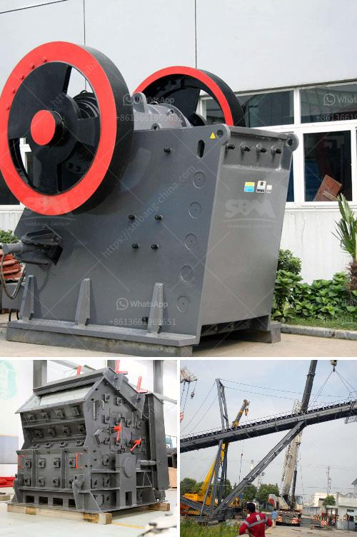

<h3>how ores are classified ?</h3>
Ores are naturally occurring minerals that contain valuable metals or elements. They play a vital role in our society as they are the primary source of many raw materials used in various industries such as construction, manufacturing, and energy production. To effectively utilize ores, they need to be classified based on their chemical composition and physical properties. This article aims to explore the classification of ores, highlighting the various factors involved.

One of the key aspects considered when classifying ores is their chemical composition. Ores can be broadly categorized into metallic and non-metallic ores based on the presence of metals in their composition. Metallic ores are those that contain metals in elemental or combined form, while non-metallic ores consist of minerals without any significant metallic content.

Within the metallic ore category, ores are further classified based on the dominant metal they contain. For instance, iron ores are primarily composed of iron oxides, while copper ores are rich in copper sulfides or oxides. Similarly, lead ores predominantly contain lead sulfide or lead carbonate, and zinc ores consist of zinc sulfides. By understanding the chemical composition, it becomes easier to determine the potential uses and properties of different ores.

Mineralogy is another factor that plays a crucial role in the classification of ores. Minerals are naturally occurring, inorganic solids with a defined chemical composition and ordered atomic arrangement. Different minerals are formed under varying geological conditions, resulting in a variety of ores.

The presence of specific minerals within an ore determines its classification. For example, bauxite is classified as an aluminum ore due to the high concentration of aluminum hydroxide minerals. Similarly, cassiterite is classified as a tin ore because it is rich in tin dioxide minerals. By analyzing the mineralogy of ores, geologists can determine the economic viability and potential extraction methods.

The physical properties of ores also contribute to their classification. Some of the key physical properties include color, streak, hardness, specific gravity, and crystal structure. These properties can help identify and distinguish different types of ores.

Color and streak are visible features that can provide preliminary information about the type of minerals present in an ore. Hardness indicates the resistance of an ore to being scratched, while specific gravity reflects its density compared to water. Crystal structure refers to the arrangement of atoms in a mineral and can be determined through detailed examination.

Geochemical analysis is an essential technique used in ore classification. It involves studying the chemical composition of rocks, soil, and minerals to identify and quantify the various elements present. This analysis provides valuable information about the concentration and distribution of elements within an ore.

By assessing the chemical composition through geochemical analysis, geologists can determine whether an ore deposit is economically viable. They can estimate the potential yield and associated impurities in the ore, helping decision-makers determine whether to proceed with mining operations.

In conclusion, ores are classified based on several factors, including chemical composition, mineralogy, physical properties, and geochemical analysis. Understanding these classifications is crucial for efficient extraction and utilization of ores. By categorizing ores, industries can determine the most suitable methods for processing and refining, ultimately contributing to sustainable economic growth.
<h3>Contact us</h3><ul><li><strong>Whatsapp:&nbsp;<a href="https://wa.me/8613661969651">+8613661969651</a></strong></li><li><a href="https://swt.shibang-china.com/?git&amp;zhl&amp;how ores are classified "><strong>Online Service(chat now)</strong></a></li></ul><h3>Related</h3><ul><li><a href='how to eliminate titaniumsulphur and silica in iron sand？.md'>how to eliminate titaniumsulphur and silica in iron sand？</a></li><li><a href='How to build a quartz crusher.md'>How to build a quartz crusher?</a></li><li><a href='How to make railway ballast stones.md'>How to make railway ballast stones?</a></li><li><a href='How to crush lumps of coal.md'>How to crush lumps of coal?</a></li><li><a href='How to set up a quarry business in india.md'>How to set up a quarry business in india?</a></li></ul>