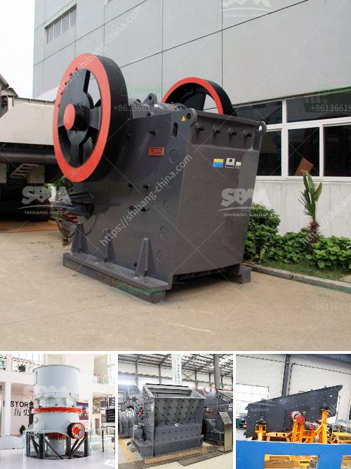

<h3>how the mine crusher operate ?</h3>
A mine crusher, also known as a rock crusher, is a key equipment in the quarrying industry. Mining is a complex operation, requiring various heavy machinery to process ore, including bulldozers, drill and blast rigs, dump trucks, crushers, and conveyors. This article discusses the mine crusher, an important part of the mining process chain.

The basic operation of a mine crusher involves rotating the shaft and applying pressure to the mined material to break it down into smaller pieces. It usually consists of two smooth metal surfaces, one fixed and the other movable. The movable jaw applies force to the rock by pressing it against the fixed jaw, resulting in the crushing of the material into smaller fragments.

The primary function of the crusher is to reduce the size of the extracted material for further processing. Crushers are commonly used to break large rocks, ores, and minerals into smaller pieces, facilitating easier handling, transportation, and subsequent processing stages. The crushed material can then be screened and sorted according to its size and specifications.

Various types of crushers are available for different mining applications. Jaw crushers are widely used in primary crushing operations and are typically the first stage in the crushing process. They can handle various types of materials, including hard rocks and ores. Gyratory crushers are another common option, especially for large-scale mining operations. They are designed to handle high-capacity feed rates and large-sized materials efficiently.

In addition to jaw and gyratory crushers, there are also cone crushers and impact crushers. Cone crushers are commonly used in secondary and tertiary crushing stages, capable of producing a high-quality end product shape. They can crush both hard and medium-hard materials. Impact crushers, on the other hand, use impact force to break rocks and ores. They are often used in the final stage of crushing to produce fine aggregates.

The operation of a mine crusher involves feeding the material into the crusher chamber and ensuring a continuous supply of material. The crusher is equipped with a hopper or feeding device that aids in controlling the flow of material into the crusher. The material is then crushed between the two surfaces as the movable jaw moves back and forth. Size reduction occurs due to compression, shear, and impact forces.

To ensure efficient and safe operation, mine crushers are equipped with guards, safety devices, and advanced control systems. These features help protect workers and prevent damage to the crusher itself from an oversize or foreign object. Additionally, regular maintenance and inspections are necessary to identify and address any potential issues that may affect the crusher's performance and reliability.

In conclusion, the mine crusher plays a crucial role in mining operations by reducing the size of extracted material, enabling easier handling, transportation, and subsequent processing stages. Various types of crushers are available to suit different mining applications. Operating a mine crusher involves feeding the material, applying pressure to break it down into smaller fragments, and ensuring efficient and safe operation through the use of safety features and regular maintenance.
<h3>Contact us</h3><ul><li><strong>Whatsapp:&nbsp;<a href="https://wa.me/8613661969651">+8613661969651</a></strong></li><li><a href="https://swt.shibang-china.com/?git&amp;zhl&amp;how the mine crusher operate "><strong>Online Service(chat now)</strong></a></li></ul><h3>Related</h3><ul><li><a href='How to fit a jaw crusher flywheel.md'>How to fit a jaw crusher flywheel?</a></li><li><a href='how the mine crusher operate .md'>how the mine crusher operate ?</a></li><li><a href='How to make a coal primary jaw crusher machine.md'>How to make a coal primary jaw crusher machine?</a></li><li><a href='how to improve the jaw crusher working efficiency？.md'>how to improve the jaw crusher working efficiency？</a></li><li><a href='How to extend the working life of a jaw crushing plate.md'>How to extend the working life of a jaw crushing plate?</a></li></ul>