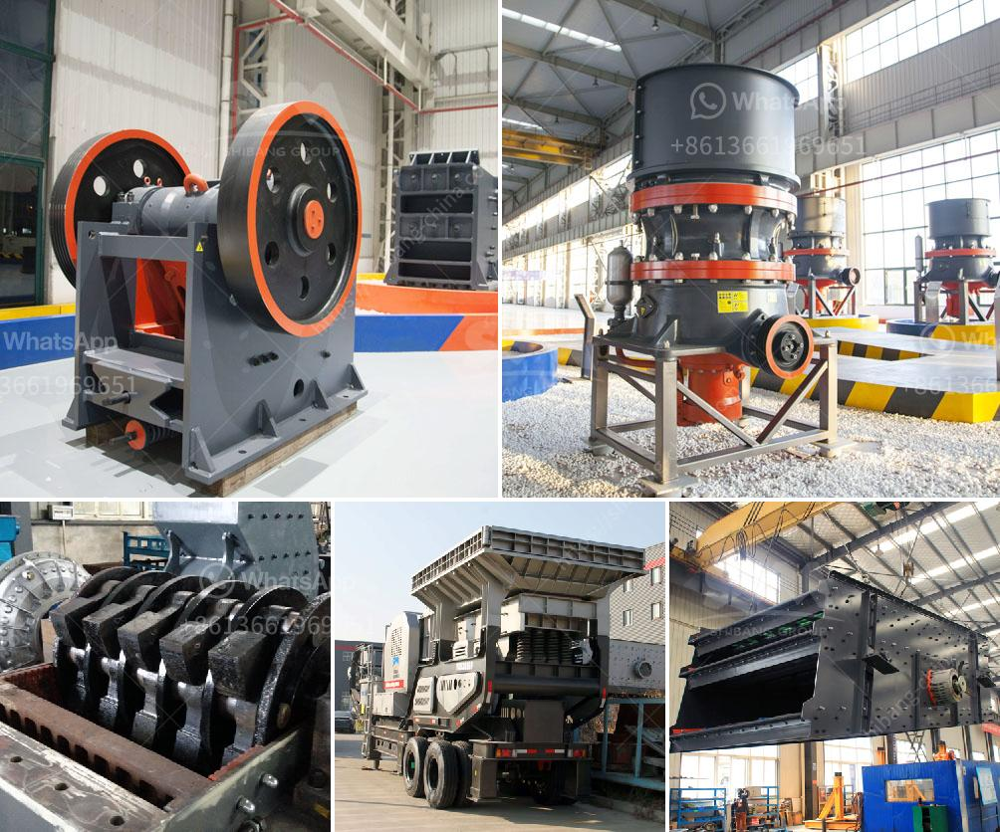

<h3>how to an ore bauxite jaw crusher ？</h3>
Bauxite mining is an integral part of the aluminum production chain, which is why it is essential to utilize efficient and reliable crushing equipment to ensure the optimal process flow. To achieve this, an ore bauxite jaw crusher is essential for maintaining an efficient production process. In this article, we will discuss some tips on how to maintain an efficient bauxite jaw crusher.

Lubrication is crucial for the proper functioning of any machinery, and a bauxite jaw crusher is no exception. Regularly lubricating the bearings, pitman, and toggle mechanism will ensure smooth operation and minimize the risk of breakdowns. It is recommended to follow the manufacturer's guidelines regarding lubrication intervals and use high-quality lubricants suitable for the conditions of the crusher.

Performing regular inspections of your crusher can help identify potential issues before they escalate into major problems. Inspect the crusher's mechanical components, such as the belt, jaws, and flywheels, for any signs of wear and tear. Timely replacements of worn-out parts can prevent costly breakdowns and production interruptions.

Optimizing the jaw crusher settings is crucial for achieving maximum efficiency. The key settings to focus on include the closed side setting (CSS), which determines the product size, and the open side setting (OSS), which affects the throughput capacity. Consult the manufacturer's recommendations or seek advice from experts to set the ideal CSS and OSS values for your bauxite jaw crusher.

Implementing a preventive maintenance program can significantly increase the lifespan of your bauxite jaw crusher. Regularly scheduled maintenance tasks, such as belt tension checks, jaw plate replacements, and lubrication, can help identify potential issues and prevent major breakdowns. Keep a detailed log of all maintenance activities to ensure that no task is overlooked.

Dust generation is a common challenge in bauxite crushing operations. Excessive dust can lead to equipment damage and pose health risks to the operators. Implementing effective dust control measures, such as installing dust suppression systems and regularly cleaning the crusher and surrounding areas, can help maintain a safe and efficient working environment.

Proper operator training is vital for maximizing the performance and lifespan of your bauxite jaw crusher. Train your operators on the safe and efficient operation of the crusher, as well as proper maintenance procedures. Educated operators are more likely to identify potential issues early on and handle the equipment correctly.

Monitor the performance of your bauxite jaw crusher by regularly measuring and analyzing key operational parameters, such as the throughput capacity, power consumption, and product size distribution. Comparing the performance data against benchmarks will help identify any deviations and prompt timely actions to optimize crusher efficiency.

In conclusion, maintaining an efficient bauxite jaw crusher requires a combination of regular lubrication, preventive maintenance, proper settings, dust control measures, operator training, and performance monitoring. By following these tips, you can ensure the smooth operation of your crusher and optimize the overall bauxite crushing process.
<h3>Contact us</h3><ul><li><strong>Whatsapp:&nbsp;<a href="https://wa.me/8613661969651">+8613661969651</a></strong></li><li><a href="https://swt.shibang-china.com/?git&amp;zhl&amp;how to an ore bauxite jaw crusher ？"><strong>Online Service(chat now)</strong></a></li></ul><h3>Related</h3><ul><li><a href='How to adjust a jaw crusher .md'>How to adjust a jaw crusher ?</a></li><li><a href='How is nickel extracted from its ore.md'>How is nickel extracted from its ore?</a></li><li><a href='how to calculate crusher production cost.md'>how to calculate crusher production cost</a></li><li><a href='How to deal with the vicious competition in the mining industry .md'>How to deal with the vicious competition in the mining industry ?</a></li><li><a href='How to calculate the cost per ton of crushing and screening stone.md'>How to calculate the cost per ton of crushing and screening stone?</a></li></ul>