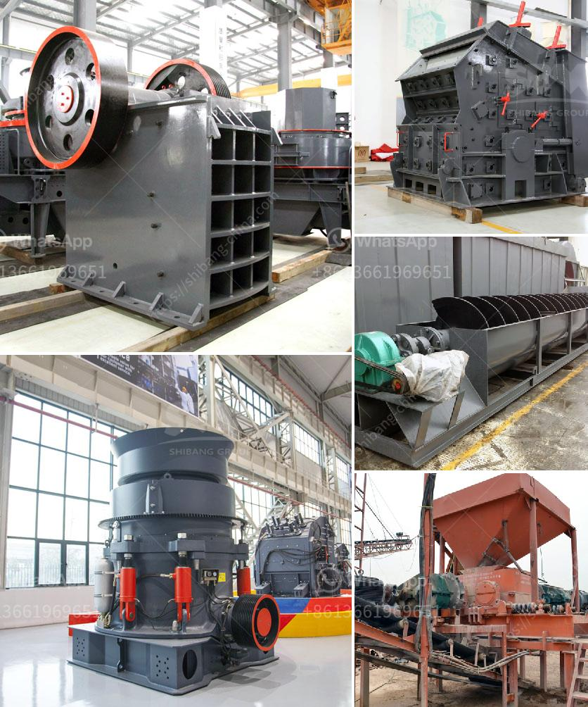

<h3>how to biuld a small rock crusher ？</h3>
Building your own rock crusher is a fun and rewarding project that can bring years of enjoyment and utility. Whether you are a do-it-yourselfer or a professional builder, it is possible to achieve great results when building a rock crusher. However, there are certain factors you should consider before starting the construction. In this article, we will guide you step-by-step on how to build a small rock crusher.

First and foremost, it is important to understand what a rock crusher is and what it is used for. A rock crusher is a device used to crush rocks into smaller pieces, usually for gravel or some other road or building application. Most rock crushers have a hopper at the top - a container which holds the rock above the crusher and uses gravity to feed it in. Alternately, rock crushers can use a belt drive to continuously transport the rock into the crusher.

The basic concept of a rock crusher is very simple: crushing rocks with pressure. Jaw crushers and gyratory crushers are commonly used in mining and construction activities because they can provide very strong crushing capabilities. However, these machines are difficult to transport and require large machinery yards, making them less practical for everyday use.

For a small-scale rock crusher, consider using a electric motor or a diesel engine to power the crusher. Use a pulley system powered by the motor or engine to drive the crusher's jaws or impactor. This way, the rocks will be crushed as soon as they enter the crusher without waiting for the motor to reach full speed.

In order to choose the right components for your rock crusher, it is essential to assess your specific needs. Consider the hardness, size, and type of rock you want to crush. Some rocks, like limestone, are more easily crushed than others, so it is important to select the appropriate crusher for your specific application. Additionally, consider the desired output size and capacity of the crusher. This will help you determine the size and strength of the crusher's components, such as the jaws or impactor.

Once you have gathered all the necessary materials and components, it is time to start building your rock crusher. Begin by welding the base of the crusher to a sturdy piece of metal or wood. Make sure it is stable and secure before moving forward. Next, attach the crusher's jaws or impactor to the base using bolts or clamps. Ensure that they are aligned properly and securely fastened.

Finally, attach the motor or engine to the crusher using a belt or chain drive. Double check to ensure that it is securely mounted and properly aligned. Make sure that the motor or engine can handle the load and has enough power to drive the crusher.

Once you have completed these steps, your rock crusher should be ready to use. Test it by feeding rocks into the hopper and watch as they are crushed into smaller pieces. Be cautious while operating the crusher and always wear appropriate safety equipment, such as gloves and safety goggles.

Building a small rock crusher can be a rewarding experience and provide a satisfying sense of accomplishment. With the right components and a little bit of effort, you can create a rock crusher that meets your needs and is capable of crushing rocks effectively. So, gather your materials, put on your safety gear, and start building your own rock crusher today!
<h3>Contact us</h3><ul><li><strong>Whatsapp:&nbsp;<a href="https://wa.me/8613661969651">+8613661969651</a></strong></li><li><a href="https://swt.shibang-china.com/?git&amp;zhl&amp;how to biuld a small rock crusher ？"><strong>Online Service(chat now)</strong></a></li></ul><h3>Related</h3><ul><li><a href='How to extract iron efficiently from silica.md'>How to extract iron efficiently from silica?</a></li><li><a href='How to adjust impact crusher 7 key steps.md'>How to adjust impact crusher? 7 key steps</a></li><li><a href='How do you find the feed rate for a jaw crusher.md'>How do you find the feed rate for a jaw crusher?</a></li><li><a href='How to maintain a stone crusher machine.md'>How to maintain a stone crusher machine?</a></li><li><a href='How to start a granite quarry.md'>How to start a granite quarry?</a></li></ul>