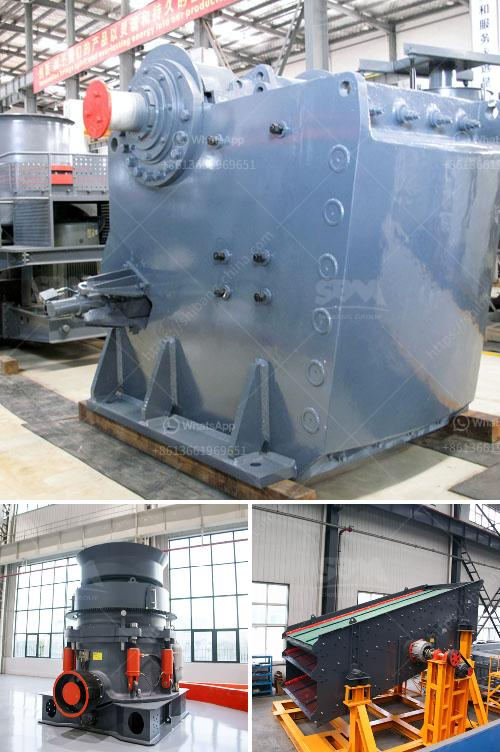

<h3>how to build a vibrating screen separators ?</h3>
A vibrating screen separator is a crucial component to a wide range of industries. Whether you are in the mining, aggregate, food processing, or pharmaceutical industry, sorting and separating materials will be a necessary step to ensure the proper functioning of your operations. Vibrating screen separators are used to sift and separate materials of varying sizes and compositions. They can be used to separate solid particles from liquids, decrease the size of particles, and remove impurities from powders.

If you are interested in building your own vibrating screen separator, the following steps will serve as a guide.

1. Plan and Design: You will need to determine the size of the vibrating screen separator you will build, determine the material specifications, and assemble a complete list of materials and tools required. Your design should include appropriate dimensions, based on the capacity and size requirements of your application.

2. Gather Materials and Tools: Once you have determined the design and size specifications, collect all the necessary materials and tools. These may include plywood or metal sheets for the screen frame, square tubes or steel bars for the support structure, wire mesh or perforated metal for the screen, springs or rubber mounts for vibration isolation, and bolts, nuts, and washers for assembly.

3. Build the Frame and Support Structure: Begin by constructing the screen frame using the plywood or metal sheets. Cut and assemble the pieces according to the dimensions outlined in your design. Next, build the support structure using the square tubes or steel bars, ensuring that it is sturdy and level.

4. Install the Vibrating Mechanism: Attach the vibrating mechanism, such as a motor, to the frame of the separator. The vibrating mechanism should be securely mounted to prevent excessive vibration and potential damage.

5. Add the Screen and Covering: Attach the wire mesh or perforated metal to the screen frame, making sure it is tight and secured. This will determine the size and shape of the materials that can pass through the separator. Additionally, you may want to consider adding a coarser screen on top to filter out larger particles. Lastly, add a covering to protect the vibrating screen separator from dust and debris.

6. Test and Adjust: Before putting the vibrating screen separator into operation, it is essential to test the unit to ensure smooth and efficient operation. Once tested, make any necessary adjustments to the vibration settings or screen tension to ensure optimal performance.

In conclusion, building your vibrating screen separator allows you to customize it to meet your specific needs and applications. By carefully planning and assembling the necessary materials and tools and following the steps outlined above, you can construct a high-quality separator. However, it is important to remember that building a vibrating screen separator requires a certain level of knowledge and experience in mechanical engineering. If you are unsure about any aspect of the process, it is recommended to seek guidance from a professional or consult relevant resources for more information.
<h3>Contact us</h3><ul><li><strong>Whatsapp:&nbsp;<a href="https://wa.me/8613661969651">+8613661969651</a></strong></li><li><a href="https://swt.shibang-china.com/?git&amp;zhl&amp;how to build a vibrating screen separators "><strong>Online Service(chat now)</strong></a></li></ul><h3>Related</h3><ul><li><a href='how to crusher river pebbles into sand ？.md'>how to crusher river pebbles into sand ？</a></li><li><a href='How to service limestone crushers.md'>How to service limestone crushers?</a></li><li><a href='How to adjust a jaw crusher .md'>How to adjust a jaw crusher ?</a></li><li><a href='How to Select a Type of Crusher.md'>How to Select a Type of Crusher</a></li><li><a href='How to increase the production capacity of stone grinding machine ？.md'>How to increase the production capacity of stone grinding machine ？</a></li></ul>