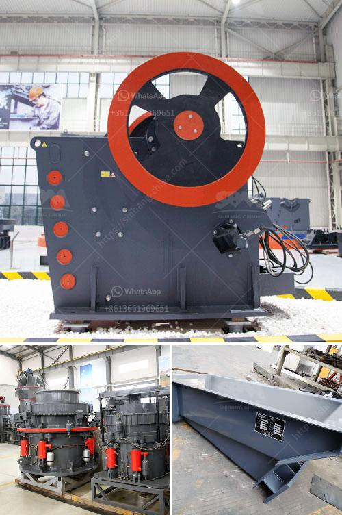

<h3>how to cal belt conveyor length for stone crusher ？</h3>
A belt conveyor is a mechanical device used to transport stones and other bulk materials from one place to another. Belt conveyors are widely used in the mining industry, building materials industry, and other industries for transporting bulk materials. The length of a belt conveyor can vary depending on the application and the specific requirements of the stone crusher. In this article, we will discuss how to calculate the appropriate length for a belt conveyor used in stone crushing operations.

The length of a belt conveyor is determined by two crucial factors: the distance between the two endpoints and the inclination angle of the conveyor. These two factors directly affect the capacity and efficiency of the conveyor system. Here is a step-by-step guide on how to calculate the belt conveyor length for a stone crusher:

1. Measure the distance between the two endpoints: Start by measuring the distance between the location where the stone crusher will be installed and the location where the stones need to be transported. This distance will determine the length of the belt conveyor.

2. Determine the maximum inclination angle: The inclination angle of the belt conveyor is the angle at which the conveyor system will be inclined from the horizontal plane. This angle should be determined based on the specific requirements of the stone crusher and the characteristics of the materials being transported. Generally, a lower inclination angle is preferred to ensure the stability of the conveyor system.

3. Calculate the horizontal length: Once you have measured the distance and determined the inclination angle, you can calculate the horizontal length of the conveyor. The horizontal length is the length of the belt conveyor when it is placed on a horizontal plane. To calculate the horizontal length, use the following formula:

Where distance is the measured distance between the two endpoints, and θ is the inclination angle in radians.

4. Calculate the vertical length: After calculating the horizontal length, you need to calculate the vertical length, which is the vertical distance between the two endpoints. To calculate the vertical length, use the following formula:

5. Calculate the total length: Finally, calculate the total length of the belt conveyor by adding the horizontal length and vertical length together.

By following these steps, you can accurately calculate the length of a belt conveyor required for your stone crusher. It is important to ensure that the calculated length meets the specific requirements of your operation and takes into account factors such as safety, efficiency, and material handling capacity.

In conclusion, a belt conveyor plays a crucial role in the transportation of stones and other bulk materials in stone crushing operations. Calculating the appropriate length of the belt conveyor is essential for ensuring the smooth operation and optimal performance of the conveyor system. By understanding and following the steps outlined in this article, you can accurately calculate the length of a belt conveyor for your stone crusher.
<h3>Contact us</h3><ul><li><strong>Whatsapp:&nbsp;<a href="https://wa.me/8613661969651">+8613661969651</a></strong></li><li><a href="https://swt.shibang-china.com/?git&amp;zhl&amp;how to cal belt conveyor length for stone crusher ？"><strong>Online Service(chat now)</strong></a></li></ul><h3>Related</h3><ul><li><a href='How to choose the model of jaw crusher ？.md'>How to choose the model of jaw crusher ？</a></li><li><a href='How can we solve the problem of the crusher bearing heating.md'>How can we solve the problem of the crusher bearing heating?</a></li><li><a href='How to select crushing equipment.md'>How to select crushing equipment?</a></li><li><a href='how much is an iron ore crushr machine？.md'>how much is an iron ore crushr machine？</a></li><li><a href='How to build a gravel crusher.md'>How to build a gravel crusher?</a></li></ul>