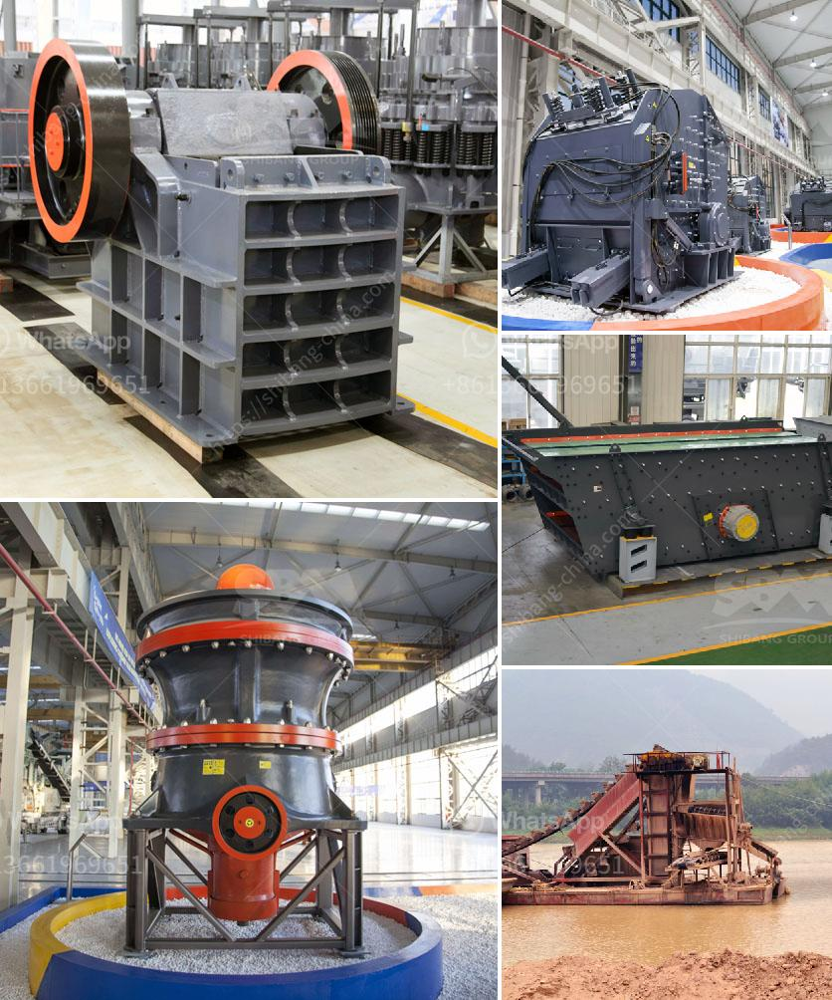

<h3>how to calculate belt feeder ？</h3>
Belt feeders are common equipment in industries where bulk materials need to be transported and controlled. They are an efficient and reliable solution for handling various types of materials such as coal, ore, sand, gravel, and food products. Calculating the belt feeder's dimensions is essential to ensure proper operation and optimal performance. In this article, we will discuss the steps to calculate a belt feeder.

The first step in calculating a belt feeder is to determine the required belt width. This is determined by considering factors such as material flow rate, size, and properties. The belt width should be wide enough to handle the desired material flow rate without causing excessive wear or spillage. It should also be narrow enough to fit within the available space and ensure proper containment of the material. It is recommended to consult industry standards and guidelines for belt width recommendations based on the specific type of material being handled.

The next step is to calculate the belt speed required for the desired material flow rate. Belt speed is measured in feet per minute (ft/min) or meters per second (m/s). The belt speed should be selected based on factors such as material characteristics, belt construction, and operational requirements. It is essential to choose a belt speed that ensures efficient material transport without causing excessive wear or spillage. Again, it is recommended to consult industry standards and guidelines for belt speed recommendations based on the specific type of material being handled.

After determining the belt width and speed, the next step is to calculate the belt length required for the desired material flow rate. Belt length is determined by considering factors such as the distance between the feeder and the material discharge point, any inclines or declines in the conveyor path, and any additional requirements specific to the application. It is crucial to ensure that the belt length is sufficient to cover the entire conveying path and accommodate any necessary adjustments or deviations. Again, consulting industry standards and guidelines will help in determining the appropriate belt length.

Finally, the material flow rate needs to be calculated to determine the capacity of the belt feeder. Material flow rate is measured in tons per hour (tph) or kilograms per second (kg/s). The material flow rate is influenced by factors such as material density, material size, and desired throughput. It is essential to accurately calculate the material flow rate based on the specific characteristics of the material being handled and the operational requirements. Various methods, including material testing and historical data analysis, can be used to determine the material flow rate accurately.

By following these four steps, one can calculate the dimensions and specifications required for a belt feeder. It is important to note that these calculations should be verified and validated by specialized engineers or consultants to ensure accuracy and safety. Additionally, it is recommended to regularly monitor and maintain the belt feeder to ensure optimal performance and prevent any issues or failures.
<h3>Contact us</h3><ul><li><strong>Whatsapp:&nbsp;<a href="https://wa.me/8613661969651">+8613661969651</a></strong></li><li><a href="https://swt.shibang-china.com/?git&amp;zhl&amp;how to calculate belt feeder ？"><strong>Online Service(chat now)</strong></a></li></ul><h3>Related</h3><ul><li><a href='how a cone crusher works .md'>how a cone crusher works ?</a></li><li><a href='How to process ore in crusher with sticky soil .md'>How to process ore in crusher with sticky soil ?</a></li><li><a href='How does a rock crusher work.md'>How does a rock crusher work?</a></li><li><a href='How to improve coal crusher hammer life .md'>How to improve coal crusher hammer life ?</a></li><li><a href='how to remove fines from stone crush.md'>how to remove fines from stone crush?</a></li></ul>