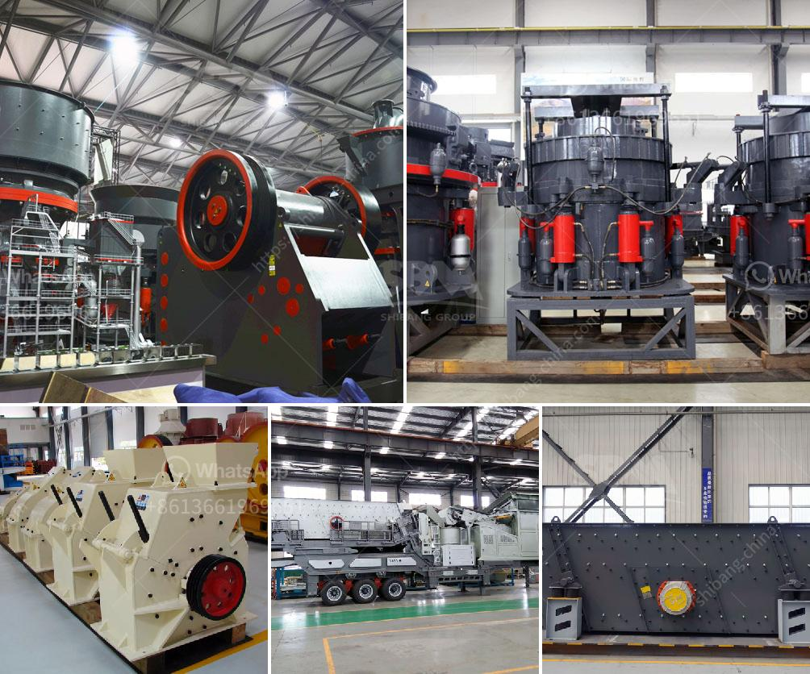

<h3>how to calculate crusher production cost</h3>
Crushing is the process of reducing large stones into smaller stones or gravel. This process involves the use of heavy machinery, such as jaw crushers or impact crushers. These machines can handle materials like coal, limestone, gypsum, and more.

For businesses that rely on the production of crushed materials, calculating the cost of crusher production is essential. Knowing the production cost allows companies to make informed decisions about pricing their products and maintaining profitability. In this article, we will discuss how to calculate crusher production cost.

The first step in calculating crusher production cost is to determine the input size and output size of the material being crushed. These measurements will provide valuable information on the type and quantity of the materials needed. Additionally, it will help determine the capacity and power requirements of the crusher.

Based on the desired output size and the capacity of the crusher, estimate the required crushing capacity. This estimation will depend on various factors like the hardness and density of the material being crushed, the desired product size, and the percentage of fines that can be tolerated.

The power requirement of the crusher is the energy consumed by the crusher to crush the material. It is influenced by the feed size, feed rate, and the efficiency of the crusher. To calculate the power requirement, use the Bond Work Index equation, which relates the power consumption to the feed and product size:

Where Wi is the Bond Work Index of the material (kWh/t), P80 is the 80% passing size of the product (μm), and F80 is the 80% passing size of the feed (μm).

Crusher wear parts, such as jaw plates, liners, and impact bars, wear out over time and need to be replaced. Estimate the wear parts cost by considering the expected life of each component and its replacement frequency. Multiply the cost of each wear part by its replacement frequency to obtain the total wear parts cost.

Regular maintenance and repair are necessary to keep the crusher in optimal condition. These costs should be accounted for when calculating the crusher production cost. Include the cost of maintenance labor and the cost of any required repairs or replacements of components.

In addition to the wear parts cost, maintenance, and repair costs, consider other operating costs, such as fuel consumption and operator wages. These costs can vary depending on the crusher's size and the production capacity.

To calculate the total crusher production cost, add all the individual costs mentioned above. The formula to calculate the total cost is as follows:

Total Cost = Power Requirement + Wear Parts Cost + Maintenance and Repair Costs + Other Operating Costs.

By accurately calculating the crusher production cost, businesses can make informed decisions about their pricing and ensure profitability. Additionally, it enables them to optimize their operations and identify areas of improvement, such as reducing power consumption or optimizing maintenance schedules.
<h3>Contact us</h3><ul><li><strong>Whatsapp:&nbsp;<a href="https://wa.me/8613661969651">+8613661969651</a></strong></li><li><a href="https://swt.shibang-china.com/?git&amp;zhl&amp;how to calculate crusher production cost"><strong>Online Service(chat now)</strong></a></li></ul><h3>Related</h3><ul><li><a href='how is iron ore transported to kenya.md'>how is iron ore transported to kenya</a></li><li><a href='How to extract manganese from ore.md'>How to extract manganese from ore?</a></li><li><a href='How to install quarry equipment.md'>How to install quarry equipment?</a></li><li><a href='how much power does a 50 tph crusher need ？.md'>how much power does a 50 tph crusher need ？</a></li><li><a href='How to start a cone crusher.md'>How to start a cone crusher?</a></li></ul>