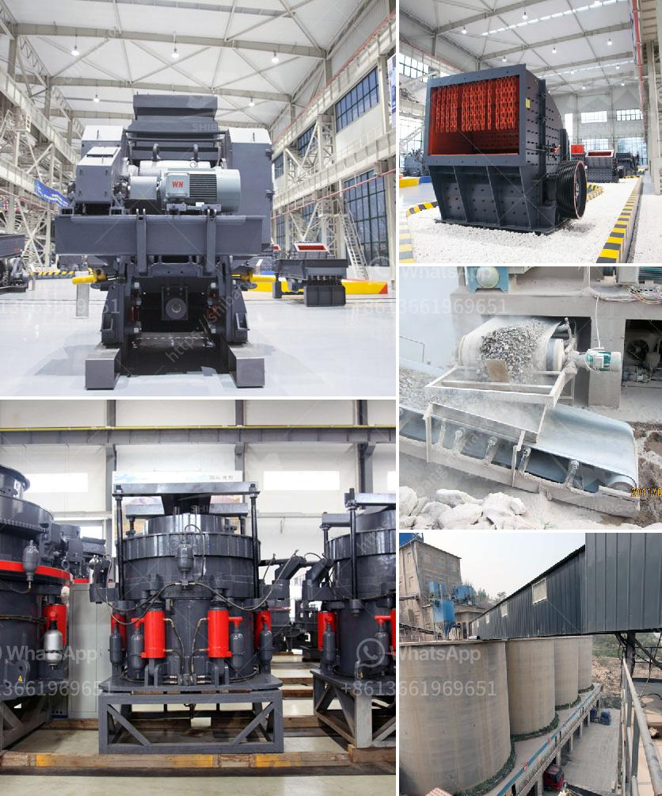

<h3>how to calculate the processing capacity of the mill ?</h3>
Calculating the processing capacity of a mill is an essential step in selecting the right equipment for a manufacturing or industrial application. It determines the efficiency and productivity of a mill, enabling businesses to maximize their output while minimizing costs. In this article, we will explore the factors involved in calculating the processing capacity of a mill.

Processing capacity refers to the amount of material a mill can process within a given time frame. The capacity is typically measured in terms of the weight or volume of the material processed per unit of time. The processing capacity of a mill depends on various factors, including the type of mill, the size and shape of the mill, and the nature of the material being processed.

One crucial factor in calculating the processing capacity is the mill's type. There are several types of mills used in various industries, including ball mills, hammer mills, roller mills, and fluid energy mills. Each mill type has its particular characteristics and capabilities.

For example, a ball mill is commonly used in the mining industry to grind ore and produce a fine powder. The processing capacity of a ball mill is determined by its size, where larger mills generally have a higher capacity. However, the size of the mill also affects other factors such as power consumption, material residence time, and grinding efficiency.

To calculate the processing capacity of a mill, the volume or weight of the material processed per unit of time needs to be determined. For example, in a ball mill, the volume can be calculated by multiplying the effective volume of the mill chamber by the bulk density of the material being processed. The bulk density is the mass of the material divided by its volume.

Similarly, for a roller mill, the processing capacity can be estimated by multiplying the roller surface area by the peripheral speed of the rollers. The roller surface area is the product of the roller diameter and length, while the peripheral speed is the speed at which the rollers rotate.

In addition to the mill type and size, the nature of the material being processed is also critical in calculating the processing capacity. Different materials have different characteristics that affect the mill's efficiency and capacity. For instance, materials with high hardness require more energy and time to be processed, resulting in a lower processing capacity.

The mill's design also plays a role in determining the processing capacity. The design may include features such as multiple grinding stages, special liners, and adjustable speed drives, all of which can enhance the mill's efficiency and capacity.

In conclusion, calculating the processing capacity of a mill involves considering several factors, including the type and size of the mill, the nature of the material being processed, and the mill's design. It is crucial to accurately determine the processing capacity to ensure the mill can meet the production requirements efficiently. By selecting a mill with an appropriate processing capacity, businesses can optimize their operations and achieve higher productivity while minimizing costs.
<h3>Contact us</h3><ul><li><strong>Whatsapp:&nbsp;<a href="https://wa.me/8613661969651">+8613661969651</a></strong></li><li><a href="https://swt.shibang-china.com/?git&amp;zhl&amp;how to calculate the processing capacity of the mill "><strong>Online Service(chat now)</strong></a></li></ul><h3>Related</h3><ul><li><a href='How to manufacture artificial sand.md'>How to manufacture artificial sand?</a></li><li><a href='How to reduce vibration in a jaw crusher.md'>How to reduce vibration in a jaw crusher?</a></li><li><a href='How to segregate gold ore from copper ore .md'>How to segregate gold ore from copper ore ?</a></li><li><a href='How to build a rock crusher for gold mining.md'>How to build a rock crusher for gold mining?</a></li><li><a href='how to build a vibrating screen separators .md'>how to build a vibrating screen separators ?</a></li></ul>