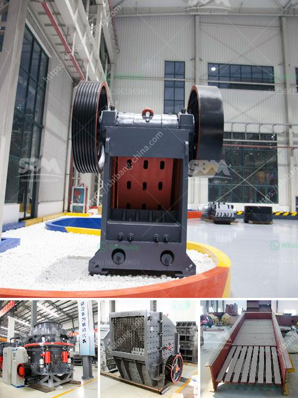

<h3>how to calculate tons per hour ball mill machine ?</h3>
A ball mill machine is a crucial equipment that grinds materials down to a fine powder. It is primarily used in manufacturing industries and construction materials. As such, it requires a precise calculation to accurately determine the capacity of the machine. In this article, we will discuss how to calculate tons per hour of ball mill machine.

To begin with, it is important to understand the basics of ball mill machine. A ball mill is a cylindrical drum mounted on the bearings and rotated by thruster motors. It is filled with grinding balls, which grind materials into a fine powder called slurry. The slurry is then used to produce various products like cement, ceramics, etc.

1. The size of the ball mill machine: The size of the machine determines the overall grinding capacity. Larger machines are used for bigger operations and can handle high volumes of materials.

2. Grinding media ratio: The grinding media ratio refers to the ratio of the volume of grinding media (balls) to the volume of the material being ground. It plays a crucial role in determining the efficiency and capacity of the machine.

3. Residence time: The residence time is the total time that the material spends inside the ball mill machine. It is determined by the speed of rotation and the length and diameter of the machine.

To calculate the tons per hour of the ball mill machine, we need to know the following three parameters:

1. The size of the machine: Usually, the diameter and length of the machine are specified in the machine's technical specifications. For example, let's assume the machine has a diameter of 3 meters and a length of 6 meters.

2. The grinding media ratio: This ratio can vary depending on the type and size of the grinding media used. Let's assume a grinding media ratio of 3:1, which means for every 3 volumes of grinding media, we need 1 volume of the material being ground.

Assuming the machine has a volume of 50 cubic meters and a flow rate of 10 cubic meters per hour, we can calculate the residence time as follows:

In conclusion, calculating the tons per hour of a ball mill machine requires a deep understanding of its working principles and technical specifications. By considering the size of the machine, the grinding media ratio, and the residence time, one can accurately determine the capacity of the machine. These calculations ensure that the machine is used to its full potential, optimizing the production process and minimizing wastage.
<h3>Contact us</h3><ul><li><strong>Whatsapp:&nbsp;<a href="https://wa.me/8613661969651">+8613661969651</a></strong></li><li><a href="https://swt.shibang-china.com/?git&amp;zhl&amp;how to calculate tons per hour ball mill machine "><strong>Online Service(chat now)</strong></a></li></ul><h3>Related</h3><ul><li><a href='How to increase the productivity of the cone crusher ？.md'>How to increase the productivity of the cone crusher ？</a></li><li><a href='How to use mineral processing equipment for tin ore beneficiation .md'>How to use mineral processing equipment for tin ore beneficiation ?</a></li><li><a href='how to limit excess fines in crushing .md'>how to limit excess fines in crushing ?</a></li><li><a href='How to produce crushed sand.md'>How to produce crushed sand</a></li><li><a href='How to select a site for aggregate quarry in kenya .md'>How to select a site for aggregate quarry in kenya ?</a></li></ul>