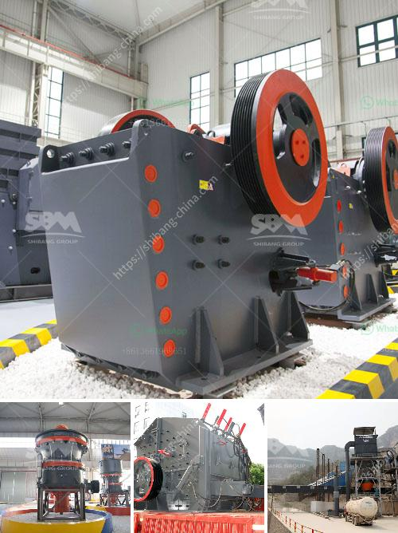

<h3>how to change hammer in rock crusher?</h3>
A rock crusher is a device used to crush rocks into smaller pieces. It is usually used for gravel or some other road or building application. Most rock crushers have a hopper at the top - a container which holds the rock above the crusher and uses gravity to feed it in. Alternately, rock crushers can be designed to use a belt drive to continuously transport the rock into the crusher.

Hammer configuration is an essential part of rock crusher design. With over two decades of experience in crushers, Eagle Crusher Company knows the importance of proper hammer configuration. The right choice of hammer configuration can improve crushing performance and reduce operational costs.

However, over time, the hammer in a rock crusher can wear down and need to be replaced. In this article, we will discuss the process of changing hammers in a rock crusher, step-by-step.

Before starting any maintenance or hammer replacement, it is crucial to ensure the rock crusher is turned off and disconnected from any power source. Ensure that the rotor assembly is locked tightly in place with a locking device.

To remove the worn hammer, loosen the bolts on the hammer retaining bar and remove it from the rotor. Next, carefully lift the hammer out of the crusher.

Place the new hammer onto the rotor and align it according to the manufacturer's instructions. If using multiple hammers, ensure that they are evenly spaced around the rotor and balanced.

Once the new hammer is in place, reattach the hammer retaining bar and securely tighten all bolts. Ensure that there is no gap between the rotor and the hammer retaining bar.

After installation, it is important to test the rock crusher and check for any vibrations or unusual noises. If necessary, adjust the hammer configuration to achieve the desired crushing performance.

Regular maintenance is essential to ensure optimal crusher performance. Inspect the hammer regularly for signs of wear or damage and replace it as needed. Additionally, ensure that all bolts and connections are tight and secure.

Changing hammers in a rock crusher is a relatively simple and straightforward process. By following these steps, you can ensure that your rock crusher operates at its best and delivers consistent, reliable results. If you are unsure about any part of the process, consult the manufacturer's instructions or seek guidance from a professional. Remember, safety should always be a top priority, so never attempt to change the hammer while the crusher is running or connected to a power source.

In conclusion, changing the hammer in a rock crusher is a routine maintenance task that can be done easily with the right tools and knowledge. By following the steps outlined in this article, you can ensure that your rock crusher continues to operate efficiently and reliably, providing you with high-quality crushed material for your various applications.
<h3>Contact us</h3><ul><li><strong>Whatsapp:&nbsp;<a href="https://wa.me/8613661969651">+8613661969651</a></strong></li><li><a href="https://swt.shibang-china.com/?git&amp;zhl&amp;how to change hammer in rock crusher"><strong>Online Service(chat now)</strong></a></li></ul><h3>Related</h3><ul><li><a href='how to intall a jaw crusher ？.md'>how to intall a jaw crusher ？</a></li><li><a href='How to achieve a smooth coal pulverizer.md'>How to achieve a smooth coal pulverizer?</a></li><li><a href='How to design a crushing plant .md'>How to design a crushing plant ?</a></li><li><a href='How to reduce vibration in a jaw crusher.md'>How to reduce vibration in a jaw crusher?</a></li><li><a href='How to separate gold ore from rock.md'>How to separate gold ore from rock?</a></li></ul>