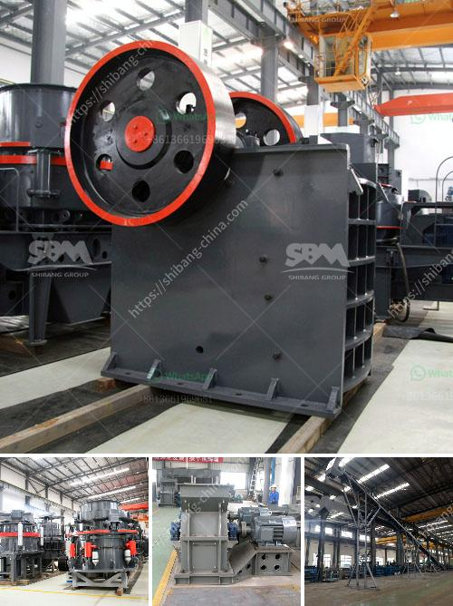

<h3>how to choose a crushing machine ?</h3>
Crushing machines are widely used in various sectors such as mining, metallurgy, building materials, highways, railways, water conservancy, and chemical industries. They play a crucial role in reducing the size of rocks, ores, and other materials for subsequent processing. However, with several types of crushing machines available in the market, it can be overwhelming to choose the right one for your specific needs. In this article, we will discuss some essential factors to consider when selecting a crushing machine.

1. Material characteristics: The first step in choosing a crushing machine is to understand the nature of the material you need to process. Different materials have varying hardness, moisture content, and abrasiveness, which can significantly impact the performance of the machine. For example, brittle materials like limestone may require a different type of crusher compared to hard granite. Therefore, analyze the material's characteristics thoroughly before making a decision.

2. Capacity and output size requirements: Determine the desired capacity and output size of the crushed material. This will help you select the right machine with the appropriate crushing chamber, motor power, and feeding size. Machines with higher capacities are suitable for larger operations, while those with lower capacities may be sufficient for smaller projects. Additionally, consider the required finished product size to ensure the chosen crusher meets your specifications.

3. Space and mobility: Depending on your working conditions and site requirements, the size and portability of the crushing machine can be crucial. Evaluate the available space for installation and operation. Some crushers are fixed, while others are mobile and can be easily transported to different locations. Consider whether a stationary or mobile machine is more suitable for your needs.

4. Maintenance and operating costs: Machines require regular maintenance and incur operating costs. Assess the maintenance requirements and costs associated with the selected crushing machine. Look for models that are easy to maintain, with readily available spare parts and technical support. Additionally, consider the energy consumption and fuel efficiency of the machine to minimize operating expenses.

5. Safety features: Prioritize safety when selecting a crushing machine. Look for features such as safety guards, emergency stop buttons, and proper ventilation systems to ensure the wellbeing of operators. Crushing machines can pose risks if not equipped with adequate safety measures, so pay close attention to this aspect.

6. Reputation and reliability of the manufacturer: Partner with a reputable manufacturer that has a track record of delivering high-quality crushing machines. A reliable manufacturer will provide comprehensive after-sales support, including technical assistance, training, and warranty. Read customer reviews, seek recommendations, and conduct thorough research to ensure the manufacturer's credibility and reliability.

In conclusion, choosing the right crushing machine requires careful evaluation of factors such as material characteristics, capacity requirements, space limitations, maintenance costs, safety features, and the reputation of the manufacturer. By considering these aspects, you can select a crushing machine that optimally fulfills your crushing needs, ultimately enhancing your productivity and profitability.
<h3>Contact us</h3><ul><li><strong>Whatsapp:&nbsp;<a href="https://wa.me/8613661969651">+8613661969651</a></strong></li><li><a href="https://swt.shibang-china.com/?git&amp;zhl&amp;how to choose a crushing machine "><strong>Online Service(chat now)</strong></a></li></ul><h3>Related</h3><ul><li><a href='How to start a ballast crushing plant.md'>How to start a ballast crushing plant?</a></li><li><a href='how a impactor crusher works ？.md'>how a impactor crusher works ？</a></li><li><a href='How to maintain the jaw crusher.md'>How to maintain the jaw crusher?</a></li><li><a href='How to maintenance coal mill.md'>How to maintenance coal mill?</a></li><li><a href='How to choose a small rock crusher for mining ？.md'>How to choose a small rock crusher for mining ？</a></li></ul>