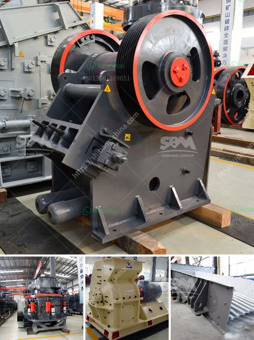

<h3>how to choose a portable crusher plant ？</h3>
In today's rapidly evolving world, the need for construction materials is increasing at an unprecedented rate. To cater to this demand, the mining and construction industries are constantly seeking efficient ways to crush and recycle materials. One of the most popular solutions is the portable crusher plant, which allows contractors and quarry operators to process materials on-site. However, with so many options available, choosing the right portable crusher plant can be a daunting task. Here are some key factors to consider when making this important decision.

The first step in choosing a portable crusher plant is to determine the type of material you need to process. Different plants are designed to handle different materials, ranging from hard rock to recycled concrete. It is important to choose a plant that is specifically designed to handle the type and size of material you are working with. This will ensure maximum efficiency and productivity.

The production capacity of a portable crusher plant determines how much material it can process in a given period. It is essential to choose a plant that can meet your production requirements. Consider factors such as the volume of material you need to process daily and the size of the finished product. Selecting a plant with a higher production capacity than your current needs can provide room for future growth and prevent operational bottlenecks.

One of the primary advantages of a portable crusher plant is its ability to be moved from site to site. Depending on your construction or mining project, you may require a plant that can be easily transported. Consider factors such as the weight, size, and ease of assembly and disassembly. Look for features such as hydraulic legs and foldable hoppers, which make the plant more versatile and easier to transport.

Portable crusher plants can be powered by various sources, including electricity, diesel fuel, or even hybrid systems. The choice of power source depends on factors such as availability, cost, and environmental impact. Evaluate the power options available at your work sites and choose a plant that best aligns with your requirements.

Opting for a portable crusher plant that is easy to maintain and service can save you significant time, effort, and money. Consider features such as easy accessibility to key components and robust construction. Also, look for manufacturers that offer reliable after-sales support and readily available spare parts.

As sustainability becomes an increasingly important consideration in construction and mining operations, it is essential to choose a portable crusher plant with minimal environmental impact. Look for features such as efficient dust suppression systems and advanced noise reduction technologies.

In conclusion, choosing the right portable crusher plant can greatly impact the success and productivity of your construction or mining project. By considering factors such as the type of material, production capacity, mobility, power source, maintenance requirements, and environmental impact, you can make an informed decision. Invest time in researching different manufacturers and models, and consult with industry experts to ensure you select a reliable and efficient portable crusher plant that meets your specific needs.
<h3>Contact us</h3><ul><li><strong>Whatsapp:&nbsp;<a href="https://wa.me/8613661969651">+8613661969651</a></strong></li><li><a href="https://swt.shibang-china.com/?git&amp;zhl&amp;how to choose a portable crusher plant ？"><strong>Online Service(chat now)</strong></a></li></ul><h3>Related</h3><ul><li><a href='How to build a granite crushing plant？.md'>How to build a granite crushing plant？</a></li><li><a href='How to improve stone crusher production.md'>How to improve stone crusher production?</a></li><li><a href='How to choose a stone crusher station .md'>How to choose a stone crusher station ?</a></li><li><a href='How to break material using a hammer crusher.md'>How to break material using a hammer crusher?</a></li><li><a href='How to install impact crusher .md'>How to install impact crusher ?</a></li></ul>